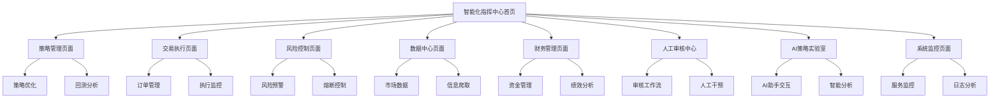

# AI智能体驱动交易系统 - 产品需求文档

> **重要说明**: 本文档是基于 `MASTER-SYSTEM-SPEC-V1.2.md` 主规范文档的产品功能需求描述。当本文档与主规范文档存在冲突时，以主规范文档为准。建议开发者首先阅读主规范文档以理解全局架构和设计理念。

**主规范文档**: `MASTER-SYSTEM-SPEC-V1.2.md` - 项目唯一权威技术纲领

## 1. 产品概述

AI智能体驱动交易系统（ASTS）是一个基于微服务架构的智能化交易平台，通过14个独立模块协同工作，实现从数据采集、策略优化到风险控制的全流程自动化交易。

系统采用"人机协作、风险优先"的核心设计理念，为专业交易员和机构投资者提供高效、安全、可扩展的智能交易解决方案。

目标市场价值：构建下一代AI驱动的量化交易基础设施，支持多资产类别的智能化投资决策。

## 2. 核心功能

### 2.1 用户角色

| 角色 | 注册方式 | 核心权限 |
|------|----------|----------|
| 交易员 | 邮箱注册+实名认证 | 策略配置、交易执行、风险监控 |
| 风控经理 | 邀请码+审批 | 风险参数设置、紧急熔断、合规监控 |
| 系统管理员 | 内部分配 | 系统配置、用户管理、全局监控 |
| 观察者 | 只读权限申请 | 数据查看、报告导出 |

### 2.2 功能模块

我们的AI智能体驱动交易系统包含以下核心页面：

1. **智能化指挥中心首页**：系统状态总览、14个模组运行监控、快速操作入口
2. **策略管理页面**：策略创建、优化配置、回测分析、参数调优
3. **交易执行页面**：订单管理、实时交易、执行监控、成交分析
4. **风险控制页面**：风险指标监控、预警设置、熔断机制、合规检查
5. **数据中心页面**：市场数据展示、信息爬取、数据质量监控
6. **财务管理页面**：资金管理、盈亏分析、绩效评估、报告生成
7. **人工审核中心**：交易审核工作流、风险评估、人工干预
8. **AI策略实验室**：AI助手交互、策略研究、智能分析
9. **系统监控页面**：服务状态、性能指标、日志查看、告警管理

### 2.3 页面详情

| 页面名称 | 模块名称 | 功能描述 |
|----------|----------|----------|
| 智能化指挥中心首页 | 系统总览 | 显示14个模组运行状态、关键业务指标、系统健康度监控 |
| 智能化指挥中心首页 | 快速操作 | 提供策略启停、紧急熔断、数据刷新等快捷操作按钮 |
| 策略管理页面 | 策略编辑器 | 支持可视化策略构建、参数配置、回测验证 |
| 策略管理页面 | 优化引擎 | 基于OptiCore模组进行策略参数自动优化、性能评估 |
| 交易执行页面 | 订单管理 | 实时订单状态跟踪、执行进度监控、异常处理 |
| 交易执行页面 | 智能路由 | 通过TradeGuard铁三角自动选择最优执行路径、滑点控制 |
| 风险控制页面 | 实时监控 | 持仓风险、市场风险、流动性风险的实时计算和展示 |
| 风险控制页面 | 预警系统 | 多级预警机制、自动熔断、风险报告生成 |
| 数据中心页面 | 市场数据 | 实时行情、历史数据、技术指标计算和展示 |
| 数据中心页面 | 信息爬取 | 通过DataSpider模组采集新闻、公告、研报等数据 |
| 财务管理页面 | 资金监控 | 实时资金状况、保证金使用率、可用资金计算 |
| 财务管理页面 | 绩效分析 | 收益率计算、风险调整收益、基准比较分析 |
| 人工审核中心 | 审核工作流 | 通过ReviewGuard模组进行交易前审核、风险评估 |
| 人工审核中心 | 人工干预 | 关键决策点的人工确认、异常情况处理 |
| AI策略实验室 | AI助手交互 | 通过AI Strategy Assistant进行策略研究和分析 |
| AI策略实验室 | 智能分析 | 市场洞察、策略建议、风险评估的AI辅助 |
| 系统监控页面 | 服务监控 | 各微服务健康状态、响应时间、错误率统计 |
| 系统监控页面 | 可观测性 | 通过Observability Center进行分布式链路追踪、指标收集 |

## 3. 核心流程

### 3.1 标准交易流程

用户通过控制台配置交易策略后，系统自动执行以下流程：数据采集→信号扫描→策略优化→风险审查→交易执行→结果监控。整个过程实现端到端的自动化，同时保留人工干预接口。

### 3.2 风险熔断流程

当系统检测到异常风险时，自动触发熔断机制：风险监控→异常检测→预警通知→自动熔断→人工确认→恢复交易。确保在极端市场条件下保护资金安全。

### 3.3 页面导航流程图

## 4. 用户界面设计

### 4.1 设计风格

- **主色调**：深蓝色(#1e3a8a)作为主色，金色(#f59e0b)作为强调色
- **按钮样式**：圆角矩形按钮，支持悬停和点击状态变化
- **字体**：主要使用Inter字体，中文使用思源黑体，代码使用JetBrains Mono
- **布局风格**：卡片式布局，顶部导航栏，左侧功能菜单
- **图标风格**：使用Lucide图标库，保持简洁现代的视觉风格

### 4.2 页面设计概览

| 页面名称 | 模块名称 | UI元素 |
|----------|----------|--------|
| 智能化指挥中心首页 | 系统总览 | 仪表盘布局，14个模组状态卡片，实时数据展示，深蓝色主题配色 |
| 策略管理页面 | 策略编辑器 | 拖拽式组件，参数配置面板，代码编辑器，实时预览窗口 |
| 交易执行页面 | 订单管理 | 表格视图，状态标签，操作按钮，实时更新动画效果 |
| 风险控制页面 | 风险监控 | 仪表盘图表，预警弹窗，红色警告色调，紧急熔断按钮突出显示 |
| 数据中心页面 | 市场数据 | 图表展示，数据表格，筛选器，响应式布局适配 |
| 财务管理页面 | 绩效分析 | 图表可视化，数据对比，导出功能，专业财务配色 |
| 人工审核中心 | 审核工作流 | 三页式报告展示，审核决策按钮，风险评估面板，工作流状态指示 |
| AI策略实验室 | AI助手交互 | 对话界面，策略分析图表，智能建议卡片，交互式数据可视化 |
| 系统监控页面 | 服务监控 | 网格布局，状态图标，日志滚动显示，暗色主题 |

### 4.3 响应式设计

系统采用桌面优先的响应式设计，支持1920x1080及以上分辨率的最佳体验。移动端提供核心功能的适配版本，重点优化监控和紧急操作界面的触控交互。