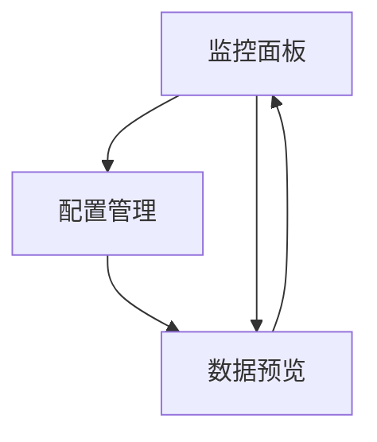

# 信息源爬虫模组产品需求文档

## 1. 产品概述

信息源爬虫模组是NeuroTrade Nexus (NTN)系统的"情报搜集员"，专门负责从无标准API的信息源（如SEC官网、Telegram频道）抓取关键信息，经过清洗和结构化处理后，通过消息总线分发给全系统其他模组。该模组采用微服务架构，支持独立部署和扩展，是整个交易系统的重要数据入口。

## 2. 核心功能

### 2.1 用户角色

| 角色 | 注册方式 | 核心权限 |
|------|----------|----------|
| 系统管理员 | 环境变量配置 | 配置爬虫目标、监控系统状态、管理数据流 |
| 开发人员 | 开发环境访问 | 调试爬虫逻辑、查看日志、测试数据输出 |

### 2.2 功能模块

我们的信息源爬虫模组包含以下核心页面：
1. **监控面板**: 系统状态监控、爬虫运行状态、数据流量统计
2. **配置管理**: 爬虫目标配置、Telegram频道管理、数据源设置
3. **数据预览**: 抓取数据展示、数据质量检查、格式验证

### 2.3 页面详情

| 页面名称 | 模块名称 | 功能描述 |
|----------|----------|----------|
| 监控面板 | 状态监控 | 实时显示爬虫运行状态、成功率、错误统计、数据产出量 |
| 监控面板 | 性能指标 | 监控CPU、内存使用率、网络延迟、消息队列状态 |
| 配置管理 | 爬虫配置 | 管理目标网站列表、抓取频率、反爬策略参数 |
| 配置管理 | Telegram设置 | 配置监听频道、关键词过滤、消息处理规则 |
| 数据预览 | 数据展示 | 展示最新抓取的数据、数据结构预览、质量评分 |
| 数据预览 | 数据验证 | 检查数据完整性、格式规范性、schema版本兼容性 |

## 3. 核心流程

### 主要操作流程

**系统管理员流程**：
1. 配置爬虫目标和参数
2. 启动爬虫服务
3. 监控运行状态和数据质量
4. 处理异常和优化配置

**数据处理流程**：
1. 爬虫抓取原始数据
2. 数据清洗和格式化
3. 质量检查和验证
4. 通过ZeroMQ发布到消息总线

## 4. 用户界面设计

### 4.1 设计风格

- **主色调**: #2563eb (蓝色) 和 #1f2937 (深灰)
- **辅助色**: #10b981 (绿色-成功), #ef4444 (红色-错误), #f59e0b (黄色-警告)
- **按钮样式**: 圆角矩形，3D阴影效果
- **字体**: 'Inter', 'Microsoft YaHei', sans-serif，主要字号14px-16px
- **布局风格**: 卡片式布局，左侧导航栏，响应式设计
- **图标风格**: Heroicons线性图标，简洁现代

### 4.2 页面设计概览

| 页面名称 | 模块名称 | UI元素 |
|----------|----------|--------|
| 监控面板 | 状态监控 | 实时状态卡片、进度条、折线图表、状态指示灯(绿/红/黄) |
| 监控面板 | 性能指标 | 仪表盘图表、资源使用率条形图、实时数据流动画 |
| 配置管理 | 爬虫配置 | 表单输入框、下拉选择器、开关按钮、保存/重置按钮 |
| 配置管理 | Telegram设置 | 频道列表、关键词标签、规则编辑器、测试连接按钮 |
| 数据预览 | 数据展示 | 数据表格、JSON格式化显示、分页控件、搜索过滤 |
| 数据预览 | 数据验证 | 验证结果徽章、错误详情弹窗、修复建议提示 |

### 4.3 响应式设计

系统采用桌面优先设计，支持移动端适配。在移动设备上，导航栏折叠为汉堡菜单，卡片布局调整为单列显示，表格支持横向滚动。触摸交互优化，按钮和链接区域增大，支持手势操作。