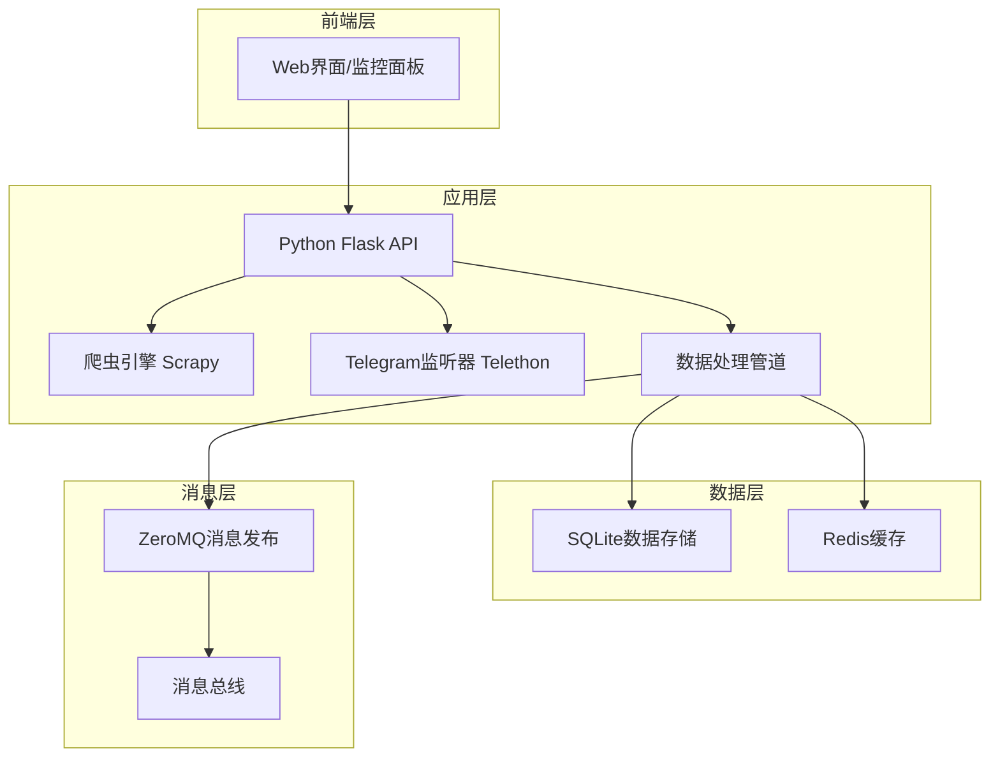
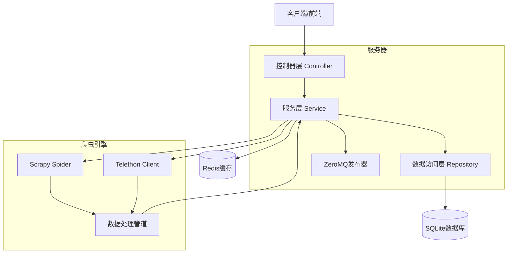
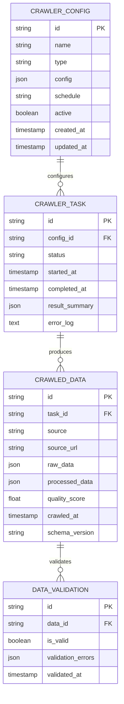

# 信息源爬虫模组技术架构文档

## 1. 架构设计



## 2. 技术描述

* **前端**: React\@18 + TypeScript + Tailwind CSS + Vite

* **后端**: Python\@3.11 + Flask\@2.3 + Scrapy\@2.11 + Telethon\@1.29

* **消息队列**: ZeroMQ\@25.1 (PUB/SUB模式)

* **数据存储**: SQLite\@3.42 + Redis\@7.0

* **部署**: Docker + Docker Compose

## 3. 数据服务

* **SQLite**: 存储爬虫配置、历史数据、日志记录

* **Redis**: 缓存实时状态、消息队列、会话管理

* **ZeroMQ**: 消息发布订阅、模组间通信

## 4. API定义

### 4.1 核心API

**爬虫管理相关**

```
POST /api/crawler/start
```

请求:

| 参数名称         | 参数类型   | 是否必需  | 描述                  |
| ------------ | ------ | ----- | ------------------- |
| target\_type | string | true  | 爬虫类型 (web/telegram) |
| config       | object | true  | 爬虫配置参数              |
| schedule     | string | false | 定时任务配置              |

响应:

| 参数名称        | 参数类型    | 描述     |
| ----------- | ------- | ------ |
| status      | boolean | 启动状态   |
| crawler\_id | string  | 爬虫实例ID |
| message     | string  | 状态消息   |

示例:

```json
{
  "target_type": "telegram",
  "config": {
    "channels": ["@crypto_news"],
    "keywords": ["listing", "delisting"]
  },
  "schedule": "*/5 * * * *"
}
```

**数据查询相关**

```
GET /api/data/recent
```

请求:

| 参数名称   | 参数类型      | 是否必需  | 描述     |
| ------ | --------- | ----- | ------ |
| source | string    | false | 数据源过滤  |
| limit  | integer   | false | 返回条数限制 |
| since  | timestamp | false | 时间范围过滤 |

响应:

| 参数名称      | 参数类型    | 描述      |
| --------- | ------- | ------- |
| data      | array   | 数据列表    |
| total     | integer | 总数量     |
| has\_more | boolean | 是否有更多数据 |

**系统状态相关**

```
GET /api/status/health
```

响应:

| 参数名称        | 参数类型   | 描述                           |
| ----------- | ------ | ---------------------------- |
| status      | string | 系统状态 (healthy/warning/error) |
| crawlers    | object | 各爬虫状态                        |
| performance | object | 性能指标                         |

## 5. 服务器架构图



## 6. 数据模型

### 6.1 数据模型定义



### 6.2 数据定义语言

**爬虫配置表 (crawler\_configs)**

```sql
-- 创建表
CREATE TABLE crawler_configs (
    id TEXT PRIMARY KEY DEFAULT (hex(randomblob(16))),
    name TEXT NOT NULL,
    type TEXT NOT NULL CHECK (type IN ('web', 'telegram')),
    config JSON NOT NULL,
    schedule TEXT,
    active BOOLEAN DEFAULT 1,
    created_at TIMESTAMP DEFAULT CURRENT_TIMESTAMP,
    updated_at TIMESTAMP DEFAULT CURRENT_TIMESTAMP
);

-- 创建索引
CREATE INDEX idx_crawler_configs_type ON crawler_configs(type);
CREATE INDEX idx_crawler_configs_active ON crawler_configs(active);

-- 初始化数据
INSERT INTO crawler_configs (name, type, config, schedule) VALUES
('SEC官网监控', 'web', '{"url": "https://www.sec.gov/news", "selectors": {".news-item"}}', '0 */6 * * *'),
('Telegram加密货币频道', 'telegram', '{"channels": ["@crypto_alerts"], "keywords": ["listing", "delisting"]}', '*/5 * * * *');
```

**爬虫任务表 (crawler\_tasks)**

```sql
CREATE TABLE crawler_tasks (
    id TEXT PRIMARY KEY DEFAULT (hex(randomblob(16))),
    config_id TEXT NOT NULL,
    status TEXT NOT NULL DEFAULT 'pending' CHECK (status IN ('pending', 'running', 'completed', 'failed')),
    started_at TIMESTAMP,
    completed_at TIMESTAMP,
    result_summary JSON,
    error_log TEXT,
    FOREIGN KEY (config_id) REFERENCES crawler_configs(id)
);

CREATE INDEX idx_crawler_tasks_config_id ON crawler_tasks(config_id);
CREATE INDEX idx_crawler_tasks_status ON crawler_tasks(status);
CREATE INDEX idx_crawler_tasks_started_at ON crawler_tasks(started_at DESC);
```

**抓取数据表 (crawled\_data)**

```sql
CREATE TABLE crawled_data (
    id TEXT PRIMARY KEY DEFAULT (hex(randomblob(16))),
    task_id TEXT NOT NULL,
    source TEXT NOT NULL,
    source_url TEXT,
    raw_data JSON NOT NULL,
    processed_data JSON,
    quality_score REAL DEFAULT 0.0,
    crawled_at TIMESTAMP DEFAULT CURRENT_TIMESTAMP,
    schema_version TEXT DEFAULT '1.1',
    FOREIGN KEY (task_id) REFERENCES crawler_tasks(id)
);

CREATE INDEX idx_crawled_data_task_id ON crawled_data(task_id);
CREATE INDEX idx_crawled_data_source ON crawled_data(source);
CREATE INDEX idx_crawled_data_crawled_at ON crawled_data(crawled_at DESC);
CREATE INDEX idx_crawled_data_quality_score ON crawled_data(quality_score DESC);
```

**数据验证表 (data\_validations)**

```sql
CREATE TABLE data_validations (
    id TEXT PRIMARY KEY DEFAULT (hex(randomblob(16))),
    data_id TEXT NOT NULL,
    is_valid BOOLEAN NOT NULL,
    validation_errors JSON,
    validated_at TIMESTAMP DEFAULT CURRENT_TIMESTAMP,
    FOREIGN KEY (data_id) REFERENCES crawled_data(id)
);

CREATE INDEX idx_data_validations_data_id ON data_validations(data_id);
CREATE INDEX idx_data_validations_is_valid ON data_validations(is_valid);
```

