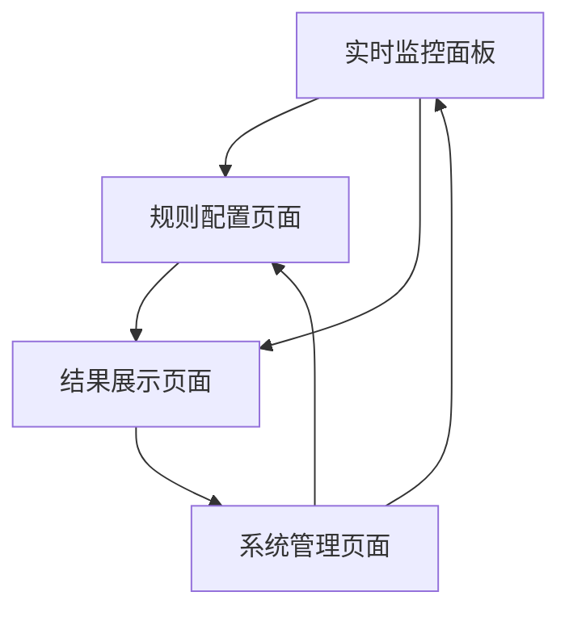

# 扫描器模组产品需求文档

## 1. Product Overview

扫描器模组是NeuroTrade Nexus交易系统的核心"雷达站"，负责7x24小时不间断扫描全市场，识别和筛选符合预设规则的交易机会。
- 该模组采用微服务架构设计，通过ZeroMQ消息总线与其他模组进行异步通信，实现高内聚、低耦合的分布式系统架构。
- 目标是为交易系统提供高质量的交易机会源，支持多种扫描策略，提升交易决策的准确性和时效性。

## 2. Core Features

### 2.1 User Roles

| Role | Registration Method | Core Permissions |
|------|---------------------|------------------|
| 系统管理员 | 系统内置账户 | 配置扫描规则、监控系统状态、管理模组参数 |
| 交易策略师 | 管理员分配权限 | 查看扫描结果、调整筛选参数、分析市场数据 |
| 默认用户 | 无需注册 | 查看基础扫描结果和市场概况 |

### 2.2 Feature Module

我们的扫描器模组包含以下核心页面：
1. **实时监控面板**：系统状态监控、扫描进度显示、实时数据流
2. **规则配置页面**：三高规则设置、黑马监测器配置、筛选参数调整
3. **结果展示页面**：扫描结果列表、机会详情查看、历史数据分析
4. **系统管理页面**：模组配置、日志查看、性能监控

### 2.3 Page Details

| Page Name | Module Name | Feature description |
|-----------|-------------|---------------------|
| 实时监控面板 | 状态监控 | 显示扫描器运行状态、连接状态、处理速度等关键指标 |
| 实时监控面板 | 数据流监控 | 实时展示市场数据流、扫描进度、发现的机会数量 |
| 实时监控面板 | 告警系统 | 监控异常情况、连接中断、数据延迟等问题并及时告警 |
| 规则配置页面 | 三高规则引擎 | 配置高波动、高流动性、高相关性的筛选阈值和权重 |
| 规则配置页面 | 黑马监测器 | 设置新闻关键词、交易所公告监控、社群热度阈值 |
| 规则配置页面 | 潜力挖掘器 | 配置低市值、低价格、低关注度币种的发现规则 |
| 结果展示页面 | 机会列表 | 展示所有发现的交易机会，支持按分数、类型、时间排序 |
| 结果展示页面 | 详情查看 | 显示单个交易机会的详细信息、触发原因、相关数据 |
| 结果展示页面 | 历史分析 | 查看历史扫描结果、成功率统计、规则效果分析 |
| 系统管理页面 | 配置管理 | 管理环境配置、API密钥、数据库连接等系统参数 |
| 系统管理页面 | 日志查看 | 查看系统运行日志、错误日志、调试信息 |
| 系统管理页面 | 性能监控 | 监控CPU、内存、网络使用情况，优化系统性能 |

## 3. Core Process

### 主要操作流程

**系统管理员流程：**
1. 登录系统管理页面
2. 配置扫描规则和参数
3. 启动扫描器模组
4. 监控系统运行状态
5. 处理异常和告警

**交易策略师流程：**
1. 访问实时监控面板
2. 查看扫描结果和市场机会
3. 分析机会详情和历史数据
4. 调整筛选参数优化结果
5. 将有价值的机会推送给交易模组

**系统自动化流程：**
1. 持续获取市场行情数据
2. 应用三高规则进行初步筛选
3. 监控新闻和公告触发黑马检测
4. 将符合条件的机会推送到预备池
5. 更新Redis缓存和状态信息

## 4. User Interface Design

### 4.1 Design Style

- **主色调：** 深蓝色 (#1a365d) 和科技蓝 (#3182ce)，体现专业和科技感
- **辅助色：** 成功绿 (#38a169)、警告橙 (#dd6b20)、危险红 (#e53e3e)
- **按钮样式：** 圆角矩形按钮，悬停时有渐变效果
- **字体：** 主要使用 'Microsoft YaHei', Arial, sans-serif，代码区域使用等宽字体
- **布局风格：** 卡片式布局，顶部导航栏，左侧功能菜单
- **图标风格：** 使用线性图标，简洁现代，支持状态指示

### 4.2 Page Design Overview

| Page Name | Module Name | UI Elements |
|-----------|-------------|-------------|
| 实时监控面板 | 状态监控 | 仪表盘样式，圆形进度条，实时数字显示，绿/红状态指示灯 |
| 实时监控面板 | 数据流监控 | 实时滚动列表，时间轴展示，动态图表，数据流动画效果 |
| 规则配置页面 | 三高规则引擎 | 滑块控件，数值输入框，权重调节器，预览效果图表 |
| 规则配置页面 | 黑马监测器 | 标签输入框，开关按钮，阈值设置，关键词云图 |
| 结果展示页面 | 机会列表 | 表格布局，分页控件，筛选器，排序按钮，分数徽章 |
| 结果展示页面 | 详情查看 | 模态对话框，信息卡片，图表展示，操作按钮组 |
| 系统管理页面 | 配置管理 | 表单布局，折叠面板，保存/重置按钮，验证提示 |
| 系统管理页面 | 日志查看 | 代码编辑器样式，搜索框，级别筛选，时间范围选择器 |

### 4.3 Responsiveness

系统采用桌面优先设计，支持1920x1080及以上分辨率的最佳显示效果。同时提供平板适配（768px以上），支持触摸操作优化，确保在不同设备上的良好用户体验。移动端提供简化版本，重点展示关键监控信息和告警通知。