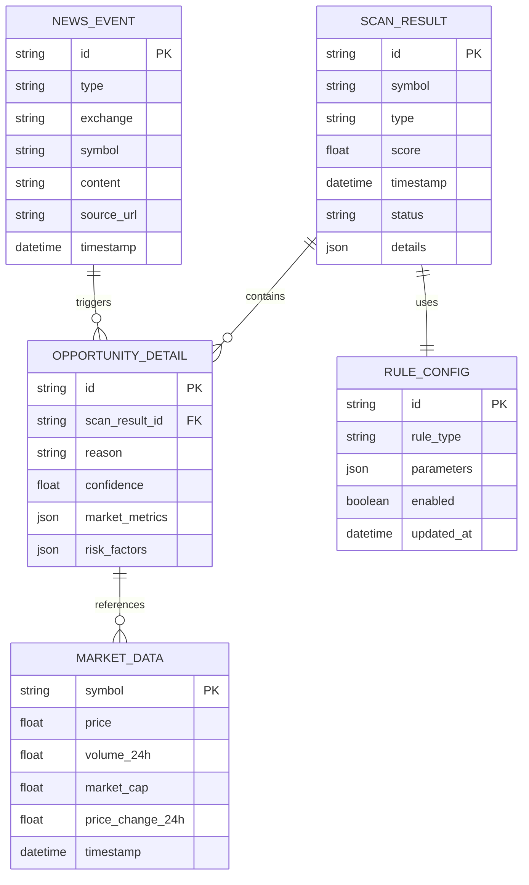

# 扫描器模组技术架构文档

## 1. Architecture design


## 2. Technology Description

* **核心语言**: Python 3.9+

* **通信框架**: ZeroMQ (pyzmq) - 高性能异步消息传递

* **缓存存储**: Redis 6.0+ - 实时数据缓存和状态管理

* **数据处理**: Pandas, NumPy - 市场数据分析和处理

* **配置管理**: PyYAML - 环境配置和规则参数管理

* **日志系统**: Python logging + structlog - 结构化日志记录

* **容器化**: Docker + Docker Compose - 微服务部署

* **集成框架**: TradingAgents-CN v3.0 - 复用现有市场扫描能力

## 3. Data Service

* **Redis**: 存储扫描结果、系统状态、配置缓存，作为轻量级消息队列

* **ZeroMQ**: 模组间异步通信，支持PUB/SUB和REQ/REP模式

* **TradingAgents-CN**: 提供基础市场数据和扫描引擎能力

## 4. API definitions

### 4.1 ZeroMQ通信接口

#### 发布接口 (Publisher)

**主题**: `scanner.pool.preliminary`
**描述**: 发布发现的交易机会到预备池

消息格式:

```json
{
  "symbol": "RNDR/USDT",
  "source": "scanner",
  "type": "black_horse",
  "score": 92,
  "timestamp": "2024-01-15T10:30:00Z",
  "details": {
    "reason": "Coinbase listing announcement",
    "volume_24h": 15000000,
    "price_change_24h": 0.15,
    "market_cap": 500000000
  },
  "schema_version": "1.1"
}
```

#### 订阅接口 (Subscriber)

**主题**: `crawler.news`
**描述**: 接收爬虫模组发现的突发新闻

消息格式:

```json
{
  "type": "listing_announcement",
  "exchange": "coinbase",
  "symbol": "RNDR",
  "content": "Coinbase announces RNDR listing",
  "timestamp": "2024-01-15T10:25:00Z",
  "source_url": "https://blog.coinbase.com/...",
  "schema_version": "1.0"
}
```

### 4.2 内部API接口

#### 扫描控制接口

```python
class ScannerController:
    def start_scanning(self, rules: Dict) -> bool:
        """启动扫描任务"""
        pass
    
    def stop_scanning(self) -> bool:
        """停止扫描任务"""
        pass
    
    def update_rules(self, rule_type: str, params: Dict) -> bool:
        """更新扫描规则"""
        pass
    
    def get_status(self) -> Dict:
        """获取扫描器状态"""
        pass
```

#### 规则引擎接口

```python
class RuleEngine:
    def apply_three_high_rules(self, market_data: List[Dict]) -> List[Dict]:
        """应用三高规则筛选"""
        pass
    
    def detect_black_horse(self, news_data: Dict, market_data: Dict) -> Optional[Dict]:
        """黑马检测"""
        pass
    
    def find_potential_gems(self, market_data: List[Dict]) -> List[Dict]:
        """潜力币种挖掘"""
        pass
```

## 5. Server architecture diagram


## 6. Data model

### 6.1 Data model definition



### 6.2 Data Definition Language

#### Redis数据结构

```redis
# 预备池 - 使用HASH存储详细信息
HSET preliminary_pool:RNDR/USDT '{"symbol": "RNDR/USDT", "score": 92, "type": "black_horse", "timestamp": "2024-01-15T10:30:00Z", "details": {...}}'

# 预备池分数排序 - 使用ZSET按分数排序
ZADD preliminary_pool_scores 92 "RNDR/USDT"
ZADD preliminary_pool_scores 85 "SOL/USDT"
ZADD preliminary_pool_scores 78 "AVAX/USDT"

# 扫描器状态
HSET scanner_status status "running" last_scan "2024-01-15T10:30:00Z" processed_count 1250

# 规则配置缓存
HSET rule_config:three_high '{"volatility_threshold": 0.05, "volume_threshold": 1000000, "correlation_threshold": 0.8}'
HSET rule_config:black_horse '{"keywords": ["listing", "partnership", "upgrade"], "score_multiplier": 1.5}'

# 市场数据缓存 (TTL: 60秒)
SETEX market_data:RNDR/USDT 60 '{"price": 2.45, "volume_24h": 15000000, "market_cap": 500000000, "change_24h": 0.15}'

# 新闻事件缓存 (TTL: 3600秒)
SETEX news_event:coinbase_rndr_listing 3600 '{"type": "listing", "exchange": "coinbase", "symbol": "RNDR", "timestamp": "2024-01-15T10:25:00Z"}'
```

#### 配置文件结构

```yaml
# config/base.yaml
scanner:
  scan_interval: 30  # 扫描间隔(秒)
  max_opportunities: 100  # 最大机会数量
  
rules:
  three_high:
    volatility_threshold: 0.05  # 波动率阈值
    volume_threshold: 1000000   # 成交量阈值
    correlation_threshold: 0.8  # 相关性阈值
    
  black_horse:
    keywords: ["listing", "partnership", "upgrade", "mainnet"]
    score_multiplier: 1.5
    news_timeout: 3600  # 新闻有效期(秒)
    
  potential_gems:
    max_market_cap: 100000000  # 最大市值
    max_price: 1.0            # 最大价格
    min_volume: 50000         # 最小成交量

zmq:
  publisher_port: 5555
  subscriber_port: 5556
  
redis:
  host: localhost
  port: 6379
  db: 0
  
logging:
  level: INFO
  format: "%(asctime)s - %(name)s - %(levelname)s - %(message)s"
```

#### 环境配置

```yaml
# config/development.yaml
redis:
  host: localhost
  port: 6379
  db: 1  # 开发环境使用db1
  
logging:
  level: DEBUG
  
# config/production.yaml
redis:
  host: redis-cluster
  port: 6379
  db: 0  # 生产环境使用db0
  
logging:
  level: INFO
  file: "/var/log/scanner/
```

