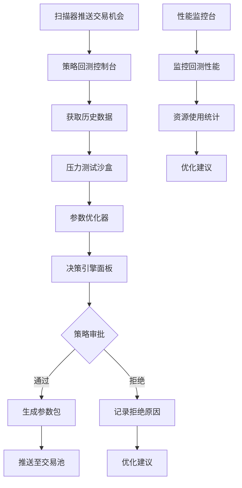

# 策略优化模组产品需求文档

## 1. Product Overview

策略优化模组是NeuroTrade Nexus交易系统的核心"军事参谋部"，负责对扫描器发现的交易机会进行严格的回测验证和参数优化。

- 主要目的：通过历史数据压力测试筛选出高胜率、低回撤的交易策略，确保只有经过严格验证的策略参数包才能进入实际交易环节。
- 目标用户：量化交易团队、策略研发人员、风险管理人员。
- 市场价值：通过AI驱动的策略优化和压力测试，显著提升交易策略的稳健性和盈利能力，降低交易风险。

## 2. Core Features

### 2.1 User Roles

| Role | Registration Method | Core Permissions |
|------|---------------------|------------------|
| 策略分析师 | 系统内部角色 | 可配置回测参数、查看回测报告、审批策略参数包 |
| 系统管理员 | 系统内部角色 | 可管理回测引擎配置、监控模组运行状态、维护历史数据 |

### 2.2 Feature Module

我们的策略优化模组包含以下核心页面：

1. **策略回测控制台**：回测引擎管理、策略配置、历史数据管理
2. **压力测试沙盒**：极端行情模拟、崩盘数据测试、风险评估
3. **参数优化器**：遗传算法优化、多目标优化、参数空间搜索
4. **决策引擎面板**：策略审批、风险指标评估、参数包生成
5. **性能监控台**：回测性能监控、资源使用统计、优化建议

### 2.3 Page Details

| Page Name | Module Name | Feature description |
|-----------|-------------|---------------------|
| 策略回测控制台 | 回测引擎管理 | 启动/停止回测引擎，配置VectorBT参数，管理策略库 |
| 策略回测控制台 | 策略配置 | 导入交易策略代码，设置策略参数范围，配置回测周期 |
| 策略回测控制台 | 历史数据管理 | 通过API工厂获取K线数据，缓存历史数据，数据质量检查 |
| 压力测试沙盒 | 极端行情模拟 | 使用2008金融危机、2020疫情等历史极端事件数据进行压力测试 |
| 压力测试沙盒 | 崩盘数据测试 | 模拟市场崩盘场景，测试策略在极端下跌中的表现 |
| 压力测试沙盒 | 风险评估 | 计算最大回撤、夏普比率、卡尔马比率等风险指标 |
| 参数优化器 | 遗传算法优化 | 使用遗传算法自动搜索最优策略参数组合 |
| 参数优化器 | 多目标优化 | 同时优化收益率、回撤、夏普比率等多个目标 |
| 参数优化器 | 参数空间搜索 | 网格搜索、随机搜索、贝叶斯优化等参数搜索方法 |
| 决策引擎面板 | 策略审批 | 根据预设阈值自动审批策略，生成审批报告 |
| 决策引擎面板 | 风险指标评估 | 评估策略风险等级，计算风险调整后收益 |
| 决策引擎面板 | 参数包生成 | 生成标准化策略参数包，推送至交易池 |
| 性能监控台 | 回测性能监控 | 监控回测速度、内存使用、CPU占用率 |
| 性能监控台 | 资源使用统计 | 统计Groq API调用次数、数据传输量、存储使用情况 |
| 性能监控台 | 优化建议 | 基于性能数据提供系统优化建议和预警 |

## 3. Core Process

### 主要操作流程

**策略优化流程：**
1. 模组订阅扫描器发布的潜在交易机会（scanner.pool.preliminary主题）
2. 接收到交易对信息后，通过API工厂获取该交易对的历史K线数据
3. 在压力测试沙盒中使用历史极端事件数据对策略进行72小时模拟交易
4. 参数优化器使用遗传算法等方法自动寻找最优策略参数
5. 决策引擎根据最大回撤、夏普比率等指标评估策略质量
6. 通过审批的策略参数包推送到交易池（optimizer.pool.trading主题）

**系统监控流程：**
1. 性能监控台实时监控回测引擎运行状态
2. 记录回测性能指标和资源使用情况
3. 异常情况自动告警并生成优化建议

## 4. User Interface Design

### 4.1 Design Style

- **主色调**：深蓝色 (#1a365d) 和金色 (#ffd700)，体现专业性和价值感
- **辅助色**：灰色 (#718096) 和绿色 (#38a169) 用于状态指示
- **按钮样式**：圆角矩形按钮，带有微妙阴影效果
- **字体**：主要使用 'Microsoft YaHei', Arial, sans-serif，代码区域使用 'Consolas', monospace
- **字体大小**：标题 18px，正文 14px，小字 12px
- **布局风格**：卡片式布局，顶部导航栏，左侧功能菜单
- **图标风格**：线性图标，简洁现代，使用 Feather Icons 风格

### 4.2 Page Design Overview

| Page Name | Module Name | UI Elements |
|-----------|-------------|-------------|
| 策略回测控制台 | 回测引擎管理 | 状态指示灯（绿色运行/红色停止），启动/停止按钮，引擎配置面板 |
| 策略回测控制台 | 策略配置 | 代码编辑器（Monaco Editor），参数输入表单，策略库下拉选择 |
| 策略回测控制台 | 历史数据管理 | 数据表格，进度条，数据质量仪表盘 |
| 压力测试沙盒 | 极端行情模拟 | 时间轴选择器，场景卡片，测试结果图表 |
| 压力测试沙盒 | 风险评估 | 风险指标仪表盘，雷达图，风险等级标签 |
| 参数优化器 | 遗传算法优化 | 参数空间可视化，优化进度条，最优解展示 |
| 参数优化器 | 多目标优化 | 帕累托前沿图，目标权重滑块，优化结果表格 |
| 决策引擎面板 | 策略审批 | 审批流程图，决策树可视化，审批按钮组 |
| 决策引擎面板 | 参数包生成 | JSON编辑器，参数包预览，发送状态指示 |
| 性能监控台 | 回测性能监控 | 实时性能图表，CPU/内存使用率，响应时间统计 |
| 性能监控台 | 优化建议 | 建议卡片，优先级标签，操作按钮 |

### 4.3 Responsiveness

系统采用桌面优先设计，针对大屏幕显示器优化，支持1920x1080及以上分辨率。考虑到量化交易的专业性，暂不考虑移动端适配，但界面支持浏览器缩放和多显示器扩展。