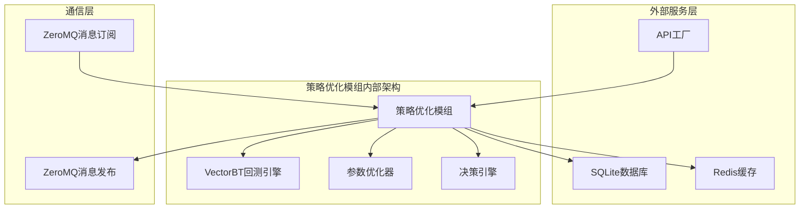
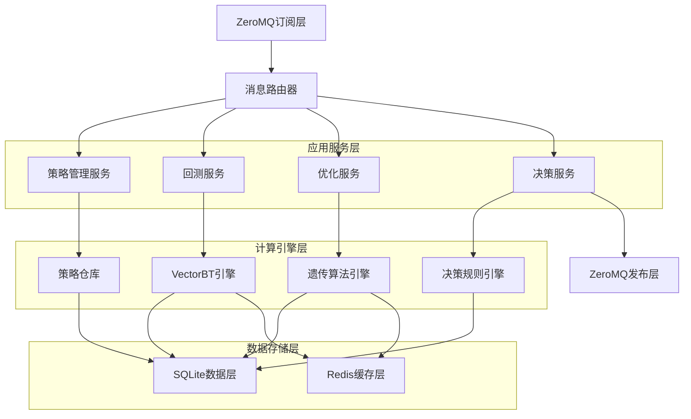
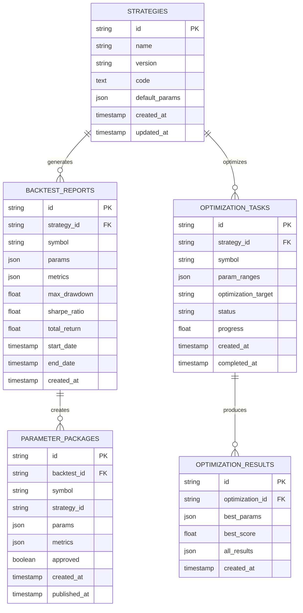

# 策略优化模组技术架构文档

## 1. Architecture design



## 2. Technology Description

* Frontend: 无（后台服务模组）

* Backend: Python\@3.9 + VectorBT + ZeroMQ + FastAPI

* Database: SQLite（本地存储）+ Redis（缓存和状态管理）

* Message Queue: ZeroMQ（PUB/SUB + REQ/REP模式）

* AI加速: Groq LPU集成

* 容器化: Docker + Docker Compose

## 3. Route definitions

| Route                   | Purpose         |
| ----------------------- | --------------- |
| /health                 | 健康检查接口，返回模组运行状态 |
| /api/backtest/start     | 启动回测任务接口        |
| /api/backtest/status    | 查询回测任务状态        |
| /api/strategies         | 策略管理接口，CRUD操作   |
| /api/optimization/start | 启动参数优化任务        |
| /api/reports            | 回测报告查询接口        |
| /api/metrics            | 性能指标监控接口        |

## 4. API definitions

### 4.1 Core API

**回测任务管理**

```
POST /api/backtest/start
```

Request:

| Param Name   | Param Type | isRequired | Description        |
| ------------ | ---------- | ---------- | ------------------ |
| symbol       | string     | true       | 交易对符号，如"RNDR/USDT" |
| strategy\_id | string     | true       | 策略标识符              |
| start\_date  | string     | true       | 回测开始日期             |
| end\_date    | string     | true       | 回测结束日期             |
| params       | object     | false      | 策略参数对象             |

Response:

| Param Name      | Param Type | Description |
| --------------- | ---------- | ----------- |
| task\_id        | string     | 回测任务ID      |
| status          | string     | 任务状态        |
| estimated\_time | integer    | 预估完成时间（秒）   |

Example:

```json
{
  "symbol": "RNDR/USDT",
  "strategy_id": "grid_v1.2",
  "start_date": "2024-01-01",
  "end_date": "2024-01-31",
  "params": {
    "grid_num": 20,
    "profit_ratio": 0.015
  }
}
```

**参数优化**

```
POST /api/optimization/start
```

Request:

| Param Name           | Param Type | isRequired | Description                  |
| -------------------- | ---------- | ---------- | ---------------------------- |
| symbol               | string     | true       | 交易对符号                        |
| strategy\_id         | string     | true       | 策略标识符                        |
| param\_ranges        | object     | true       | 参数优化范围                       |
| optimization\_target | string     | true       | 优化目标（sharpe/return/drawdown） |
| max\_iterations      | integer    | false      | 最大迭代次数，默认100                 |

Response:

| Param Name       | Param Type | Description |
| ---------------- | ---------- | ----------- |
| optimization\_id | string     | 优化任务ID      |
| status           | string     | 任务状态        |
| progress         | float      | 优化进度（0-1）   |

**策略审批**

```
POST /api/strategies/approve
```

Request:

| Param Name         | Param Type | isRequired | Description |
| ------------------ | ---------- | ---------- | ----------- |
| strategy\_id       | string     | true       | 策略ID        |
| backtest\_id       | string     | true       | 回测结果ID      |
| approval\_criteria | object     | false      | 审批标准覆盖      |

Response:

| Param Name         | Param Type | Description  |
| ------------------ | ---------- | ------------ |
| approved           | boolean    | 是否通过审批       |
| reason             | string     | 审批原因         |
| parameter\_package | object     | 生成的参数包（如果通过） |

## 5. Server architecture diagram



## 6. Data model

### 6.1 Data model definition



### 6.2 Data Definition Language

**策略表 (strategies)**

```sql
-- 创建策略表
CREATE TABLE strategies (
    id VARCHAR(50) PRIMARY KEY,
    name VARCHAR(100) NOT NULL,
    version VARCHAR(20) NOT NULL,
    code TEXT NOT NULL,
    default_params JSON,
    created_at TIMESTAMP DEFAULT CURRENT_TIMESTAMP,
    updated_at TIMESTAMP DEFAULT CURRENT_TIMESTAMP
);

-- 创建索引
CREATE INDEX idx_strategies_name ON strategies(name);
CREATE INDEX idx_strategies_version ON strategies(version);
```

**回测报告表 (backtest\_reports)**

```sql
-- 创建回测报告表
CREATE TABLE backtest_reports (
    id VARCHAR(50) PRIMARY KEY,
    strategy_id VARCHAR(50) NOT NULL,
    symbol VARCHAR(20) NOT NULL,
    params JSON NOT NULL,
    metrics JSON NOT NULL,
    max_drawdown REAL,
    sharpe_ratio REAL,
    total_return REAL,
    start_date TIMESTAMP,
    end_date TIMESTAMP,
    created_at TIMESTAMP DEFAULT CURRENT_TIMESTAMP,
    FOREIGN KEY (strategy_id) REFERENCES strategies(id)
);

-- 创建索引
CREATE INDEX idx_backtest_strategy_id ON backtest_reports(strategy_id);
CREATE INDEX idx_backtest_symbol ON backtest_reports(symbol);
CREATE INDEX idx_backtest_created_at ON backtest_reports(created_at DESC);
CREATE INDEX idx_backtest_sharpe ON backtest_reports(sharpe_ratio DESC);
```

**优化任务表 (optimization\_tasks)**

```sql
-- 创建优化任务表
CREATE TABLE optimization_tasks (
    id VARCHAR(50) PRIMARY KEY,
    strategy_id VARCHAR(50) NOT NULL,
    symbol VARCHAR(20) NOT NULL,
    param_ranges JSON NOT NULL,
    optimization_target VARCHAR(20) NOT NULL,
    status VARCHAR(20) DEFAULT 'pending',
    progress REAL DEFAULT 0.0,
    created_at TIMESTAMP DEFAULT CURRENT_TIMESTAMP,
    completed_at TIMESTAMP,
    FOREIGN KEY (strategy_id) REFERENCES strategies(id)
);

-- 创建索引
CREATE INDEX idx_optimization_strategy_id ON optimization_tasks(strategy_id);
CREATE INDEX idx_optimization_status ON optimization_tasks(status);
CREATE INDEX idx_optimization_created_at ON optimization_tasks(created_at DESC);
```

**优化结果表 (optimization\_results)**

```sql
-- 创建优化结果表
CREATE TABLE optimization_results (
    id VARCHAR(50) PRIMARY KEY,
    optimization_id VARCHAR(50) NOT NULL,
    best_params JSON NOT NULL,
    best_score REAL NOT NULL,
    all_results JSON,
    created_at TIMESTAMP DEFAULT CURRENT_TIMESTAMP,
    FOREIGN KEY (optimization_id) REFERENCES optimization_tasks(id)
);

-- 创建索引
CREATE INDEX idx_optimization_results_task_id ON optimization_results(optimization_id);
CREATE INDEX idx_optimization_results_score ON optimization_results(best_score DESC);
```

**参数包表 (parameter\_packages)**

```sql
-- 创建参数包表
CREATE TABLE parameter_packages (
    id VARCHAR(50) PRIMARY KEY,
    backtest_id VARCHAR(50) NOT NULL,
    symbol VARCHAR(20) NOT NULL,
    strategy_id VARCHAR(50) NOT NULL,
    params JSON NOT NULL,
    metrics JSON NOT NULL,
    approved BOOLEAN DEFAULT FALSE,
    created_at TIMESTAMP DEFAULT CURRENT_TIMESTAMP,
    published_at TIMESTAMP,
    FOREIGN KEY (backtest_id) REFERENCES backtest_reports(id),
    FOREIGN KEY (strategy_id) REFERENCES strategies(id)
);

-- 创建索引
CREATE INDEX idx_parameter_packages_symbol ON parameter_packages(symbol);
CREATE INDEX idx_parameter_packages_approved ON parameter_packages(approved);
CREATE INDEX idx_parameter_packages_created_at ON parameter_packages(created_at DESC);
```

**初始化数据**

```sql
-- 插入默认网格策略
INSERT INTO strategies (id, name, version, code, default_params) VALUES (
    'grid_v1.2',
    'Grid Trading Strategy',
    '1.2',
    '# Grid trading strategy implementation\n# ...',
    '{"grid_num": 10, "profit_ratio": 0.01, "stop_loss": 0.05}'
);

-- 插入默认均线策略
INSERT INTO strategies (id, name, version, code, default_params) VALUES (
    'ma_cross_v1.0',
    'Moving Average Cross Strategy',
    '1.0',
    '# MA cross strategy implementation\n# ...',
    '{"fast_period": 5, "slow_period": 20, "signal_threshold": 0.02}'
);
```

