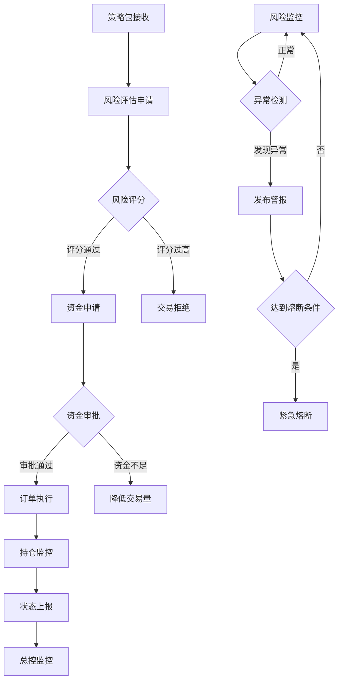

# 交易执行铁三角 - 产品需求文档

## 1. Product Overview

交易执行铁三角是一个分布式量化交易系统的核心执行模块，由交易员(Trader)、风控(Risk Control)、财务(Finance)三个模组构成。系统采用微服务架构，通过ZeroMQ消息总线实现高效协同，确保交易执行的安全性、合规性和资金管理的智能化。

本系统解决了传统交易系统中风险控制滞后、资金分配不合理、模块耦合度高等问题，为量化交易团队提供了一个可扩展、高可靠的交易执行平台。

目标是构建一个零配置、轻量级部署的交易执行系统，适合初期预算有限的量化交易团队快速上线。

## 2. Core Features

### 2.1 User Roles

| Role | Registration Method | Core Permissions |
|------|---------------------|------------------|
| 系统管理员 | 系统初始化配置 | 全局系统配置、环境切换、紧急熔断 |
| 交易策略师 | 内部邀请注册 | 策略参数配置、交易计划制定、执行监控 |
| 风控专员 | 内部邀请注册 | 风险规则配置、风险评分审核、警报处理 |
| 财务管理员 | 内部邀请注册 | 资金分配策略、预算审批、账户监控 |

### 2.2 Feature Module

我们的交易执行铁三角系统包含以下核心页面：

1. **系统总控台**: 全局状态监控、模组健康检查、紧急控制面板
2. **交易员工作台**: 策略包接收、交易计划制定、订单执行监控
3. **风控管理台**: 风险评估配置、实时风险监控、警报管理
4. **财务管理台**: 资金分配策略、预算审批流程、账户状态监控
5. **系统配置页**: 环境管理、通信配置、数据库设置
6. **监控仪表板**: 实时数据展示、性能指标、历史统计

### 2.3 Page Details

| Page Name | Module Name | Feature description |
|-----------|-------------|---------------------|
| 系统总控台 | 全局监控面板 | 实时显示所有模组状态、Redis数据概览、系统健康度指标 |
| 系统总控台 | 紧急控制中心 | 一键熔断、模式切换(牛/熊市)、全局指令发布 |
| 交易员工作台 | 策略包管理 | 接收optimizer推送的策略包、策略参数展示、执行优先级排序 |
| 交易员工作台 | 风险财务申请 | 向风控申请风险评估、向财务申请资金、审批状态跟踪 |
| 交易员工作台 | 订单执行器 | TWAP/VWAP智能订单执行、实时持仓监控、执行日志记录 |
| 风控管理台 | 风险评分引擎 | 交易前风险评估、1-10分风险评分、评分规则配置 |
| 风控管理台 | 实时监控系统 | 持仓风险监控、市场异动检测、黑天鹅事件预警 |
| 风控管理台 | 警报管理中心 | 风险警报发布、熔断触发条件、历史警报查询 |
| 财务管理台 | 资金分配算法 | 基于风险评分的动态资金分配、分配策略配置、历史分配记录 |
| 财务管理台 | 预算审批流程 | 交易预算申请处理、审批决策记录、资金使用追踪 |
| 财务管理台 | 账户健康检查 | 总资金监控、各策略资金占用、盈亏统计分析 |
| 系统配置页 | 环境管理 | development/staging/production环境切换、配置文件管理 |
| 系统配置页 | 通信配置 | ZeroMQ连接设置、Redis连接配置、API密钥管理 |
| 监控仪表板 | 实时数据展示 | 交易量统计、成功率指标、延迟监控、错误率统计 |
| 监控仪表板 | 历史分析 | 交易历史查询、性能趋势分析、模组运行日志 |

## 3. Core Process

### 主要用户操作流程

**交易执行流程**：
1. 交易策略师在交易员工作台接收来自策略优化模组的策略包
2. 系统自动向风控模组发起风险评估请求，获得1-10分的风险评分
3. 基于风险评分向财务模组申请交易资金，财务模组根据算法批准相应额度
4. 交易员工作台执行TWAP/VWAP智能订单，通过API工厂完成实际交易
5. 所有模组实时上报状态到Redis，总控台进行全局监控

**风险管控流程**：
1. 风控专员配置风险评估规则和熔断条件
2. 系统实时监控市场数据和持仓状况
3. 检测到异常时自动发布风险警报
4. 达到熔断条件时触发紧急停止交易

**资金管理流程**：
1. 财务管理员设置资金分配策略和风险系数
2. 系统根据风险评分动态计算可分配资金
3. 实时监控各策略资金使用情况
4. 定期生成资金使用报告和盈亏分析

## 4. User Interface Design

### 4.1 Design Style

- **主色调**: 深蓝色(#1e3a8a)作为主色，代表专业和稳定；橙色(#f59e0b)作为强调色，用于警告和重要操作
- **辅助色**: 灰色系(#6b7280, #f3f4f6)用于背景和次要信息；绿色(#10b981)表示成功状态；红色(#ef4444)表示危险状态
- **按钮样式**: 圆角矩形按钮，主要操作使用实心按钮，次要操作使用边框按钮
- **字体**: 中文使用微软雅黑，英文使用Roboto，代码使用Consolas等宽字体
- **布局风格**: 卡片式布局，顶部导航栏，左侧功能菜单，主要内容区域采用网格布局
- **图标风格**: 使用线性图标风格，简洁明了，支持状态变化动画

### 4.2 Page Design Overview

| Page Name | Module Name | UI Elements |
|-----------|-------------|-------------|
| 系统总控台 | 全局监控面板 | 深色主题仪表板，实时数据卡片，状态指示灯(绿/黄/红)，圆形进度条显示系统健康度 |
| 系统总控台 | 紧急控制中心 | 大红色紧急熔断按钮，模式切换开关，全局指令下拉选择器，确认对话框 |
| 交易员工作台 | 策略包管理 | 策略卡片列表，优先级标签，参数展示表格，执行状态进度条 |
| 交易员工作台 | 订单执行器 | 实时K线图表，订单执行日志表格，持仓饼图，TWAP执行进度条 |
| 风控管理台 | 风险评分引擎 | 评分滑块(1-10)，风险热力图，评分历史趋势图，规则配置表单 |
| 风控管理台 | 警报管理中心 | 警报列表，严重程度颜色编码，时间轴展示，一键确认按钮 |
| 财务管理台 | 资金分配算法 | 资金分配饼图，算法参数调节器，分配历史表格，实时资金流水 |
| 财务管理台 | 账户健康检查 | 账户总览仪表板，盈亏曲线图，资金使用率环形图，健康度评分 |
| 系统配置页 | 环境管理 | 环境切换标签页，配置文件编辑器，保存/重置按钮，环境状态指示 |
| 监控仪表板 | 实时数据展示 | 多维度图表组合，实时数据流，性能指标卡片，可自定义布局 |

### 4.3 Responsiveness

系统采用桌面优先设计，主要面向专业交易人员使用大屏幕显示器。支持最小1920x1080分辨率，针对多屏幕环境进行优化。移动端提供基础监控功能，支持紧急操作和警报查看。不考虑触摸交互优化，专注于鼠标和键盘操作的高效性。