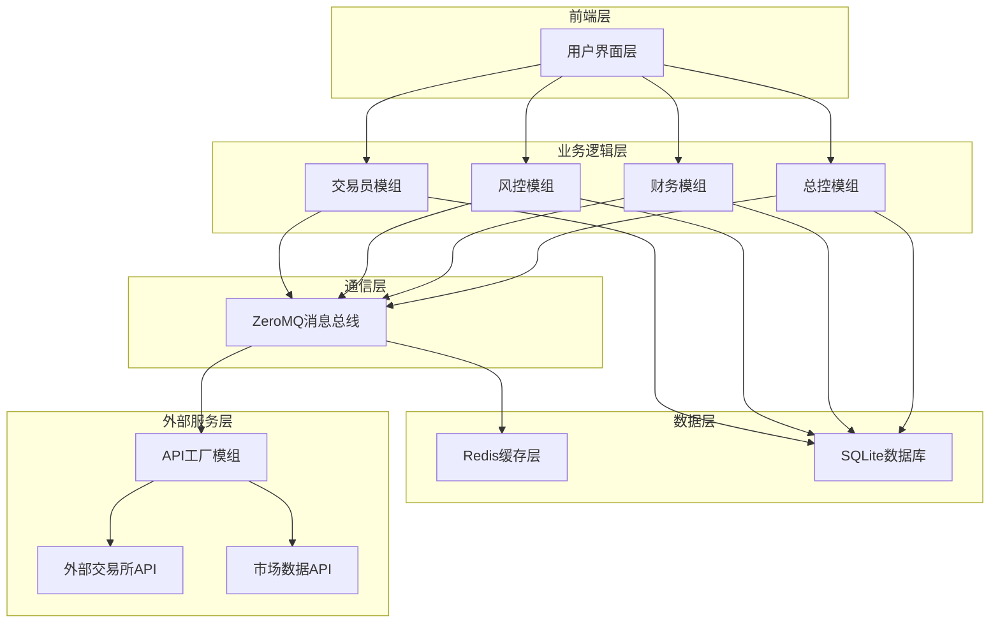
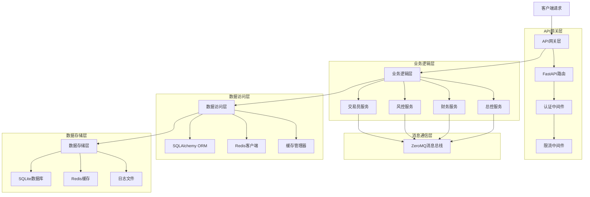
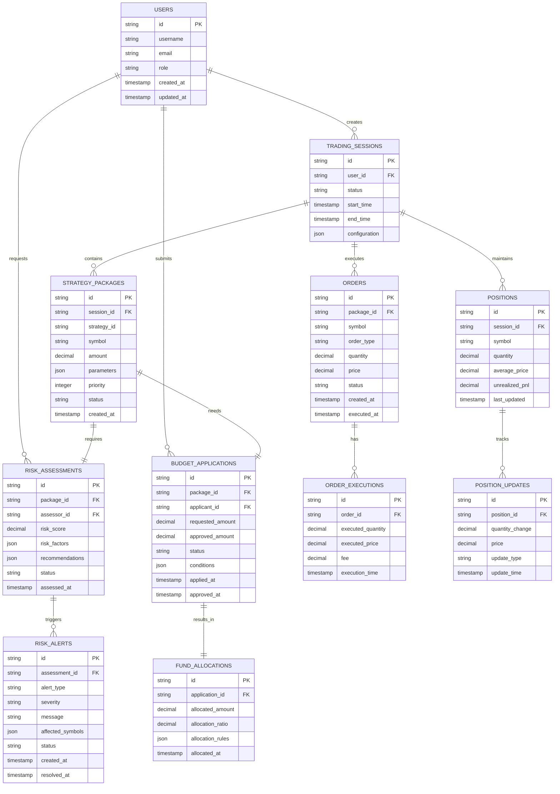

# 交易执行铁三角 - 技术架构文档

## 1. Architecture design



## 2. Technology Description

* **前端**: React\@18 + TypeScript + Tailwind CSS + Vite + Recharts(图表库)

* **后端**: Python\@3.9 + FastAPI + ZeroMQ + SQLAlchemy

* **消息队列**: ZeroMQ (PUB/SUB, REQ/REP模式)

* **缓存**: Redis\@7.0 (状态存储、实时数据缓存)

* **数据库**: SQLite (轻量级、零配置)

* **容器化**: Docker + Docker Compose

* **AI集成**: TradingAgents-CN v3.0

## 3. Route definitions

| Route      | Purpose                 |
| ---------- | ----------------------- |
| /          | 系统总控台首页，显示全局监控面板和紧急控制中心 |
| /trader    | 交易员工作台，策略包管理和订单执行       |
| /risk      | 风控管理台，风险评估和实时监控         |
| /finance   | 财务管理台，资金分配和预算审批         |
| /config    | 系统配置页，环境管理和通信配置         |
| /dashboard | 监控仪表板，实时数据展示和历史分析       |
| /login     | 用户登录页面                  |
| /api/docs  | API文档页面                 |

## 4. API definitions

### 4.1 Core API

#### 交易员模组API

**策略包接收**

```
POST /api/trader/strategy-packages
```

Request:

| Param Name   | Param Type | isRequired | Description |
| ------------ | ---------- | ---------- | ----------- |
| strategy\_id | string     | true       | 策略唯一标识符     |
| symbol       | string     | true       | 交易对符号       |
| amount       | number     | true       | 交易数量        |
| parameters   | object     | true       | 策略参数包       |
| priority     | integer    | false      | 执行优先级(1-10) |

Response:

| Param Name                 | Param Type | Description             |
| -------------------------- | ---------- | ----------------------- |
| status                     | string     | 接收状态(accepted/rejected) |
| package\_id                | string     | 策略包ID                   |
| estimated\_execution\_time | string     | 预估执行时间                  |

**风险评估请求**

```
POST /api/trader/risk-evaluation
```

Request:

| Param Name  | Param Type | isRequired | Description |
| ----------- | ---------- | ---------- | ----------- |
| package\_id | string     | true       | 策略包ID       |
| symbol      | string     | true       | 交易对         |
| amount      | number     | true       | 交易金额        |
| leverage    | number     | false      | 杠杆倍数        |

Response:

| Param Name       | Param Type | Description |
| ---------------- | ---------- | ----------- |
| risk\_score      | number     | 风险评分(1-10)  |
| suggestions      | array      | 风险建议列表      |
| approval\_status | string     | 审批状态        |

**资金申请**

```
POST /api/trader/budget-application
```

Request:

| Param Name        | Param Type | isRequired | Description |
| ----------------- | ---------- | ---------- | ----------- |
| package\_id       | string     | true       | 策略包ID       |
| requested\_amount | number     | true       | 申请金额        |
| risk\_score       | number     | true       | 风险评分        |
| justification     | string     | false      | 申请理由        |

Response:

| Param Name       | Param Type | Description |
| ---------------- | ---------- | ----------- |
| approved\_amount | number     | 批准金额        |
| approval\_ratio  | number     | 批准比例        |
| conditions       | array      | 批准条件        |

#### 风控模组API

**风险评估服务**

```
POST /api/risk/evaluate
```

Request:

| Param Name         | Param Type | isRequired | Description |
| ------------------ | ---------- | ---------- | ----------- |
| symbol             | string     | true       | 交易对         |
| amount             | number     | true       | 交易金额        |
| strategy\_type     | string     | true       | 策略类型        |
| market\_conditions | object     | false      | 市场条件        |

Response:

| Param Name      | Param Type | Description |
| --------------- | ---------- | ----------- |
| risk\_score     | number     | 风险评分(1-10)  |
| risk\_factors   | array      | 风险因子列表      |
| recommendations | array      | 建议措施        |

**警报发布**

```
POST /api/risk/alerts
```

Request:

| Param Name        | Param Type | isRequired | Description                    |
| ----------------- | ---------- | ---------- | ------------------------------ |
| alert\_type       | string     | true       | 警报类型                           |
| severity          | string     | true       | 严重程度(low/medium/high/critical) |
| message           | string     | true       | 警报消息                           |
| affected\_symbols | array      | false      | 影响的交易对                         |

Response:

| Param Name | Param Type | Description |
| ---------- | ---------- | ----------- |
| alert\_id  | string     | 警报ID        |
| timestamp  | string     | 发布时间        |
| status     | string     | 发布状态        |

#### 财务模组API

**资金分配**

```
POST /api/finance/allocate
```

Request:

| Param Name        | Param Type | isRequired | Description |
| ----------------- | ---------- | ---------- | ----------- |
| trader\_id        | string     | true       | 交易员ID       |
| strategy\_id      | string     | true       | 策略ID        |
| risk\_score       | number     | true       | 风险评分        |
| requested\_amount | number     | true       | 申请金额        |

Response:

| Param Name        | Param Type | Description |
| ----------------- | ---------- | ----------- |
| allocated\_amount | number     | 分配金额        |
| allocation\_ratio | number     | 分配比例        |
| conditions        | array      | 分配条件        |

**账户状态查询**

```
GET /api/finance/account-status
```

Response:

| Param Name         | Param Type | Description |
| ------------------ | ---------- | ----------- |
| total\_balance     | number     | 总余额         |
| available\_balance | number     | 可用余额        |
| allocated\_funds   | number     | 已分配资金       |
| profit\_loss       | number     | 总盈亏         |

## 5. Server architecture diagram



## 6. Data model

### 6.1 Data model definition



### 6.2 Data Definition Language

**用户表 (users)**

```sql
-- 创建用户表
CREATE TABLE users (
    id TEXT PRIMARY KEY DEFAULT (lower(hex(randomblob(16)))),
    username VARCHAR(50) UNIQUE NOT NULL,
    email VARCHAR(255) UNIQUE NOT NULL,
    password_hash VARCHAR(255) NOT NULL,
    role VARCHAR(20) NOT NULL CHECK (role IN ('admin', 'trader', 'risk_manager', 'finance_manager')),
    is_active BOOLEAN DEFAULT TRUE,
    created_at TIMESTAMP DEFAULT CURRENT_TIMESTAMP,
    updated_at TIMESTAMP DEFAULT CURRENT_TIMESTAMP
);

-- 创建索引
CREATE INDEX idx_users_role ON users(role);
CREATE INDEX idx_users_email ON users(email);
```

**交易会话表 (trading\_sessions)**

```sql
-- 创建交易会话表
CREATE TABLE trading_sessions (
    id TEXT PRIMARY KEY DEFAULT (lower(hex(randomblob(16)))),
    user_id TEXT NOT NULL,
    status VARCHAR(20) DEFAULT 'active' CHECK (status IN ('active', 'paused', 'stopped', 'completed')),
    start_time TIMESTAMP DEFAULT CURRENT_TIMESTAMP,
    end_time TIMESTAMP,
    configuration JSON,
    total_pnl DECIMAL(15,8) DEFAULT 0,
    created_at TIMESTAMP DEFAULT CURRENT_TIMESTAMP,
    FOREIGN KEY (user_id) REFERENCES users(id)
);

-- 创建索引
CREATE INDEX idx_trading_sessions_user_id ON trading_sessions(user_id);
CREATE INDEX idx_trading_sessions_status ON trading_sessions(status);
CREATE INDEX idx_trading_sessions_start_time ON trading_sessions(start_time DESC);
```

**策略包表 (strategy\_packages)**

```sql
-- 创建策略包表
CREATE TABLE strategy_packages (
    id TEXT PRIMARY KEY DEFAULT (lower(hex(randomblob(16)))),
    session_id TEXT NOT NULL,
    strategy_id VARCHAR(100) NOT NULL,
    symbol VARCHAR(20) NOT NULL,
    amount DECIMAL(15,8) NOT NULL,
    parameters JSON NOT NULL,
    priority INTEGER DEFAULT 5 CHECK (priority BETWEEN 1 AND 10),
    status VARCHAR(20) DEFAULT 'pending' CHECK (status IN ('pending', 'risk_assessment', 'budget_approval', 'executing', 'completed', 'failed', 'cancelled')),
    created_at TIMESTAMP DEFAULT CURRENT_TIMESTAMP,
    updated_at TIMESTAMP DEFAULT CURRENT_TIMESTAMP,
    FOREIGN KEY (session_id) REFERENCES trading_sessions(id)
);

-- 创建索引
CREATE INDEX idx_strategy_packages_session_id ON strategy_packages(session_id);
CREATE INDEX idx_strategy_packages_status ON strategy_packages(status);
CREATE INDEX idx_strategy_packages_priority ON strategy_packages(priority DESC);
CREATE INDEX idx_strategy_packages_symbol ON strategy_packages(symbol);
```

**风险评估表 (risk\_assessments)**

```sql
-- 创建风险评估表
CREATE TABLE risk_assessments (
    id TEXT PRIMARY KEY DEFAULT (lower(hex(randomblob(16)))),
    package_id TEXT NOT NULL,
    assessor_id TEXT NOT NULL,
    risk_score DECIMAL(3,1) NOT NULL CHECK (risk_score BETWEEN 1.0 AND 10.0),
    risk_factors JSON,
    recommendations JSON,
    status VARCHAR(20) DEFAULT 'pending' CHECK (status IN ('pending', 'approved', 'rejected', 'requires_review')),
    assessed_at TIMESTAMP DEFAULT CURRENT_TIMESTAMP,
    FOREIGN KEY (package_id) REFERENCES strategy_packages(id),
    FOREIGN KEY (assessor_id) REFERENCES users(id)
);

-- 创建索引
CREATE INDEX idx_risk_assessments_package_id ON risk_assessments(package_id);
CREATE INDEX idx_risk_assessments_assessor_id ON risk_assessments(assessor_id);
CREATE INDEX idx_risk_assessments_risk_score ON risk_assessments(risk_score DESC);
CREATE INDEX idx_risk_assessments_status ON risk_assessments(status);
```

**预算申请表 (budget\_applications)**

```sql
-- 创建预算申请表
CREATE TABLE budget_applications (
    id TEXT PRIMARY KEY DEFAULT (lower(hex(randomblob(16)))),
    package_id TEXT NOT NULL,
    applicant_id TEXT NOT NULL,
    requested_amount DECIMAL(15,8) NOT NULL,
    approved_amount DECIMAL(15,8) DEFAULT 0,
    risk_score DECIMAL(3,1),
    status VARCHAR(20) DEFAULT 'pending' CHECK (status IN ('pending', 'approved', 'rejected', 'partial_approved')),
    conditions JSON,
    applied_at TIMESTAMP DEFAULT CURRENT_TIMESTAMP,
    approved_at TIMESTAMP,
    FOREIGN KEY (package_id) REFERENCES strategy_packages(id),
    FOREIGN KEY (applicant_id) REFERENCES users(id)
);

-- 创建索引
CREATE INDEX idx_budget_applications_package_id ON budget_applications(package_id);
CREATE INDEX idx_budget_applications_applicant_id ON budget_applications(applicant_id);
CREATE INDEX idx_budget_applications_status ON budget_applications(status);
CREATE INDEX idx_budget_applications_applied_at ON budget_applications(applied_at DESC);
```

**订单表 (orders)**

```sql
-- 创建订单表
CREATE TABLE orders (
    id TEXT PRIMARY KEY DEFAULT (lower(hex(randomblob(16)))),
    package_id TEXT NOT NULL,
    symbol VARCHAR(20) NOT NULL,
    order_type VARCHAR(20) NOT NULL CHECK (order_type IN ('market', 'limit', 'twap', 'vwap')),
    side VARCHAR(10) NOT NULL CHECK (side IN ('buy', 'sell')),
    quantity DECIMAL(15,8) NOT NULL,
    price DECIMAL(15,8),
    executed_quantity DECIMAL(15,8) DEFAULT 0,
    average_price DECIMAL(15,8) DEFAULT 0,
    status VARCHAR(20) DEFAULT 'pending' CHECK (status IN ('pending', 'partial_filled', 'filled', 'cancelled', 'failed')),
    created_at TIMESTAMP DEFAULT CURRENT_TIMESTAMP,
    executed_at TIMESTAMP,
    FOREIGN KEY (package_id) REFERENCES strategy_packages(id)
);

-- 创建索引
CREATE INDEX idx_orders_package_id ON orders(package_id);
CREATE INDEX idx_orders_symbol ON orders(symbol);
CREATE INDEX idx_orders_status ON orders(status);
CREATE INDEX idx_orders_created_at ON orders(created_at DESC);
```

**风险警报表 (risk\_alerts)**

```sql
-- 创建风险警报表
CREATE TABLE risk_alerts (
    id TEXT PRIMARY KEY DEFAULT (lower(hex(randomblob(16)))),
    alert_type VARCHAR(50) NOT NULL,
    severity VARCHAR(20) NOT NULL CHECK (severity IN ('low', 'medium', 'high', 'critical')),
    message TEXT NOT NULL,
    affected_symbols JSON,
    source_module VARCHAR(50),
    status VARCHAR(20) DEFAULT 'active' CHECK (status IN ('active', 'acknowledged', 'resolved')),
    created_at TIMESTAMP DEFAULT CURRENT_TIMESTAMP,
    resolved_at TIMESTAMP
);

-- 创建索引
CREATE INDEX idx_risk_alerts_severity ON risk_alerts(severity);
CREATE INDEX idx_risk_alerts_status ON risk_alerts(status);
CREATE INDEX idx_risk_alerts_created_at ON risk_alerts(created_at DESC);
CREATE INDEX idx_risk_alerts_alert_type ON risk_alerts(alert_type);
```

**初始化数据**

```sql
-- 插入默认管理员用户
INSERT INTO users (username, email, password_hash, role) VALUES 
('admin', 'admin@tradeguard.com', 'hashed_password_here', 'admin'),
('trader1', 'trader1@tradeguard.com', 'hashed_password_here', 'trader'),
('risk_manager1', 'risk@tradeguard.com', 'hashed_password_here', 'risk_manager'),
('finance_manager1', 'finance@tradeguard.com', 'hashed_password_here', 'finance_manager');

-- 插入默认风险评估规则
INSERT INTO risk_alerts (alert_type, severity, message, source_module, status) VALUES 
('system_startup', 'low', '交易执行铁三角系统已启动', 'master_control', 'resolved'),
('database_initialized', 'low', '数据库初始化完成', 'master_control', 'resolved');
```

