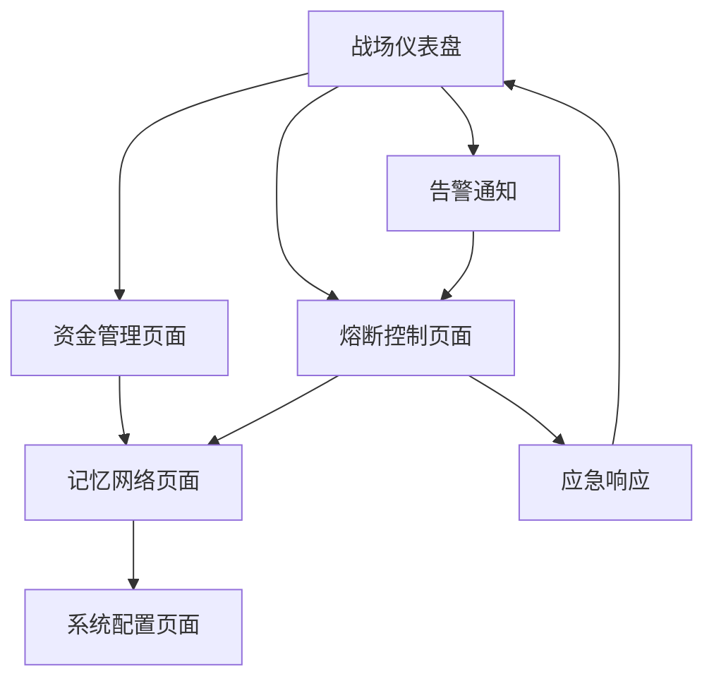

# 模组八：总控模块 (Master Control Module) 产品需求文档

## 1. 产品概述

模组八总控模块是整个NeuroTrade Nexus交易系统的决策大脑和指挥中心。作为系统的"总司令"，它不执行具体交易操作，而是通过监控全局状态、分析宏观市场环境，做出最高级别的战略决策。

该模块采用"化整为零，分而治之"的设计理念，通过ZeroMQ消息总线与其他8个独立模组协同工作，实现低延迟、高可靠性的分布式交易系统管控。

产品的核心价值在于提供智能化的风险管控和资金管理，能够在市场极端情况下自动执行熔断机制，保护交易资金安全。

## 2. 核心功能

### 2.1 用户角色

| 角色 | 注册方式 | 核心权限 |
|------|----------|----------|
| 系统管理员 | 内部配置 | 可查看所有监控数据、手动触发熔断、修改系统参数 |
| 交易监控员 | 管理员授权 | 可查看实时状态、接收告警通知、执行预设操作 |
| 只读用户 | 邀请码注册 | 仅可查看基础监控面板和历史数据 |

### 2.2 功能模块

我们的总控模块需求包含以下核心页面：

1. **战场仪表盘页面**：实时监控面板、市场状态指标、系统健康度展示
2. **资金管理页面**：资金模式切换、预算分配监控、风险敞口管理
3. **熔断控制页面**：紧急熔断触发、风险事件处理、应急预案执行
4. **记忆网络页面**：历史事件回顾、决策模式学习、策略优化建议
5. **系统配置页面**：环境参数设置、通信配置、日志管理

### 2.3 页面详情

| 页面名称 | 模块名称 | 功能描述 |
|----------|----------|----------|
| 战场仪表盘页面 | 实时监控面板 | 显示牛熊指数、板块轮动、市场杠杆率等关键指标，支持自定义监控项和告警阈值设置 |
| 战场仪表盘页面 | 系统状态总览 | 汇总展示所有模组运行状态、连接健康度、消息队列状态，支持一键诊断功能 |
| 资金管理页面 | 模式切换器 | 根据总资金量自动切换微/低/标准资金模式，支持手动干预和策略调整 |
| 资金管理页面 | 风险敞口监控 | 实时计算和展示各交易对的风险敞口，提供风险分散度分析和建议 |
| 熔断控制页面 | 紧急熔断系统 | 在极端风险事件下执行一键清仓、资产转移等最高权限操作，支持分级熔断策略 |
| 熔断控制页面 | 风险事件处理 | 自动识别和响应市场异常事件，执行预设的风险应对方案 |
| 记忆网络页面 | 历史事件库 | 存储和检索历史重大事件处置方案，支持事件标签分类和相似度匹配 |
| 记忆网络页面 | 决策学习引擎 | 基于历史数据训练决策模型，提供策略优化建议和风险预警 |
| 系统配置页面 | 环境管理 | 管理development/staging/production三套环境的配置和切换 |
| 系统配置页面 | 通信配置 | 配置ZeroMQ连接参数、Redis连接设置、API密钥管理 |

## 3. 核心流程

### 主要用户操作流程

**系统管理员流程：**
1. 登录系统后进入战场仪表盘，查看全局系统状态
2. 根据市场情况在资金管理页面调整资金模式和风险参数
3. 监控各模组运行状态，必要时通过熔断控制页面执行应急操作
4. 在记忆网络页面回顾历史事件，优化决策策略
5. 通过系统配置页面管理环境和参数设置

**交易监控员流程：**
1. 进入战场仪表盘查看实时市场状态和系统健康度
2. 接收系统告警通知，评估风险等级
3. 根据预设权限执行相应的风险应对操作
4. 记录和上报异常事件，协助系统优化

## 4. 用户界面设计

### 4.1 设计风格

- **主色调**：深蓝色 (#1a365d) 作为主色，橙色 (#ed8936) 作为强调色
- **按钮风格**：圆角矩形按钮，支持悬停和点击状态变化
- **字体**：主要使用 'Microsoft YaHei', Arial, sans-serif，标题16px，正文14px
- **布局风格**：响应式卡片布局，顶部导航栏 + 侧边栏 + 主内容区
- **图标风格**：使用简洁的线性图标，支持状态指示和动画效果

### 4.2 页面设计概览

| 页面名称 | 模块名称 | UI元素 |
|----------|----------|--------|
| 战场仪表盘页面 | 实时监控面板 | 大屏显示风格，深色背景，多色彩图表，实时数据流动画效果，支持全屏模式 |
| 资金管理页面 | 模式切换器 | 卡片式布局，清晰的状态指示器，滑动开关组件，资金流向可视化图表 |
| 熔断控制页面 | 紧急熔断系统 | 红色警告色调，大号操作按钮，确认对话框，操作日志时间轴展示 |
| 记忆网络页面 | 历史事件库 | 时间轴布局，事件卡片展示，标签云组件，搜索和筛选功能 |
| 系统配置页面 | 环境管理 | 表单式布局，分组配置项，实时验证反馈，配置导入导出功能 |

### 4.3 响应式设计

产品采用桌面优先的响应式设计，主要面向大屏监控场景。在移动端提供基础的监控查看功能，但复杂操作仍建议在桌面端进行。支持触摸操作优化，确保在平板设备上的良好体验。