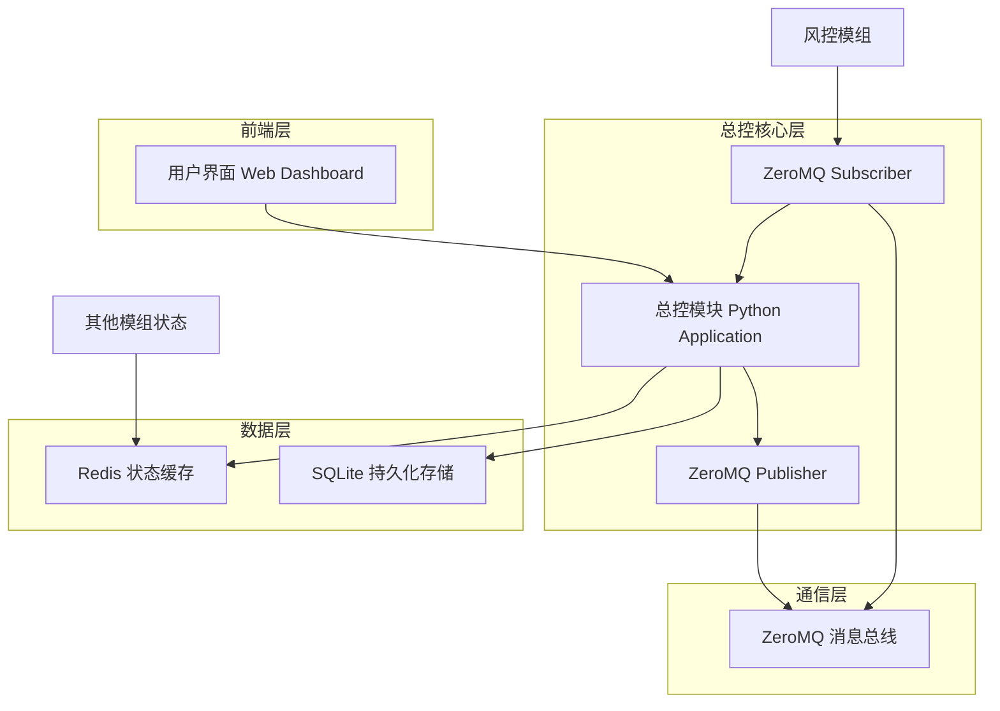
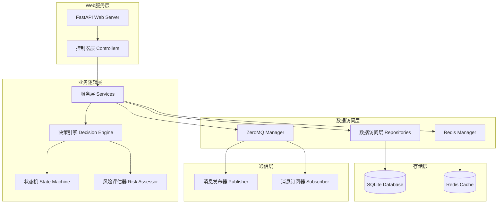
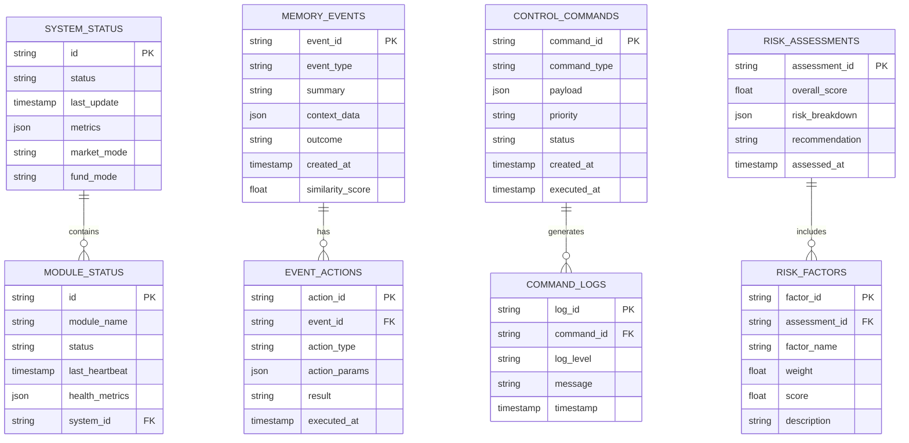

# 模组八：总控模块 (Master Control Module) 技术架构文档

## 1. 架构设计



## 2. 技术描述

* 前端：React\@18 + TypeScript + Ant Design + ECharts + WebSocket

* 后端：Python\@3.9 + FastAPI + ZeroMQ + Redis + SQLite

* 容器化：Docker + Docker Compose

* 监控：Prometheus + Grafana (可选)

## 3. 路由定义

| 路由               | 目的                    |
| ---------------- | --------------------- |
| /                | 战场仪表盘主页，显示系统总览和实时监控数据 |
| /dashboard       | 详细监控面板，包含所有关键指标和图表    |
| /fund-management | 资金管理页面，资金模式切换和风险敞口管理  |
| /circuit-breaker | 熔断控制页面，紧急操作和风险事件处理    |
| /memory-network  | 记忆网络页面，历史事件和决策学习      |
| /system-config   | 系统配置页面，环境管理和参数设置      |
| /api/status      | API接口，获取系统状态数据        |
| /api/commands    | API接口，发送控制指令          |
| /ws/realtime     | WebSocket连接，实时数据推送    |

## 4. API定义

### 4.1 核心API

#### 系统状态获取

```
GET /api/status/overview
```

响应：

| 参数名称             | 参数类型   | 描述                              |
| ---------------- | ------ | ------------------------------- |
| system\_health   | string | 系统健康状态：healthy/warning/critical |
| active\_modules  | array  | 活跃模组列表及其状态                      |
| market\_mode     | string | 当前市场模式：bull/bear/sideways       |
| fund\_mode       | string | 资金模式：micro/low/standard         |
| total\_positions | number | 总持仓数量                           |
| risk\_score      | number | 当前风险评分 (0-100)                  |

示例：

```json
{
  "system_health": "healthy",
  "active_modules": [
    {"name": "scanner", "status": "running", "last_heartbeat": "2024-01-15T10:30:00Z"},
    {"name": "trader", "status": "running", "last_heartbeat": "2024-01-15T10:30:00Z"}
  ],
  "market_mode": "bull",
  "fund_mode": "standard",
  "total_positions": 15,
  "risk_score": 25
}
```

#### 控制指令发送

```
POST /api/commands/execute
```

请求：

| 参数名称     | 参数类型   | 是否必需  | 描述                                                 |
| -------- | ------ | ----- | -------------------------------------------------- |
| command  | string | true  | 指令类型：SWITCH\_MODE/EMERGENCY\_SHUTDOWN/ADJUST\_RISK |
| payload  | object | true  | 指令参数                                               |
| priority | string | false | 优先级：low/medium/high/critical                       |

响应：

| 参数名称        | 参数类型    | 描述     |
| ----------- | ------- | ------ |
| success     | boolean | 指令执行状态 |
| command\_id | string  | 指令唯一标识 |
| message     | string  | 执行结果描述 |

示例：

```json
{
  "command": "SWITCH_MODE",
  "payload": {
    "mode": "DEFENSIVE",
    "reason": "Market volatility increased"
  },
  "priority": "high"
}
```

#### 历史事件查询

```
GET /api/memory/events
```

请求参数：

| 参数名称        | 参数类型   | 是否必需  | 描述              |
| ----------- | ------ | ----- | --------------- |
| event\_type | string | false | 事件类型筛选          |
| start\_date | string | false | 开始日期 (ISO 8601) |
| end\_date   | string | false | 结束日期 (ISO 8601) |
| limit       | number | false | 返回数量限制，默认50     |

响应：

| 参数名称      | 参数类型    | 描述      |
| --------- | ------- | ------- |
| events    | array   | 事件列表    |
| total     | number  | 总事件数量   |
| has\_more | boolean | 是否有更多数据 |

## 5. 服务器架构图



## 6. 数据模型

### 6.1 数据模型定义



### 6.2 数据定义语言

#### 系统状态表 (system\_status)

```sql
-- 创建系统状态表
CREATE TABLE system_status (
    id TEXT PRIMARY KEY DEFAULT (hex(randomblob(16))),
    status TEXT NOT NULL CHECK (status IN ('healthy', 'warning', 'critical')),
    last_update TIMESTAMP DEFAULT CURRENT_TIMESTAMP,
    metrics TEXT, -- JSON格式存储各种指标
    market_mode TEXT DEFAULT 'sideways' CHECK (market_mode IN ('bull', 'bear', 'sideways')),
    fund_mode TEXT DEFAULT 'standard' CHECK (fund_mode IN ('micro', 'low', 'standard')),
    created_at TIMESTAMP DEFAULT CURRENT_TIMESTAMP
);

-- 创建模组状态表
CREATE TABLE module_status (
    id TEXT PRIMARY KEY DEFAULT (hex(randomblob(16))),
    module_name TEXT NOT NULL,
    status TEXT NOT NULL CHECK (status IN ('running', 'stopped', 'error', 'maintenance')),
    last_heartbeat TIMESTAMP DEFAULT CURRENT_TIMESTAMP,
    health_metrics TEXT, -- JSON格式存储健康指标
    system_id TEXT,
    FOREIGN KEY (system_id) REFERENCES system_status(id)
);

-- 创建记忆事件表
CREATE TABLE memory_events (
    event_id TEXT PRIMARY KEY DEFAULT (hex(randomblob(16))),
    event_type TEXT NOT NULL,
    summary TEXT NOT NULL,
    context_data TEXT, -- JSON格式存储事件上下文
    outcome TEXT,
    similarity_score REAL DEFAULT 0.0,
    created_at TIMESTAMP DEFAULT CURRENT_TIMESTAMP
);

-- 创建事件行动表
CREATE TABLE event_actions (
    action_id TEXT PRIMARY KEY DEFAULT (hex(randomblob(16))),
    event_id TEXT NOT NULL,
    action_type TEXT NOT NULL,
    action_params TEXT, -- JSON格式存储行动参数
    result TEXT,
    executed_at TIMESTAMP DEFAULT CURRENT_TIMESTAMP,
    FOREIGN KEY (event_id) REFERENCES memory_events(event_id)
);

-- 创建控制指令表
CREATE TABLE control_commands (
    command_id TEXT PRIMARY KEY DEFAULT (hex(randomblob(16))),
    command_type TEXT NOT NULL,
    payload TEXT NOT NULL, -- JSON格式存储指令载荷
    priority TEXT DEFAULT 'medium' CHECK (priority IN ('low', 'medium', 'high', 'critical')),
    status TEXT DEFAULT 'pending' CHECK (status IN ('pending', 'executing', 'completed', 'failed')),
    created_at TIMESTAMP DEFAULT CURRENT_TIMESTAMP,
    executed_at TIMESTAMP
);

-- 创建风险评估表
CREATE TABLE risk_assessments (
    assessment_id TEXT PRIMARY KEY DEFAULT (hex(randomblob(16))),
    overall_score REAL NOT NULL CHECK (overall_score >= 0 AND overall_score <= 100),
    risk_breakdown TEXT, -- JSON格式存储风险分解
    recommendation TEXT,
    assessed_at TIMESTAMP DEFAULT CURRENT_TIMESTAMP
);

-- 创建索引
CREATE INDEX idx_module_status_name ON module_status(module_name);
CREATE INDEX idx_module_status_heartbeat ON module_status(last_heartbeat DESC);
CREATE INDEX idx_memory_events_type ON memory_events(event_type);
CREATE INDEX idx_memory_events_created ON memory_events(created_at DESC);
CREATE INDEX idx_control_commands_status ON control_commands(status);
CREATE INDEX idx_control_commands_priority ON control_commands(priority);
CREATE INDEX idx_risk_assessments_score ON risk_assessments(overall_score DESC);

-- 初始化数据
INSERT INTO system_status (status, market_mode, fund_mode, metrics) VALUES 
('healthy', 'sideways', 'standard', '{"cpu_usage": 15.2, "memory_usage": 45.8, "active_connections": 8}');

INSERT INTO memory_events (event_type, summary, context_data, outcome) VALUES 
('market_crash', 'LUNA崩盘事件处理', '{"trigger": "price_drop_80%", "duration": "2_hours", "affected_pairs": ["LUNA/USDT", "UST/USDT"]}', 'emergency_liquidation_successful'),
('system_overload', '高并发交易处理', '{"concurrent_orders": 1500, "response_time": "2.5s", "error_rate": "0.02%"}', 'load_balancing_activated'),
('api_failure', '交易所API故障', '{"exchange": "binance", "error_type": "timeout", "duration": "15_minutes"}', 'failover_to_backup_exchange');
```

