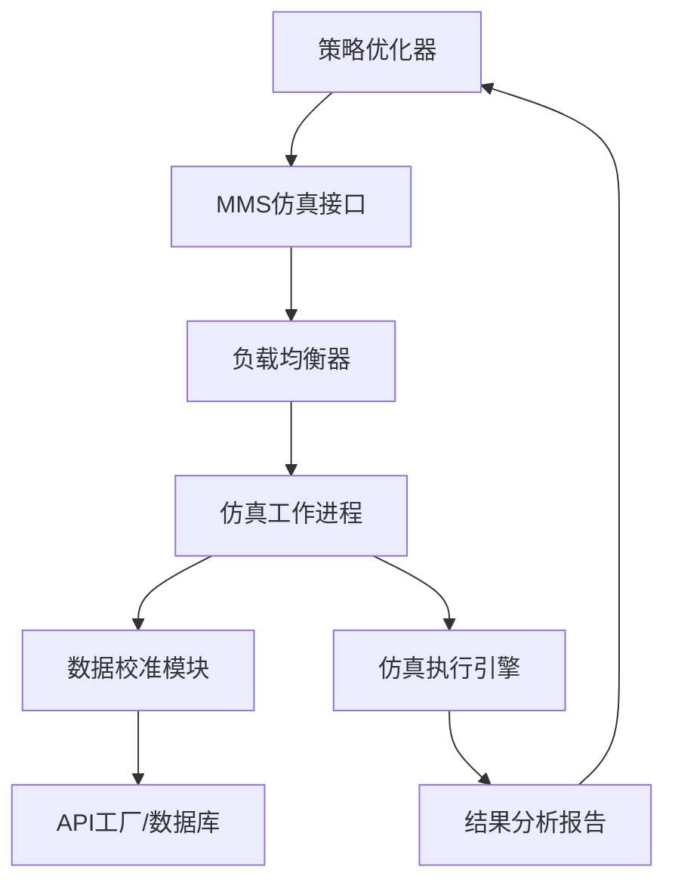

# 市场微结构仿真引擎 (MMS) 产品需求文档

## 1. Product Overview

市场微结构仿真引擎 (MMS) 是NeuroTrade Nexus交易系统的"虚拟现实"引擎，专门为策略压力测试和优化提供高度逼真的仿真环境。
- 核心目的：利用高度压缩的市场数据，提供比传统回测更逼真的仿真环境，用于评估交易策略在各种模拟市场条件下的表现。
- 目标用户：策略优化器模组、风险管理系统、交易策略开发团队。
- 市场价值：通过精确的市场微结构仿真，显著提升策略测试的准确性和可靠性，降低实盘交易风险。

## 2. Core Features

### 2.1 User Roles

| Role | Registration Method | Core Permissions |
|------|---------------------|------------------|
| 策略优化器模组 | 系统内部服务调用 | 可发起仿真请求、获取仿真结果报告 |
| 风险管理系统 | 系统内部服务调用 | 可进行压力测试、获取风险评估数据 |
| 系统管理员 | 管理界面登录 | 可配置仿真参数、监控系统状态 |

### 2.2 Feature Module

我们的市场微结构仿真引擎包含以下核心页面：
1. **仿真服务接口**：gRPC/HTTP RESTful API服务，策略仿真请求处理。
2. **数据校准模块**：历史数据获取，模型参数校准。
3. **仿真执行引擎**：市场条件模拟，策略表现评估。
4. **结果分析报告**：仿真结果生成，性能指标计算。

### 2.3 Page Details

| Page Name | Module Name | Feature description |
|-----------|-------------|---------------------|
| 仿真服务接口 | API端点管理 | 接收仿真请求，验证参数格式，返回仿真结果。支持POST /simulate端点，处理symbol、period、scenario等参数 |
| 仿真服务接口 | 负载均衡 | 管理多个工作进程，分发仿真任务，确保高并发处理能力 |
| 数据校准模块 | 历史数据获取 | 从API工厂或数据库获取实盘交易数据和历史行情，用于模型校准 |
| 数据校准模块 | 模型参数校准 | 基于历史数据校准滑点、成交概率、价格冲击等关键参数 |
| 仿真执行引擎 | 市场场景模拟 | 模拟各种市场条件（如黑天鹅事件），生成逼真的交易环境 |
| 仿真执行引擎 | 策略执行仿真 | 在模拟环境中执行交易策略，计算实际表现指标 |
| 结果分析报告 | 性能指标计算 | 计算滑点、成交概率、价格冲击等关键性能指标 |
| 结果分析报告 | 报告生成 | 生成详细的仿真报告，提供报告访问URL |

## 3. Core Process

### 策略仿真流程
1. 策略优化器模组发起仿真请求，包含交易对、时间周期、场景类型和策略参数
2. MMS验证请求参数，分配仿真任务到可用的工作进程
3. 工作进程从数据源获取相关历史数据，校准仿真模型参数
4. 执行市场场景模拟，在虚拟环境中运行交易策略
5. 计算关键性能指标（滑点、成交概率、价格冲击等）
6. 生成仿真报告并返回结果给调用方

### 系统集成流程

## 4. User Interface Design

### 4.1 Design Style
- 主色调：深蓝色 (#1e3a8a) 和科技绿 (#10b981)
- 辅助色：灰色系 (#6b7280, #f3f4f6)
- 按钮样式：圆角现代风格，带有微妙阴影效果
- 字体：系统默认字体，标题16px，正文14px，代码12px等宽字体
- 布局风格：卡片式布局，顶部导航，左侧功能面板
- 图标风格：线性图标，简洁现代，与金融科技主题一致

### 4.2 Page Design Overview

| Page Name | Module Name | UI Elements |
|-----------|-------------|-------------|
| 仿真服务接口 | API状态监控 | 实时状态指示器，绿色/红色状态灯，请求计数器，响应时间图表 |
| 仿真服务接口 | 请求日志 | 表格形式显示请求历史，包含时间戳、参数、状态、耗时等信息 |
| 数据校准模块 | 参数配置面板 | 滑块和输入框组合，实时预览校准效果，参数有效性验证 |
| 数据校准模块 | 数据源状态 | 连接状态指示，数据更新时间，数据质量评分 |
| 仿真执行引擎 | 进度监控 | 进度条显示仿真进度，当前处理阶段，预计完成时间 |
| 仿真执行引擎 | 实时指标 | 数字仪表盘显示关键指标，动态更新，颜色编码风险等级 |
| 结果分析报告 | 图表展示 | 交互式图表显示性能曲线，支持缩放和筛选，多维度对比 |
| 结果分析报告 | 报告下载 | 下载按钮，支持PDF/Excel格式，报告分享链接生成 |

### 4.3 Responsiveness
本系统主要面向桌面端专业用户，采用桌面优先设计。考虑到金融交易的专业性和复杂性，暂不考虑移动端适配，专注于大屏幕下的最佳用户体验。