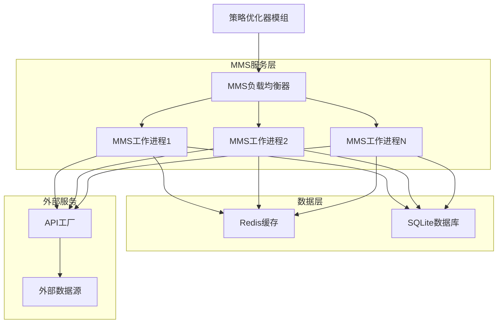
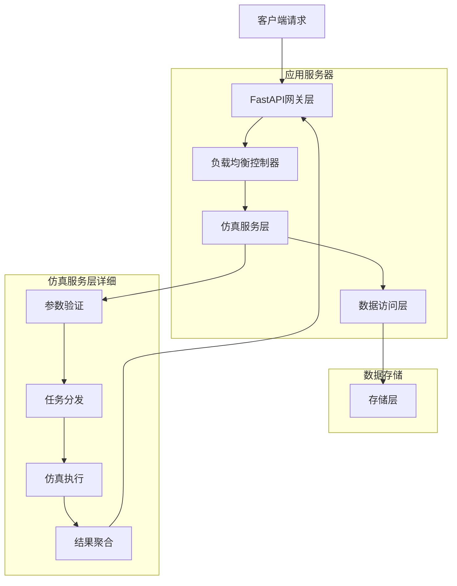
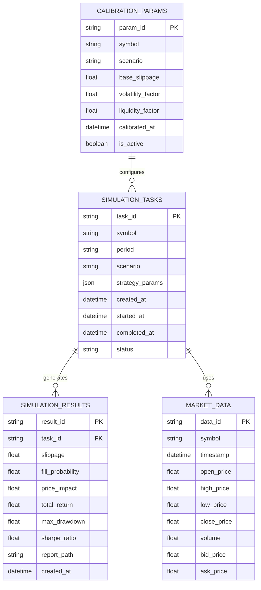

# 市场微结构仿真引擎 (MMS) 技术架构文档

## 1. Architecture design



## 2. Technology Description

* Frontend: 无独立前端（作为后端服务存在）

* Backend: Python\@3.9 + FastAPI + gRPC + ZeroMQ

* Database: SQLite（历史数据存储）+ Redis（缓存和状态管理）

* Container: Docker + Docker Compose

* Load Balancer: ZeroMQ DEALER/ROUTER模式

## 3. Route definitions

| Route           | Purpose              |
| --------------- | -------------------- |
| POST /simulate  | 主要仿真接口，接收仿真请求并返回结果   |
| GET /health     | 健康检查接口，返回服务状态        |
| GET /status     | 系统状态接口，返回工作进程状态和负载信息 |
| GET /metrics    | 性能指标接口，返回系统性能数据      |
| POST /calibrate | 模型校准接口，手动触发参数校准      |

## 4. API definitions

### 4.1 Core API

#### 仿真服务接口

```
POST /simulate
```

Request:

| Param Name       | Param Type | isRequired | Description                                         |
| ---------------- | ---------- | ---------- | --------------------------------------------------- |
| symbol           | string     | true       | 交易对符号，如"BTCUSDT"                                    |
| period           | string     | true       | 仿真时间周期，如"30d", "7d", "1h"                           |
| scenario         | string     | true       | 市场场景类型，如"normal", "black\_swan", "high\_volatility" |
| strategy\_params | object     | true       | 策略参数对象，包含具体的策略配置                                    |
| start\_time      | string     | false      | 仿真开始时间，ISO格式                                        |
| end\_time        | string     | false      | 仿真结束时间，ISO格式                                        |

Response:

| Param Name        | Param Type | Description |
| ----------------- | ---------- | ----------- |
| simulation\_id    | string     | 仿真任务唯一标识符   |
| slippage          | float      | 平均滑点值       |
| fill\_probability | float      | 成交概率        |
| price\_impact     | float      | 价格冲击系数      |
| total\_return     | float      | 总收益率        |
| max\_drawdown     | float      | 最大回撤        |
| sharpe\_ratio     | float      | 夏普比率        |
| report\_url       | string     | 详细报告访问链接    |
| execution\_time   | float      | 仿真执行时间（秒）   |

Example Request:

```json
{
  "symbol": "BTCUSDT",
  "period": "30d",
  "scenario": "black_swan",
  "strategy_params": {
    "entry_threshold": 0.02,
    "exit_threshold": 0.01,
    "position_size": 0.1,
    "stop_loss": 0.05
  }
}
```

Example Response:

```json
{
  "simulation_id": "sim_20241201_001",
  "slippage": 0.0015,
  "fill_probability": 0.98,
  "price_impact": 0.0005,
  "total_return": 0.125,
  "max_drawdown": -0.08,
  "sharpe_ratio": 1.85,
  "report_url": "http://mms:50051/reports/sim_20241201_001",
  "execution_time": 2.34
}
```

#### 系统状态接口

```
GET /status
```

Response:

| Param Name          | Param Type | Description                        |
| ------------------- | ---------- | ---------------------------------- |
| service\_status     | string     | 服务状态："running", "degraded", "down" |
| worker\_count       | integer    | 活跃工作进程数量                           |
| queue\_length       | integer    | 待处理任务队列长度                          |
| avg\_response\_time | float      | 平均响应时间（毫秒）                         |
| memory\_usage       | float      | 内存使用率                              |
| cpu\_usage          | float      | CPU使用率                             |

## 5. Server architecture diagram



## 6. Data model

### 6.1 Data model definition



### 6.2 Data Definition Language

#### 仿真任务表 (simulation\_tasks)

```sql
-- 创建仿真任务表
CREATE TABLE simulation_tasks (
    task_id VARCHAR(50) PRIMARY KEY,
    symbol VARCHAR(20) NOT NULL,
    period VARCHAR(10) NOT NULL,
    scenario VARCHAR(30) NOT NULL,
    strategy_params TEXT NOT NULL, -- JSON格式存储
    created_at TIMESTAMP DEFAULT CURRENT_TIMESTAMP,
    started_at TIMESTAMP,
    completed_at TIMESTAMP,
    status VARCHAR(20) DEFAULT 'pending' CHECK (status IN ('pending', 'running', 'completed', 'failed'))
);

-- 创建索引
CREATE INDEX idx_simulation_tasks_symbol ON simulation_tasks(symbol);
CREATE INDEX idx_simulation_tasks_status ON simulation_tasks(status);
CREATE INDEX idx_simulation_tasks_created_at ON simulation_tasks(created_at DESC);
```

#### 仿真结果表 (simulation\_results)

```sql
-- 创建仿真结果表
CREATE TABLE simulation_results (
    result_id VARCHAR(50) PRIMARY KEY,
    task_id VARCHAR(50) NOT NULL,
    slippage REAL NOT NULL,
    fill_probability REAL NOT NULL,
    price_impact REAL NOT NULL,
    total_return REAL NOT NULL,
    max_drawdown REAL NOT NULL,
    sharpe_ratio REAL NOT NULL,
    report_path VARCHAR(255),
    created_at TIMESTAMP DEFAULT CURRENT_TIMESTAMP,
    FOREIGN KEY (task_id) REFERENCES simulation_tasks(task_id)
);

-- 创建索引
CREATE INDEX idx_simulation_results_task_id ON simulation_results(task_id);
CREATE INDEX idx_simulation_results_created_at ON simulation_results(created_at DESC);
```

#### 市场数据表 (market\_data)

```sql
-- 创建市场数据表
CREATE TABLE market_data (
    data_id VARCHAR(50) PRIMARY KEY,
    symbol VARCHAR(20) NOT NULL,
    timestamp TIMESTAMP NOT NULL,
    open_price REAL NOT NULL,
    high_price REAL NOT NULL,
    low_price REAL NOT NULL,
    close_price REAL NOT NULL,
    volume REAL NOT NULL,
    bid_price REAL,
    ask_price REAL
);

-- 创建索引
CREATE INDEX idx_market_data_symbol_timestamp ON market_data(symbol, timestamp);
CREATE INDEX idx_market_data_timestamp ON market_data(timestamp DESC);
```

#### 校准参数表 (calibration\_params)

```sql
-- 创建校准参数表
CREATE TABLE calibration_params (
    param_id VARCHAR(50) PRIMARY KEY,
    symbol VARCHAR(20) NOT NULL,
    scenario VARCHAR(30) NOT NULL,
    base_slippage REAL NOT NULL,
    volatility_factor REAL NOT NULL,
    liquidity_factor REAL NOT NULL,
    calibrated_at TIMESTAMP DEFAULT CURRENT_TIMESTAMP,
    is_active BOOLEAN DEFAULT TRUE
);

-- 创建索引
CREATE INDEX idx_calibration_params_symbol_scenario ON calibration_params(symbol, scenario);
CREATE INDEX idx_calibration_params_active ON calibration_params(is_active);

-- 初始化数据
INSERT INTO calibration_params (param_id, symbol, scenario, base_slippage, volatility_factor, liquidity_factor)
VALUES 
    ('cal_btcusdt_normal', 'BTCUSDT', 'normal', 0.001, 1.0, 1.0),
    ('cal_btcusdt_black_swan', 'BTCUSDT', 'black_swan', 0.005, 3.0, 0.3),
    ('cal_ethusdt_normal', 'ETHUSDT', 'normal', 0.0012, 1.1, 0.9),
    ('cal_ethusdt_high_volatility', 'ETHUSDT', 'high_volatility', 0.003, 2.0, 0.6
```

