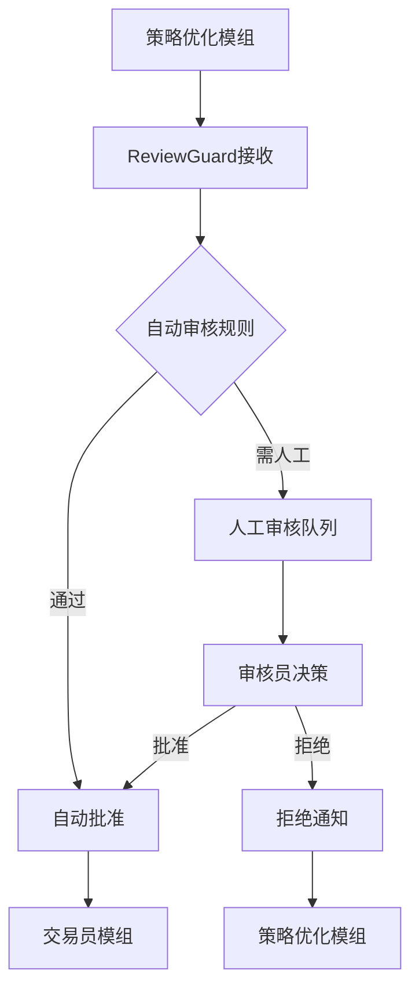

# ReviewGuard人工审核模组产品需求文档

## 1. 产品概述

ReviewGuard是NeuroTrade Nexus (NTN)交易系统中的智能安全阀模组，位于策略优化和交易员模组之间。该模组负责接收所有待执行的交易策略，根据预设规则和模式（人工/自动）对交易进行审核、放行或拦截，为自动化交易系统增加关键的人工监督和风险控制层。

通过ReviewGuard模组，系统能够在保持自动化效率的同时，确保所有高风险或异常交易都经过人工审核，显著提升交易安全性和合规性。

## 2. 核心功能

### 2.1 用户角色

| 角色 | 注册方式 | 核心权限 |
|------|----------|----------|
| 审核员 | 系统管理员分配 | 可审核交易策略、批准或拒绝交易、查看审核历史 |
| 系统管理员 | 超级管理员授权 | 可配置审核规则、管理审核员权限、查看系统统计 |
| 只读用户 | 邀请码注册 | 可查看审核状态和历史记录，无审核权限 |

### 2.2 功能模块

我们的ReviewGuard系统包含以下主要页面：
1. **审核工作台**：待审核策略列表、策略详情展示、审核决策操作
2. **审核历史**：历史审核记录、审核统计分析、决策追溯
3. **规则配置**：自动审核规则设置、风险阈值配置、审核流程管理
4. **系统监控**：实时状态监控、性能指标展示、告警管理

### 2.3 页面详情

| 页面名称 | 模块名称 | 功能描述 |
|----------|----------|----------|
| 审核工作台 | 策略列表 | 显示所有待审核的交易策略，支持筛选和排序 |
| 审核工作台 | 策略详情 | 展示策略的详细信息、风险评估、历史表现 |
| 审核工作台 | 决策操作 | 提供批准、拒绝、暂缓等审核决策选项 |
| 审核历史 | 记录查询 | 查询和展示历史审核记录，支持多维度筛选 |
| 审核历史 | 统计分析 | 展示审核通过率、拒绝原因分析等统计数据 |
| 规则配置 | 自动规则 | 配置自动审核的规则和条件 |
| 规则配置 | 风险阈值 | 设置各类风险指标的阈值参数 |
| 系统监控 | 实时状态 | 监控模组运行状态、消息队列状态 |
| 系统监控 | 性能指标 | 展示审核效率、响应时间等性能数据 |

## 3. 核心流程

### 3.1 主要用户操作流程

**审核员流程：**
1. 登录系统进入审核工作台
2. 查看待审核策略列表
3. 选择策略查看详细信息
4. 根据风险评估做出审核决策
5. 提交审核结果，系统自动通知下游模组

**系统管理员流程：**
1. 登录管理界面
2. 配置自动审核规则和风险阈值
3. 管理审核员权限和工作分配
4. 监控系统运行状态和性能指标
5. 分析审核数据并优化流程

### 3.2 系统交互流程

## 4. 用户界面设计

### 4.1 设计风格

- **主色调**：深蓝色(#1e3a8a)作为主色，橙色(#f97316)作为强调色
- **按钮样式**：圆角矩形按钮，支持悬停和点击状态
- **字体**：系统默认字体，标题16px，正文14px，说明文字12px
- **布局风格**：卡片式布局，顶部导航栏，左侧功能菜单
- **图标风格**：使用简洁的线性图标，支持审核、监控等业务场景

### 4.2 页面设计概览

| 页面名称 | 模块名称 | UI元素 |
|----------|----------|--------|
| 审核工作台 | 策略列表 | 表格组件、筛选器、分页器，支持实时刷新和状态标识 |
| 审核工作台 | 策略详情 | 详情卡片、风险指标图表、决策按钮组 |
| 审核历史 | 记录查询 | 搜索框、时间选择器、状态筛选器、数据表格 |
| 规则配置 | 自动规则 | 表单组件、规则编辑器、预览功能 |
| 系统监控 | 实时状态 | 状态指示器、实时图表、告警面板 |

### 4.3 响应式设计

系统采用桌面优先的响应式设计，主要面向PC端用户。支持平板设备访问，针对移动端提供基础的查看功能，确保审核员能够在不同设备上进行必要的审核操作。