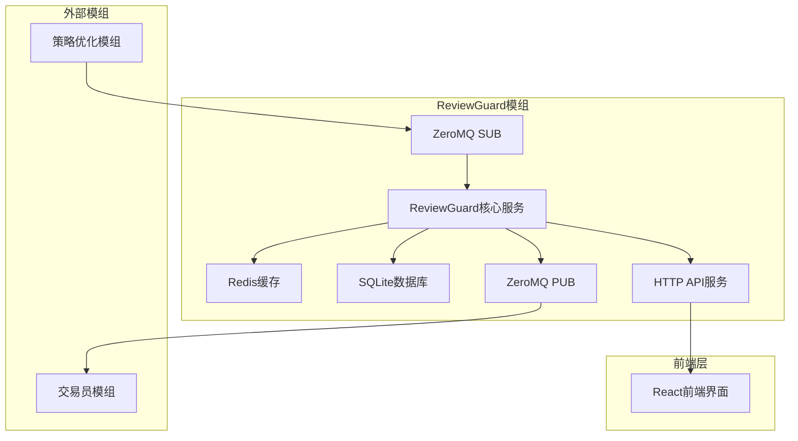
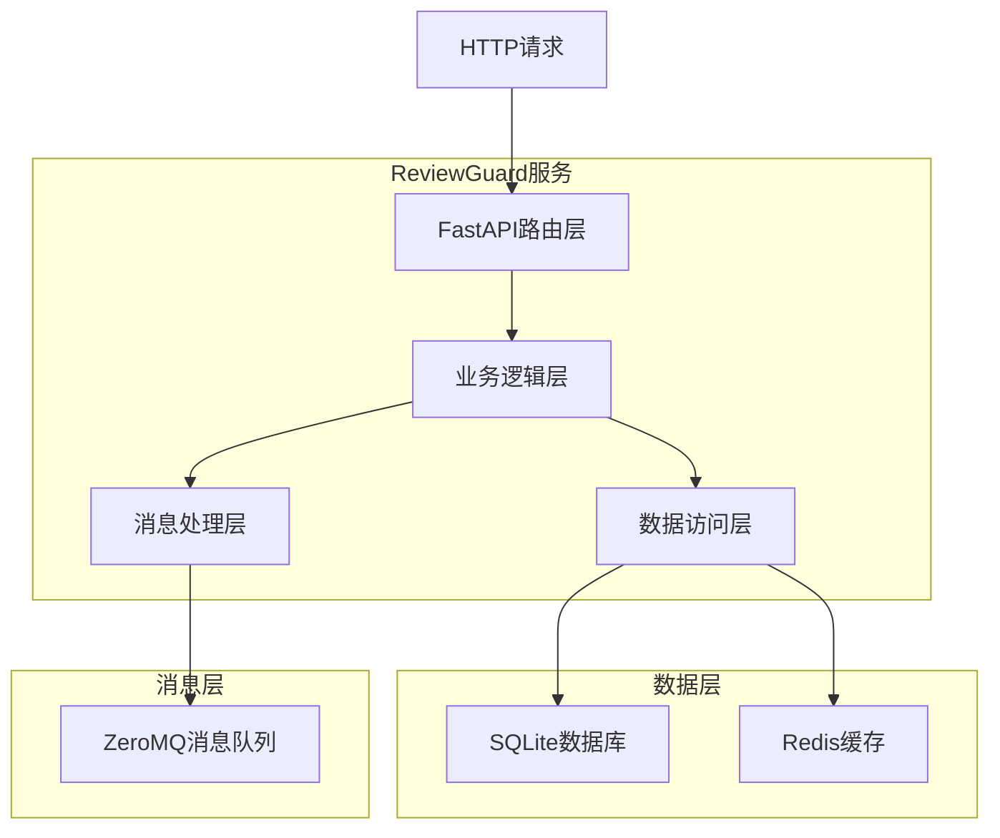
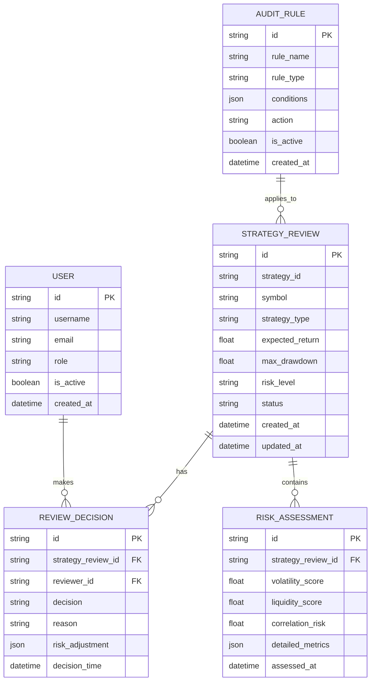

# ReviewGuard人工审核模组技术架构文档

## 1. 架构设计



## 2. 技术描述

* **后端服务**: Python + FastAPI + ZeroMQ

* **前端界面**: React\@18 + Next.js + Shadcn/UI + Zustand + TanStack Query

* **消息通信**: ZeroMQ (PUB/SUB, REQ/REP)

* **缓存存储**: Redis

* **持久化存储**: SQLite

* **部署方式**: Docker + Docker Compose

## 3. 路由定义

| 路由                  | 用途                     |
| ------------------- | ---------------------- |
| /dashboard          | 审核工作台主页，显示待审核策略概览和快速操作 |
| /reviews/pending    | 待审核策略列表页面，支持筛选和批量操作    |
| /reviews/history    | 审核历史记录页面，提供查询和统计功能     |
| /reviews/detail/:id | 策略详情页面，显示完整的策略信息和风险分析  |
| /config/rules       | 规则配置页面，管理自动审核规则和风险阈值   |
| /config/users       | 用户管理页面，管理审核员权限和角色分配    |
| /monitor/status     | 系统监控页面，显示实时状态和性能指标     |
| /login              | 用户登录页面                 |

## 4. API定义

### 4.1 核心API

#### 获取待审核策略列表

```
GET /api/reviews/pending
```

请求参数:

| 参数名称        | 参数类型    | 是否必需  | 描述                        |
| ----------- | ------- | ----- | ------------------------- |
| page        | integer | false | 页码，默认为1                   |
| limit       | integer | false | 每页数量，默认为20                |
| risk\_level | string  | false | 风险等级筛选 (low/medium/high)  |
| status      | string  | false | 状态筛选 (pending/processing) |

响应数据:

| 参数名称       | 参数类型    | 描述     |
| ---------- | ------- | ------ |
| total      | integer | 总记录数   |
| data       | array   | 策略列表数据 |
| page\_info | object  | 分页信息   |

示例响应:

```json
{
  "total": 156,
  "data": [
    {
      "id": "strategy_001",
      "symbol": "BTCUSDT",
      "strategy_type": "momentum",
      "risk_level": "medium",
      "expected_return": 0.025,
      "max_drawdown": 0.15,
      "created_at": "2024-01-15T10:30:00Z",
      "status": "pending"
    }
  ],
  "page_info": {
    "current_page": 1,
    "total_pages": 8,
    "has_next": true
  }
}
```

#### 提交审核决策

```
POST /api/reviews/{id}/decision
```

请求参数:

| 参数名称             | 参数类型   | 是否必需  | 描述                          |
| ---------------- | ------ | ----- | --------------------------- |
| decision         | string | true  | 审核决策 (approve/reject/defer) |
| reason           | string | false | 决策原因说明                      |
| risk\_adjustment | object | false | 风险参数调整                      |

响应数据:

| 参数名称       | 参数类型    | 描述     |
| ---------- | ------- | ------ |
| success    | boolean | 操作是否成功 |
| message    | string  | 响应消息   |
| review\_id | string  | 审核记录ID |

示例请求:

```json
{
  "decision": "approve",
  "reason": "策略风险可控，历史表现良好",
  "risk_adjustment": {
    "position_size_limit": 0.8
  }
}
```

#### 获取策略详情

```
GET /api/strategies/{id}/detail
```

响应数据:

| 参数名称                    | 参数类型   | 描述     |
| ----------------------- | ------ | ------ |
| strategy\_info          | object | 策略基本信息 |
| risk\_analysis          | object | 风险分析数据 |
| historical\_performance | array  | 历史表现数据 |
| market\_conditions      | object | 市场环境分析 |

## 5. 服务架构图



## 6. 数据模型

### 6.1 数据模型定义



### 6.2 数据定义语言

#### 策略审核表 (strategy\_reviews)

```sql
-- 创建策略审核表
CREATE TABLE strategy_reviews (
    id TEXT PRIMARY KEY,
    strategy_id TEXT NOT NULL,
    symbol TEXT NOT NULL,
    strategy_type TEXT NOT NULL,
    expected_return REAL,
    max_drawdown REAL,
    risk_level TEXT CHECK (risk_level IN ('low', 'medium', 'high')),
    status TEXT DEFAULT 'pending' CHECK (status IN ('pending', 'processing', 'approved', 'rejected', 'deferred')),
    raw_data TEXT, -- JSON格式存储原始策略数据
    created_at TIMESTAMP DEFAULT CURRENT_TIMESTAMP,
    updated_at TIMESTAMP DEFAULT CURRENT_TIMESTAMP
);

-- 创建审核决策表
CREATE TABLE review_decisions (
    id TEXT PRIMARY KEY,
    strategy_review_id TEXT NOT NULL,
    reviewer_id TEXT NOT NULL,
    decision TEXT NOT NULL CHECK (decision IN ('approve', 'reject', 'defer')),
    reason TEXT,
    risk_adjustment TEXT, -- JSON格式存储风险调整参数
    decision_time TIMESTAMP DEFAULT CURRENT_TIMESTAMP,
    FOREIGN KEY (strategy_review_id) REFERENCES strategy_reviews(id)
);

-- 创建用户表
CREATE TABLE users (
    id TEXT PRIMARY KEY,
    username TEXT UNIQUE NOT NULL,
    email TEXT UNIQUE NOT NULL,
    password_hash TEXT NOT NULL,
    role TEXT DEFAULT 'reviewer' CHECK (role IN ('admin', 'reviewer', 'readonly')),
    is_active BOOLEAN DEFAULT TRUE,
    created_at TIMESTAMP DEFAULT CURRENT_TIMESTAMP
);

-- 创建风险评估表
CREATE TABLE risk_assessments (
    id TEXT PRIMARY KEY,
    strategy_review_id TEXT NOT NULL,
    volatility_score REAL,
    liquidity_score REAL,
    correlation_risk REAL,
    detailed_metrics TEXT, -- JSON格式存储详细指标
    assessed_at TIMESTAMP DEFAULT CURRENT_TIMESTAMP,
    FOREIGN KEY (strategy_review_id) REFERENCES strategy_reviews(id)
);

-- 创建审核规则表
CREATE TABLE audit_rules (
    id TEXT PRIMARY KEY,
    rule_name TEXT NOT NULL,
    rule_type TEXT NOT NULL CHECK (rule_type IN ('auto_approve', 'auto_reject', 'require_review')),
    conditions TEXT NOT NULL, -- JSON格式存储规则条件
    action TEXT NOT NULL,
    is_active BOOLEAN DEFAULT TRUE,
    created_at TIMESTAMP DEFAULT CURRENT_TIMESTAMP
);

-- 创建索引
CREATE INDEX idx_strategy_reviews_status ON strategy_reviews(status);
CREATE INDEX idx_strategy_reviews_created_at ON strategy_reviews(created_at DESC);
CREATE INDEX idx_review_decisions_strategy_id ON review_decisions(strategy_review_id);
CREATE INDEX idx_review_decisions_reviewer_id ON review_decisions(reviewer_id);
CREATE INDEX idx_risk_assessments_strategy_id ON risk_assessments(strategy_review_id);

-- 初始化数据
INSERT INTO users (id, username, email, password_hash, role) VALUES 
('admin_001', 'admin', 'admin@neurotrade.com', 'hashed_password', 'admin'),
('reviewer_001', 'reviewer1', 'reviewer1@neurotrade.com', 'hashed_password', 'reviewer');

INSERT INTO audit_rules (id, rule_name, rule_type, conditions, action) VALUES 
('rule_001', '低风险自动通过', 'auto_approve', '{"risk_level": "low", "max_drawdown": {"<": 0.05}}', 'approve'),
('rule_002', '高风险强制审核', 'require_review', '{"risk_level": "high"}', 'manual_review'),
('rule_003', '超大仓位拒绝', 'auto_reject', '{"position_size": {">=": 0.5}}', 'reject');
```

