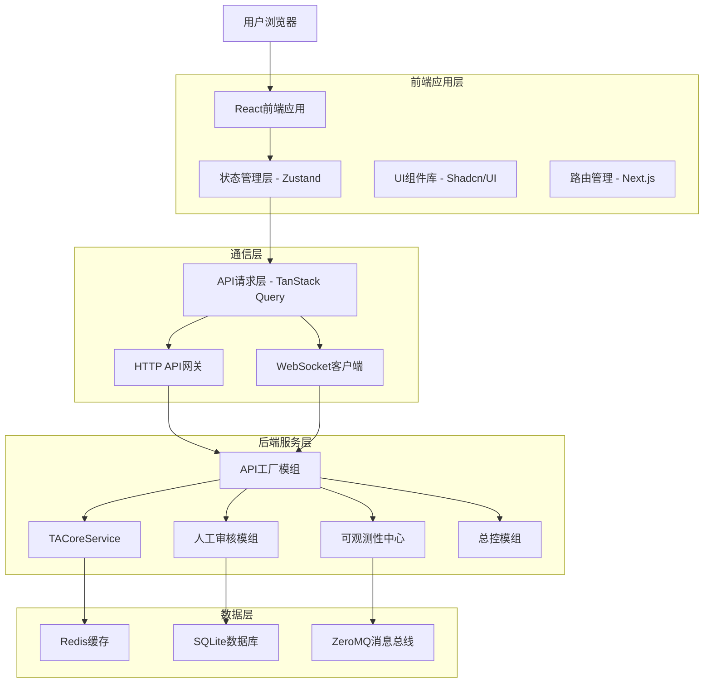
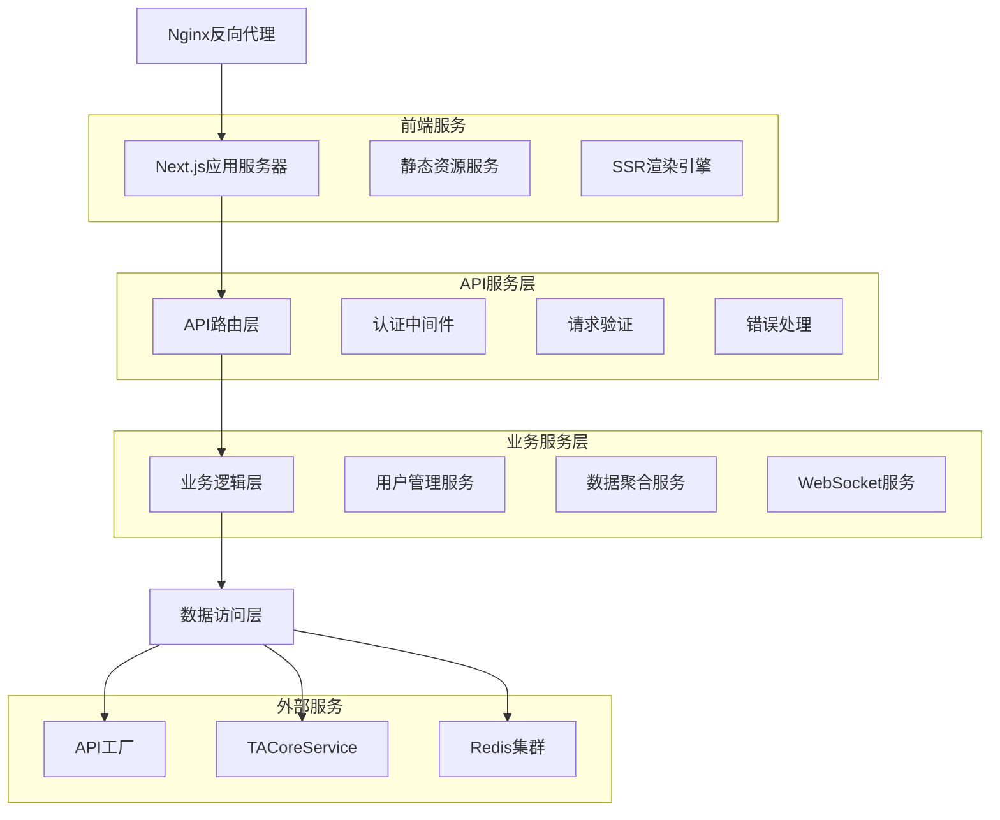
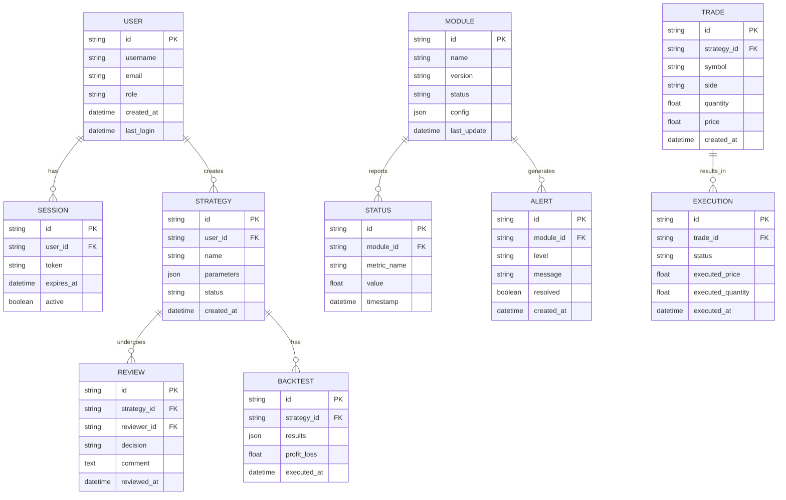

# 前端管理界面(ASTS Console)技术架构文档

## 1. 架构设计



## 2. 技术描述

- **前端框架**: React\@18 + Next.js\@14 + TypeScript\@5

- **UI组件库**: Shadcn/UI + Tailwind CSS\@3 + Lucide React

- **状态管理**: Zustand\@4

- **数据请求**: TanStack Query\@5 + Axios

- **数据可视化**: ECharts\@5 + TradingView Charting Library

- **构建工具**: Vite\@5

- **代码质量**: ESLint + Prettier + Husky

- **测试框架**: Vitest + React Testing Library

- **部署**: Docker + Nginx

## 3. 路由定义

| 路由            | 用途                                    |
| --------------- | --------------------------------------- |
| /               | 首页重定向到仪表盘                      |
| /dashboard      | 仪表盘页面，展示系统总览和关键指标      |
| /review         | 人工审核中心，策略审核和风险评估        |
| /ai-lab         | AI策略实验室，智能对话和策略生成        |
| /replay         | 高级交易复盘，TradingView集成和性能分析 |
| /monitoring     | 系统监控中心，模组状态和告警管理        |
| /risk-rehearsal | 风控演习中心，风险场景模拟和压力测试    |
| /api-cost       | API成本中心，成本统计和预算管理         |
| /modules        | 模块管理页面，模组配置和依赖管理        |
| /login          | 用户登录页面                            |
| /settings       | 系统设置页面                            |

## 4. API定义

### 4.1 核心API

#### 用户认证相关

```
POST /api/auth/login
```

请求参数:

| 参数名   | 参数类型 | 是否必需 | 描述   |
| -------- | -------- | -------- | ------ |
| username | string   | true     | 用户名 |
| password | string   | true     | 密码   |

响应参数:

| 参数名  | 参数类型 | 描述         |
| ------- | -------- | ------------ |
| success | boolean  | 登录是否成功 |
| token   | string   | JWT访问令牌  |
| user    | object   | 用户信息     |

示例:

```json
{
  "username": "trader001",
  "password": "encrypted_password"
}
```

#### 仪表盘数据获取

```
GET /api/dashboard/overview
```

响应参数:

| 参数名           | 参数类型 | 描述       |
| ---------------- | -------- | ---------- |
| totalProfit      | number   | 总盈利     |
| activeStrategies | number   | 活跃策略数 |
| systemStatus     | string   | 系统状态   |
| marketData       | object   | 市场数据   |

#### 策略审核相关

```
GET /api/review/pending
```

响应参数:

| 参数名     | 参数类型 | 描述           |
| ---------- | -------- | -------------- |
| strategies | array    | 待审核策略列表 |
| total      | number   | 总数量         |

```
POST /api/review/approve
```

请求参数:

| 参数名     | 参数类型 | 是否必需 | 描述                     |
| ---------- | -------- | -------- | ------------------------ |
| strategyId | string   | true     | 策略ID                   |
| decision   | string   | true     | 审核决定(approve/reject) |
| comment    | string   | false    | 审核意见                 |

#### AI策略实验室

```
POST /api/ai-lab/chat
```

请求参数:

| 参数名    | 参数类型 | 是否必需 | 描述     |
| --------- | -------- | -------- | -------- |
| message   | string   | true     | 用户消息 |
| sessionId | string   | true     | 会话ID   |

响应参数:

| 参数名   | 参数类型 | 描述             |
| -------- | -------- | ---------------- |
| response | string   | AI回复           |
| strategy | object   | 生成的策略(如有) |

#### 系统监控相关

```
GET /api/monitoring/modules
```

响应参数:

| 参数名    | 参数类型 | 描述         |
| --------- | -------- | ------------ |
| modules   | array    | 模组状态列表 |
| timestamp | string   | 数据时间戳   |

#### WebSocket事件定义

实时数据推送事件:

- `market_update`: 市场数据更新

- `trade_executed`: 交易执行通知

- `system_alert`: 系统告警

- `module_status`: 模组状态变化

## 5. 服务器架构图



## 6. 数据模型

### 6.1 数据模型定义



### 6.2 数据定义语言

#### 用户表 (users)

```sql
-- 创建用户表
CREATE TABLE users (
    id VARCHAR(36) PRIMARY KEY DEFAULT (lower(hex(randomblob(16)))),
    username VARCHAR(50) UNIQUE NOT NULL,
    email VARCHAR(100) UNIQUE NOT NULL,
    password_hash VARCHAR(255) NOT NULL,
    role VARCHAR(20) DEFAULT 'trader' CHECK (role IN ('trader', 'analyst', 'risk_manager', 'admin')),
    created_at DATETIME DEFAULT CURRENT_TIMESTAMP,
    last_login DATETIME,
    active BOOLEAN DEFAULT 1
);

-- 创建索引
CREATE INDEX idx_users_username ON users(username);
CREATE INDEX idx_users_email ON users(email);
CREATE INDEX idx_users_role ON users(role);
```

#### 策略表 (strategies)

```sql
-- 创建策略表
CREATE TABLE strategies (
    id VARCHAR(36) PRIMARY KEY DEFAULT (lower(hex(randomblob(16)))),
    user_id VARCHAR(36) NOT NULL,
    name VARCHAR(100) NOT NULL,
    description TEXT,
    parameters JSON NOT NULL,
    status VARCHAR(20) DEFAULT 'draft' CHECK (status IN ('draft', 'pending', 'approved', 'rejected', 'active', 'inactive')),
    created_at DATETIME DEFAULT CURRENT_TIMESTAMP,
    updated_at DATETIME DEFAULT CURRENT_TIMESTAMP,
    FOREIGN KEY (user_id) REFERENCES users(id)
);

-- 创建索引
CREATE INDEX idx_strategies_user_id ON strategies(user_id);
CREATE INDEX idx_strategies_status ON strategies(status);
CREATE INDEX idx_strategies_created_at ON strategies(created_at DESC);
```

#### 模组状态表 (module_status)

```sql
-- 创建模组状态表
CREATE TABLE module_status (
    id VARCHAR(36) PRIMARY KEY DEFAULT (lower(hex(randomblob(16)))),
    module_name VARCHAR(50) NOT NULL,
    status VARCHAR(20) NOT NULL CHECK (status IN ('running', 'stopped', 'error', 'maintenance')),
    health_score FLOAT DEFAULT 100.0,
    cpu_usage FLOAT DEFAULT 0.0,
    memory_usage FLOAT DEFAULT 0.0,
    last_heartbeat DATETIME DEFAULT CURRENT_TIMESTAMP,
    metadata JSON,
    created_at DATETIME DEFAULT CURRENT_TIMESTAMP
);

-- 创建索引
CREATE INDEX idx_module_status_name ON module_status(module_name);
CREATE INDEX idx_module_status_timestamp ON module_status(last_heartbeat DESC);
```

#### 初始化数据

```sql
-- 插入默认管理员用户
INSERT INTO users (username, email, password_hash, role) VALUES
('admin', 'admin@neurotrade.com', '$2b$12$encrypted_password_hash', 'admin'),
('trader001', 'trader001@neurotrade.com', '$2b$12$encrypted_password_hash', 'trader'),
('analyst001', 'analyst001@neurotrade.com', '$2b$12$encrypted_password_hash', 'analyst');

-- 插入默认模组状态
INSERT INTO module_status (module_name, status, health_score) VALUES
('API工厂', 'running', 95.0),
('扫描器', 'running', 98.0),
('TACoreService', 'running', 92.0),
('人工审核', 'running', 100.0),
('总控模组', 'running', 96.0);
```
