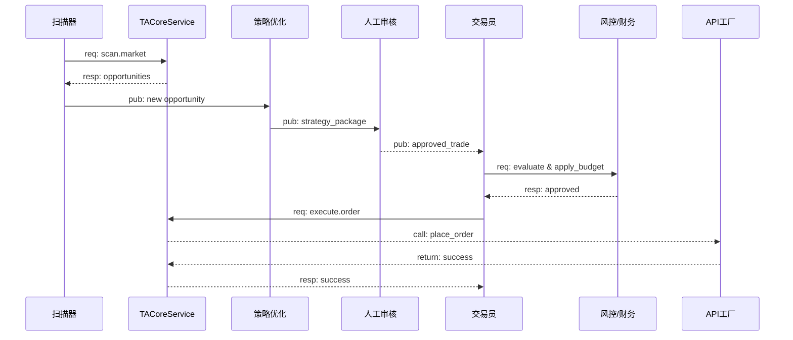
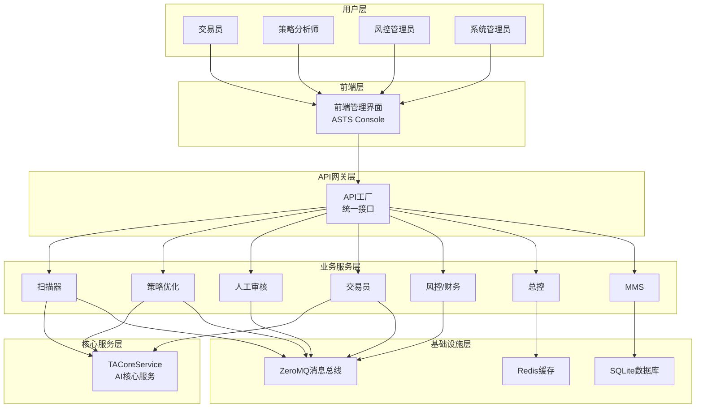

# NeuroTrade Nexus (NTN) 模组十一开发蓝图总览

## 项目概述

**项目名称**: NeuroTrade Nexus (NTN) - 模组十一：前端管理界面(ASTS Console)

**版本**: V2.0

**项目描述**: 构建一个集成了AI交互、深度分析、实时监控和高级运维工具的智能化、响应式的前端指挥中心，作为整个交易系统的统一管理界面。

## 1. 核心设计理念

### 1.1 "化整为零，分而治之"架构思想

**核心理念**: 将复杂的交易系统拆分成12个（未来扩展至14个）可以独立开发、测试和升级的"积木块"（模组）。各模组通过高效的"信使系统"（ZeroMQ消息总线）进行沟通，既能协同作战，又互不干扰。

**架构优势**:

* **高内聚、低耦合**: 每个模组职责单一，模组间依赖最小化

* **独立部署**: 支持模组级别的独立升级和维护

* **水平扩展**: 可根据负载需求动态扩展特定模组

* **故障隔离**: 单个模组故障不会影响整个系统运行

### 1.2 服务化AI能力封装

**核心升级**: 系统的核心AI能力（市场扫描、订单执行等）已被统一封装在模组十二：TACoreService中。所有业务模组不再直接依赖`TradingAgents-CN`库，而是通过网络请求调用这个中央服务。

**服务化优势**:

* **统一管理**: AI模型和算法集中管理，便于版本控制和优化

* **资源共享**: 多个模组共享AI计算资源，提高利用率

* **安全隔离**: AI核心逻辑与业务逻辑分离，提高安全性

* **易于扩展**: 支持AI服务的水平扩展和负载均衡

## 2. 统一技术选型

### 2.1 技术栈标准

| 分类          | 技术/格式                   | 模式/规范                              | 用途描述                          |
| ----------- | ----------------------- | ---------------------------------- | ----------------------------- |
| **模块间通信**   | ZeroMQ                  | `PUB/SUB`, `REQ/REP`               | 用于模组间的低延迟、高吞吐量异步消息传递          |
| **数据序列化**   | JSON                    | 消息体必须包含 `schema_version` 字段        | 确保高效、规范的数据交换，易于调试             |
| **缓存与状态存储** | Redis                   | -                                  | 用于存储实时状态、市场数据缓存、轻量级消息队列       |
| **持久化存储**   | SQLite                  | -                                  | 零配置、文件型数据库，用于存储交易记录、回测报告等     |
| **部署与运维**   | Docker & Docker Compose | -                                  | 实现一键式、跨环境的部署和隔离               |
| **核心AI库集成** | TradingAgents-CN v3.0   | 服务化封装                              | 所有功能被封装在独立的`TACoreService`模组中 |
| **前端技术栈**   | React (Next.js)         | Shadcn/UI, Zustand, TanStack Query | 用于构建现代化、高性能的前端管理界面            |

### 2.2 前端技术选型详解

**核心框架**:

* **React 18**: 现代化的组件化开发框架

* **Next.js 14**: 全栈React框架，支持SSR和静态生成

* **TypeScript 5**: 类型安全的JavaScript超集

**UI组件与样式**:

* **Shadcn/UI**: 现代化的React组件库

* **Tailwind CSS 3**: 原子化CSS框架

* **Lucide React**: 简洁现代的图标库

**状态管理与数据请求**:

* **Zustand**: 轻量级状态管理库

* **TanStack Query**: 强大的数据同步库

* **Axios**: HTTP客户端库

**数据可视化**:

* **ECharts 5**: 强大的图表库

* **TradingView Charting Library**: 专业的金融图表库

## 3. 全局规范与流程

### 3.1 系统核心工作流



### 3.2 数据隔离与环境管理规范

**环境定义**:

* **development**: 开发环境，用于日常开发和调试

* **staging**: 预生产环境，用于集成测试和用户验收测试

* **production**: 生产环境，实际运行环境

**配置管理原则**:

* 严禁硬编码敏感信息

* 使用分环境配置文件

* 通过Docker环境变量注入密钥

* 配置文件版本化管理

**数据管理规范**:

* 占位数据严禁入库到生产或测试环境

* 各环境使用独立的数据库

* 严禁将生产数据库直接拷贝到开发环境

* 敏感数据脱敏处理

### 3.3 开发与运维核心准则

**版本控制规范**:

* 严格遵循Git Flow分支模型

* 所有向`develop`或`master`分支的合并必须通过Pull Request

* 必须经过代码审查(Code Review)

* 提交信息遵循约定式提交规范

**向后兼容性原则** (最高优先级):

* 对模组间接口（ZeroMQ消息格式、HTTP API）的任何修改都**必须**保持向后兼容

* API版本化管理

* 渐进式升级策略

**自动化测试要求**:

* 所有新增的核心业务逻辑必须有相应的单元测试

* 代码覆盖率需达标（>80%）

* 集成测试覆盖关键业务流程

* 端到端测试验证用户场景

**自动化部署规范**:

* 严禁手动登录生产服务器进行部署操作

* 所有部署必须通过CI/CD流水线完成

* 部署过程可回滚

* 部署状态可监控

## 4. 通用开发者指南

### 4.1 系统总体架构



### 4.2 部署与集成规范

**Docker Compose配置示例**:

```yaml
version: '3.8'

services:
  # 基础服务
  redis:
    image: redis:alpine
    ports:
      - '6379:6379'
    networks:
      - app_net

  # 核心AI服务
  tacore_service:
    build: ./12TACoreService
    container_name: tacore_service
    command: python main.py
    ports:
      - '5555:5555'
    environment:
      - APP_ENV=production
    networks:
      - app_net

  # AI服务工作进程
  tacore_worker:
    build: ./12TACoreService
    command: python worker.py
    depends_on:
      - tacore_service
    networks:
      - app_net
    deploy:
      replicas: 4

  # 前端管理界面
  m11_asts_console:
    build: ./11ASTSConsole
    container_name: 11_asts_console
    ports:
      - '3000:3000'
    environment:
      - APP_ENV=production
      - API_BASE_URL=http://api_factory:8000
    depends_on:
      - redis
      - tacore_service
    networks:
      - app_net

  # API工厂
  api_factory:
    build: ./01API_Factory
    container_name: api_factory
    ports:
      - '8000:8000'
    environment:
      - APP_ENV=production
    depends_on:
      - redis
      - tacore_service
    networks:
      - app_net

networks:
  app_net:
    driver: bridge
```

### 4.3 开发环境搭建

**前置要求**:

* Node.js 18+

* Docker & Docker Compose

* Git

**快速启动步骤**:

1. **克隆项目**:

```bash
git clone <repository_url>
cd NeuroTrade-Nexus/11ASTSConsole
```

1. **安装依赖**:

```bash
npm install
```

1. **环境配置**:

```bash
cp .env.example .env.local
# 编辑 .env.local 配置必要的环境变量
```

1. **启动开发服务器**:

```bash
npm run dev
```

1. **启动后端服务**:

```bash
docker-compose up -d redis tacore_service api_factory
```

### 4.4 代码规范

**文件结构规范**:

```
/src
├── /app              # Next.js 13+ App Router
│   ├── /dashboard    # 仪表盘页面
│   ├── /review       # 人工审核中心
│   ├── /ai-lab       # AI策略实验室
│   └── /layout.tsx   # 根布局
├── /components       # 可复用UI组件
│   ├── /ui           # 基础UI组件
│   ├── /charts       # 图表组件
│   └── /forms        # 表单组件
├── /features         # 功能模块
│   ├── /auth         # 认证相关
│   ├── /dashboard    # 仪表盘功能
│   └── /monitoring   # 监控功能
├── /hooks            # 自定义Hooks
├── /lib              # 工具函数
│   ├── /api          # API客户端
│   ├── /utils        # 通用工具
│   └── /constants    # 常量定义
├── /store            # Zustand状态管理
└── /types            # TypeScript类型定义
```

**命名规范**:

* 组件文件使用PascalCase: `UserProfile.tsx`

* 工具函数使用camelCase: `formatCurrency.ts`

* 常量使用UPPER\_SNAKE\_CASE: `API_BASE_URL`

* 类型定义使用PascalCase: `UserType`, `ApiResponse`

**代码质量工具**:

* ESLint: 代码静态分析

* Prettier: 代码格式化

* Husky: Git hooks管理

* lint-staged: 暂存文件检查

## 5. 项目实施计划

### 5.1 开发阶段划分

**阶段一: 基础框架与核心UI (2周)**

* 统一设计语言与组件库选型

* 搭建Next.js项目框架

* 构建API通信层与状态管理

* 开发全局导航与布局

**阶段二: 核心功能开发 (3周)**

* 仪表盘页面与数据可视化

* 人工审核中心UI与交互

* 模块管理页面(API工厂/扫描器)

**阶段三: 高级功能开发 (3周)**

* AI策略实验室与对话界面

* 高级交易复盘页面(集成TradingView)

* 监控/演习/成本中心页面

**阶段四: 优化与测试 (2周)**

* 性能调优与响应式适配

* 全面的用户验收测试(UAT)

### 5.2 质量保证

**性能目标**:

* 核心Web指标: LCP < 2.5秒, FID < 100毫秒, CLS < 0.1

* 打包体积: 初始加载JS包 < 500KB

* 首屏渲染时间 < 1.5秒

**测试策略**:

* 单元测试覆盖率 > 80%

* 集成测试覆盖核心业务流程

* E2E测试验证关键用户路径

* 性能测试确保响应时间达标

**监控与运维**:

* 实时性能监控

* 错误追踪与告警

* 用户行为分析

* 系统健康度检查

## 6. 风险管控

### 6.1 技术风险

**依赖风险**:

* 第三方库版本兼容性问题

* TradingView集成复杂度

* WebSocket连接稳定性

**缓解措施**:

* 依赖版本锁定

* 渐进式集成策略

* 连接重试机制

### 6.2 业务风险

**数据安全**:

* 敏感交易数据保护

* 用户权限管理

* API访问控制

**缓解措施**:

* 数据加密传输

* 细粒度权限控制

* API访问限流

### 6.3 运维风险

**系统可用性**:

* 服务单点故障

* 数据库性能瓶颈

* 网络连接中断

**缓解措施**:

* 服务冗余部署

* 数据库读写分离

* 断线重连机制

## 7. 总结

本开发蓝图为NeuroTrade Nexus项目的前端管理界面提供了完整的技术指导和实施方案。通过采用现代化的技术栈、规范化的开发流程和系统化的质量保证措施，确保构建出一个功能强大、性能优异、用户体验卓越的智能化交易管理平台。

项目团队应严格按照本蓝图执行开发工作，同时保持与其他模组的协调配合，确保整个系统的一致性和稳定性。
