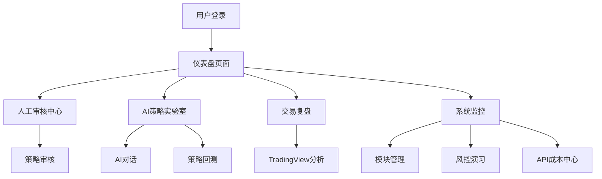

# 前端管理界面(ASTS Console)产品需求文档

## 1. 产品概述

前端管理界面(ASTS Console)是NeuroTrade Nexus(NTN)交易系统的智能化指挥中心，集成了AI交互、深度分析、实时监控和高级运维工具。

该产品采用"化整为零，分而治之"的核心设计理念，通过微服务架构将复杂的交易系统拆分为12个独立模组，各模组通过ZeroMQ消息总线进行高效协同。

产品目标是构建一个集"实时战情室"、"AI参谋部"、"策略实验室"和"总指挥台"于一体的综合性平台，为交易决策提供全方位支持。

## 2. 核心功能

### 2.1 用户角色

| 角色       | 注册方式       | 核心权限                                     |
| ---------- | -------------- | -------------------------------------------- |
| 交易员     | 系统分配账户   | 查看交易数据、执行已审核策略、监控交易状态   |
| 策略分析师 | 管理员邀请     | 使用AI策略实验室、查看复盘数据、制定交易策略 |
| 风控管理员 | 高级权限分配   | 全局监控、风险演习、紧急暂停操作             |
| 系统管理员 | 超级管理员权限 | 模块管理、系统配置、API成本监控              |

### 2.2 功能模块

前端管理界面包含以下核心页面：

1. **仪表盘页面**：实时数据展示、系统状态监控、关键指标可视化
2. **人工审核中心**：策略审核界面、风险评估工具、审核流程管理
3. **AI策略实验室**：智能对话界面、策略生成工具、回测功能
4. **高级交易复盘**：TradingView集成、历史数据分析、性能评估
5. **系统监控中心**：模块状态监控、性能指标、告警管理
6. **风控演习中心**：风险场景模拟、压力测试、应急预案
7. **API成本中心**：API调用统计、成本分析、预算管理
8. **模块管理页面**：模组配置、状态控制、依赖管理

### 2.3 页面详情

| 页面名称     | 模块名称        | 功能描述                                                           |
| ------------ | --------------- | ------------------------------------------------------------------ |
| 仪表盘页面   | 数据可视化模块  | 实时展示交易数据、市场状况、系统性能指标，支持自定义图表和告警设置 |
| 仪表盘页面   | 全局控制模块    | 提供全局模式切换器和紧急暂停按钮，确保系统安全运行                 |
| 人工审核中心 | 策略审核模块    | 展示待审核策略列表，提供详细的风险评估和审核工具                   |
| 人工审核中心 | 审核流程模块    | 管理审核工作流，记录审核历史，支持多级审核机制                     |
| AI策略实验室 | AI对话界面      | 与AI策略助理进行自然语言交互，生成和优化交易策略                   |
| AI策略实验室 | 策略测试模块    | 提供策略回测功能，评估策略性能和风险指标                           |
| 高级交易复盘 | TradingView集成 | 嵌入专业图表工具，支持技术分析和历史数据回放                       |
| 高级交易复盘 | 性能分析模块    | 生成详细的交易报告，分析盈亏情况和改进建议                         |
| 系统监控中心 | 实时监控模块    | 监控各模组运行状态，展示系统健康度和性能指标                       |
| 系统监控中心 | 告警管理模块    | 配置告警规则，管理告警通知，提供故障排查工具                       |
| 风控演习中心 | 场景模拟模块    | 创建和执行风险场景，测试系统在极端情况下的表现                     |
| 风控演习中心 | 压力测试模块    | 进行系统压力测试，评估系统承载能力和稳定性                         |
| API成本中心  | 成本统计模块    | 统计各API的调用次数和费用，生成成本分析报告                        |
| API成本中心  | 预算管理模块    | 设置API使用预算，监控预算执行情况，提供成本优化建议                |
| 模块管理页面 | 模组控制模块    | 管理各模组的启停状态，配置模组参数，查看模组日志                   |
| 模块管理页面 | 依赖管理模块    | 展示模组间依赖关系，管理模组版本，处理依赖冲突                     |

## 3. 核心流程

### 3.1 系统核心工作流

系统采用端到端的交易流程，各模组通过ZeroMQ消息总线协同工作：

1. **市场扫描阶段**：扫描器模组通过TACoreService进行市场机会识别
2. **策略优化阶段**：策略优化模组生成交易策略包
3. **人工审核阶段**：ReviewGuard模组进行策略审核和风险评估
4. **交易执行阶段**：交易员模组执行已审核的交易策略
5. **风控监控阶段**：风控模组进行实时监控和预算管理
6. **订单执行阶段**：通过API工厂完成实际的订单操作

### 3.2 用户操作流程

**交易员操作流程**：
登录系统 → 查看仪表盘 → 检查待执行策略 → 执行交易 → 监控交易状态 → 查看交易结果

**策略分析师操作流程**：
登录系统 → 进入AI策略实验室 → 与AI助理对话 → 生成策略 → 进行回测 → 提交审核

**风控管理员操作流程**：
登录系统 → 查看系统监控 → 审核策略风险 → 执行风控演习 → 处理异常告警

## 4. 用户界面设计

### 4.1 设计风格

- **主色调**：深蓝色(#1e3a8a)作为主色，绿色(#10b981)表示盈利，红色(#ef4444)表示亏损

- **辅助色**：灰色系(#6b7280, #9ca3af)用于次要信息，橙色(#f59e0b)用于警告

- **按钮样式**：现代化圆角设计，支持悬停和点击动效

- **字体**：Inter字体，主要文字16px，标题18-24px，数据展示14px

- **布局风格**：卡片式布局，顶部导航栏，左侧功能菜单

- **图标风格**：使用Lucide React图标库，简洁现代的线性图标

### 4.2 页面设计概览

| 页面名称     | 模块名称        | UI元素                                                            |
| ------------ | --------------- | ----------------------------------------------------------------- |
| 仪表盘页面   | 数据可视化区域  | ECharts图表组件，实时数据卡片，颜色编码状态指示器，响应式网格布局 |
| 仪表盘页面   | 全局控制区域    | 顶部固定的模式切换开关，醒目的红色紧急暂停按钮，状态指示灯        |
| 人工审核中心 | 策略列表区域    | 表格组件展示待审核策略，优先级标签，风险等级色彩编码              |
| 人工审核中心 | 审核详情区域    | 侧边栏详情面板，多步骤审核流程，审核意见输入框                    |
| AI策略实验室 | 对话界面        | 聊天式UI布局，消息气泡设计，代码高亮显示，加载动画                |
| AI策略实验室 | 策略展示区域    | 代码编辑器组件，策略参数配置面板，回测结果图表                    |
| 高级交易复盘 | TradingView容器 | 全屏图表嵌入，工具栏集成，数据同步指示器                          |
| 高级交易复盘 | 分析面板        | 侧边统计面板，性能指标卡片，时间范围选择器                        |
| 系统监控中心 | 监控仪表板      | 实时状态网格，健康度环形图，告警通知列表                          |
| 系统监控中心 | 详情面板        | 模组详情抽屉，日志查看器，性能趋势图                              |
| 风控演习中心 | 场景配置区域    | 表单组件，参数滑块，场景模板选择器                                |
| 风控演习中心 | 结果展示区域    | 测试结果表格，风险热力图，建议列表                                |
| API成本中心  | 统计图表区域    | 成本趋势图，API使用分布饼图，预算进度条                           |
| API成本中心  | 详细数据区域    | 数据表格，筛选器，导出功能按钮                                    |
| 模块管理页面 | 模组状态网格    | 状态卡片网格，开关控件，依赖关系图                                |
| 模块管理页面 | 配置面板        | 配置表单，日志查看器，重启按钮                                    |

### 4.3 响应式设计

产品采用桌面优先的响应式设计策略：

- **桌面端(≥1024px)**：完整功能展示，多列布局，侧边栏导航

- **平板端(768px-1023px)**：适配触摸操作，简化布局，折叠侧边栏

- **移动端(<768px)**：核心功能优先，单列布局，底部导航

- **触摸优化**：按钮最小44px点击区域，手势支持，触摸反馈
