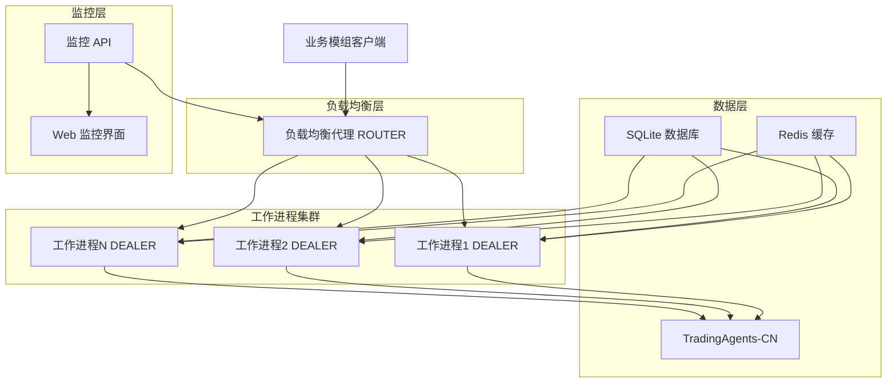
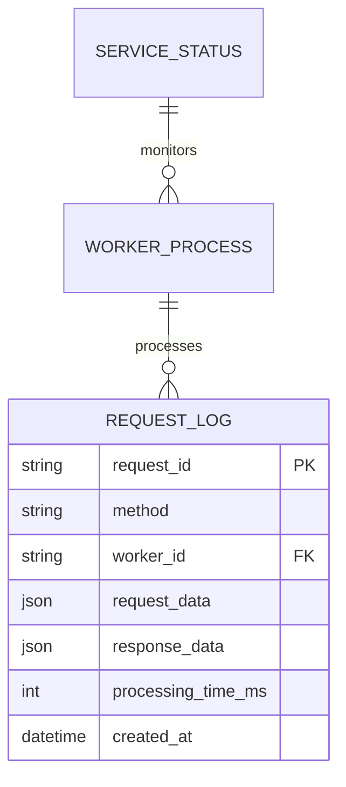

# TACoreService 最终技术规格与实施指南

**文档版本**: V1.0 优化整合版  
**创建时间**: 2024年  
**文档状态**: 最终规格文档  
**适用范围**: TACoreService 完整技术实施

---

## 1. 产品概述

TACoreService 是一个基于 ZeroMQ 的高性能 AI 核心服务，专门设计用于封装和分发 TradingAgents-CN 的多代理交易分析功能。该服务采用负载均衡代理模式，支持水平扩展，为各种业务模组提供统一的 AI 分析接口。

- **核心价值**: 将单体 AI 应用转换为可独立部署、水平扩展的微服务架构
- **技术特点**: ZeroMQ 异步通信、多工作进程负载均衡、Docker 容器化部署
- **目标市场**: 需要高性能 AI 分析能力的金融交易系统和量化平台

## 2. 核心功能

### 2.1 功能模块

本系统包含以下核心功能模块：

| 模块名称 | 核心功能 | 技术实现 |
|----------|----------|----------|
| **负载均衡代理** | 请求分发、故障转移、连接管理 | ZeroMQ ROUTER 模式 |
| **工作进程集群** | AI 分析处理、并发执行、状态管理 | ZeroMQ DEALER + TradingAgents-CN |
| **服务接口层** | 统一 API、消息序列化、协议转换 | JSON over ZeroMQ |
| **监控管理仪表盘** | 性能监控、健康检查、日志管理 | HTTP API + Web 界面 |

### 2.2 页面详情

| 页面名称 | 模块名称 | 功能描述 |
|----------|----------|----------|
| 负载均衡代理 | 请求路由 | 接收客户端请求，根据负载情况分发到空闲工作进程，实现故障转移 |
| 工作进程集群 | AI 分析引擎 | 调用 TradingAgents-CN 执行具体分析任务，支持市场扫描、订单执行、风险评估 |
| 服务接口层 | API 网关 | 提供标准化 JSON 接口，支持同步/异步调用，包含请求验证和响应格式化 |
| 监控仪表盘 | 系统监控 | 实时显示服务状态、工作进程健康度、请求处理统计和性能指标 |

## 3. 技术架构规格

### 3.1 架构范式
**核心模式**: ZeroMQ ROUTER/DEALER 负载均衡模式  
**通信协议**: TCP + JSON 消息序列化  
**部署模式**: Docker 容器化 + 多实例水平扩展

### 3.2 技术栈
- **核心框架**: Python 3.11 + ZeroMQ (pyzmq)
- **Web 服务**: FastAPI (监控 API)
- **消息格式**: JSON 序列化
- **缓存层**: Redis (会话缓存、结果缓存)
- **持久化**: SQLite (请求日志、配置存储)
- **容器化**: Docker + Docker Compose

### 3.3 系统架构图



## 4. API接口规范

### 4.1 ZeroMQ 服务接口

#### 4.1.1 市场扫描服务
**接口**: `scan.market`
```json
{
  "method": "scan.market",
  "params": {
    "market_type": "stock",
    "symbols": ["AAPL", "GOOGL"],
    "filters": {"min_volume": 1000000}
  },
  "request_id": "req_001"
}
```

#### 4.1.2 订单执行服务
**接口**: `execute.order`
```json
{
  "method": "execute.order",
  "params": {
    "symbol": "AAPL",
    "action": "buy",
    "quantity": 100,
    "price": 150.00
  },
  "request_id": "req_002"
}
```

#### 4.1.3 风险评估服务
**接口**: `evaluate.risk`
```json
{
  "method": "evaluate.risk",
  "params": {
    "portfolio": {...},
    "proposed_trade": {...}
  },
  "request_id": "req_003"
}
```

### 4.2 HTTP 监控 API

| 端点 | 方法 | 功能 |
|------|------|------|
| `/api/status` | GET | 获取服务整体状态 |
| `/api/workers` | GET | 获取工作进程状态列表 |
| `/api/logs` | GET | 获取系统日志 |
| `/api/metrics` | GET | 获取性能指标 |

## 4. 高可用性与弹性设计

### 4.1 客户端可靠性模式
**模式名称**: Lazy Pirate Pattern (客户端可靠性模式)  
**描述**: 客户端在请求超时后，应能自动重新连接并进行有限次数的重试，而不是直接失败。这极大地增强了通信的健壮性。  
**实现要求**: 所有调用本服务的客户端，都应实现或使用一个包含超时、重试和重连逻辑的可靠客户端（Reliable REQ Client）。

### 4.2 健康检查机制
负载均衡器或一个独立的监控进程应定期对工作进程进行健康检查（如心跳检测），并能自动剔除无响应的进程。

## 5. 数据模型规格

### 5.1 实体关系图


### 5.2 数据库表结构

#### 请求日志表 (request_logs)
```sql
CREATE TABLE request_logs (
    request_id VARCHAR(100) PRIMARY KEY,
    method VARCHAR(50) NOT NULL,
    worker_id VARCHAR(50),
    request_data TEXT,
    response_data TEXT,
    processing_time_ms INTEGER,
    status VARCHAR(20) DEFAULT 'pending',
    created_at TIMESTAMP DEFAULT CURRENT_TIMESTAMP
);
```

## 6. 部署规范

### 6.1 Dockerfile
```dockerfile
# 采用一个简洁且官方的Python镜像
FROM python:3.11-slim
WORKDIR /app
# 安装系统依赖，仅在需要时开启
# RUN apt-get update && apt-get install -y gcc g++
COPY requirements.txt .
RUN pip install --no-cache-dir -r requirements.txt
COPY . .
# 设置环境变量，确保能找到TradingAgents-CN库
ENV PYTHONPATH=/app/TradingAgents-CN:$PYTHONPATH
# 暴露核心服务端口和监控API端口
EXPOSE 5555 8080
# 默认启动命令，可以通过docker-compose覆盖
CMD ["python", "-m", "tacoreservice.main"]
```

### 6.2 Docker Compose配置
```yaml
version: '3.8'
services:
  tacore_service:
    build: .
    container_name: tacore_service
    command: python -m tacoreservice.load_balancer # 启动负载均衡代理
    ports:
      - "5555:5555" # 对外暴露给其他模组的ZMQ端口
      - "8080:8080" # 对外暴露给监控前端的HTTP端口
    networks:
      - asts_net
    depends_on:
      - redis

  tacore_worker:
    build: .
    command: python -m tacoreservice.worker # 启动工作进程
    depends_on:
      - tacore_service # 依赖代理先启动
    deploy:
      replicas: 4 # 在此轻松扩展工作进程数量
    networks:
      - asts_net

  redis:
    image: redis:7-alpine
    ports:
      - "6379:6379"
    networks:
      - asts_net

networks:
  asts_net:
    driver: bridge
```

## 7. 实施指导

### 7.1 开发阶段
1. **第一阶段**: 实现基础的ZeroMQ ROUTER/DEALER架构和简单的工作进程
2. **第二阶段**: 集成TradingAgents-CN，实现核心AI分析功能
3. **第三阶段**: 添加监控API、健康检查和Lazy Pirate模式
4. **第四阶段**: 完善Docker部署和性能优化

### 7.2 测试策略
- **单元测试**: 各个组件的独立功能测试
- **集成测试**: ZeroMQ通信和TradingAgents-CN集成测试
- **负载测试**: 多工作进程并发处理能力测试
- **故障恢复测试**: 工作进程崩溃和网络中断恢复测试

### 7.3 性能指标
- **响应时间**: 单个请求处理时间 < 5秒
- **并发能力**: 支持至少10个并发请求
- **可用性**: 99.5%的服务可用性
- **故障恢复**: 工作进程故障后30秒内自动恢复

---

**文档版本**: V1.0 优化整合版  
**最后更新**: 2024年  
**状态**: 最终规格文档