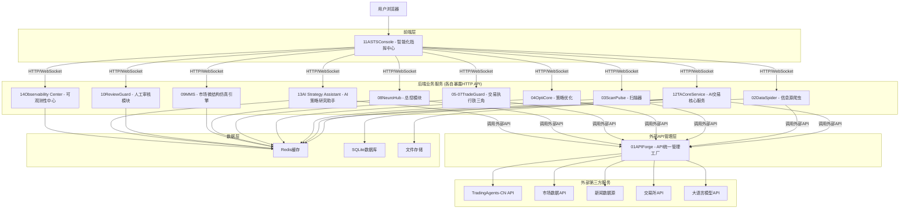
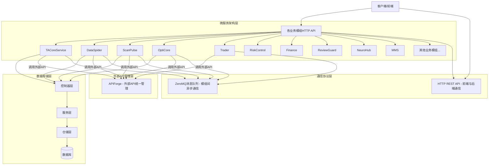
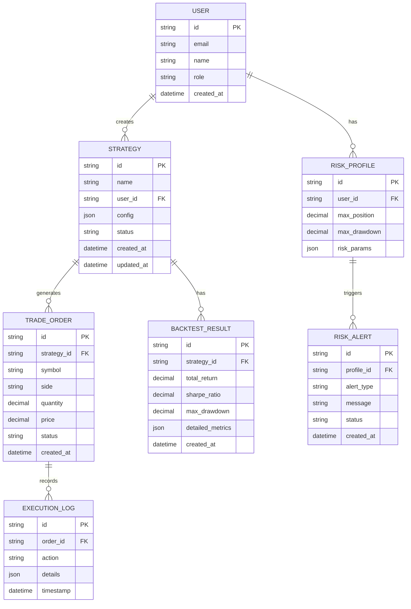

# AI智能体驱动交易系统 - 技术架构文档

> **重要说明**: 本文档是基于 `MASTER-SYSTEM-SPEC-V1.2.md` 主规范文档的技术实现细节。当本文档与主规范文档存在冲突时，以主规范文档为准。建议开发者首先阅读主规范文档以理解全局架构和设计理念。

**参考文档**: `MASTER-SYSTEM-SPEC-V1.2.md` - 项目唯一权威技术纲领

## 1. 架构设计

> **重要说明**: 本架构图已根据MASTER-SYSTEM-SPEC-V1.2进行修正，明确了APIForge仅负责外部API管理，前端可直接调用各后端模组的HTTP API。



## 2. 技术描述

- **前端**: React@18 + Next.js@14 + Shadcn/UI + Tailwind CSS@3 + Zustand + TanStack Query
- **后端**: Python@3.11 + FastAPI + ZeroMQ + Docker
- **数据库**: SQLite + Redis
- **通信**: ZeroMQ (REQ/REP模式) + HTTP REST API
- **部署**: Docker + Docker Compose
- **监控**: Prometheus + Grafana + OpenTelemetry

### 2.1 架构说明

> **重要**: 本架构说明已根据MASTER-SYSTEM-SPEC-V1.2进行修正和统一。

**APIForge职责明确**：
- APIForge模组作为系统的"对外联络部"，专门负责管理对**外部第三方服务**的API调用
- 包括：交易所API、市场数据API、大语言模型API、新闻数据源等外部服务
- **不作为内部API网关**：前端应用和内部模组调用内部服务时，应直接调用目标模组的HTTP API

**通信架构**：
- **前端到后端**：前端应用通过HTTP/WebSocket直接调用各后端模组的API
- **模组间通信**：业务模组之间通过ZeroMQ进行异步通信
- **外部API调用**：所有对外部第三方服务的调用统一通过APIForge模组进行

**架构优势**：
- 消除了APIForge作为内部网关可能造成的单点故障
- 提高了系统的并发处理能力和响应速度
- 简化了内部服务间的调用链路
- 保持了对外部API的统一管理和监控

## 3. 路由定义

| 路由 | 用途 |
|------|------|
| / | 智能化指挥中心首页，显示14个模组状态总览和关键指标 |
| /strategy | 策略管理页面，策略创建和优化配置 |
| /trading | 交易执行页面，订单管理和实时交易 |
| /risk | 风险控制页面，风险监控和预警设置 |
| /data | 数据中心页面，市场数据和信息展示 |
| /finance | 财务管理页面，资金管理和绩效分析 |
| /review | 人工审核中心，交易审核工作流和风险评估 |
| /ai-lab | AI策略实验室，AI助手交互和智能分析 |
| /monitor | 系统监控页面，服务状态和日志查看 |
| /settings | 系统设置页面，用户配置和系统参数 |

## 4. API定义

### 4.1 核心API

#### 策略管理相关
```
POST /api/strategy/create
```

请求参数:
| 参数名 | 参数类型 | 是否必需 | 描述 |
|--------|----------|----------|------|
| name | string | true | 策略名称 |
| config | object | true | 策略配置参数 |
| description | string | false | 策略描述 |

响应参数:
| 参数名 | 参数类型 | 描述 |
|--------|----------|------|
| success | boolean | 操作是否成功 |
| strategy_id | string | 策略唯一标识 |
| message | string | 响应消息 |

示例:
```json
{
  "name": "均线策略",
  "config": {
    "short_period": 5,
    "long_period": 20,
    "symbol": "BTCUSDT"
  },
  "description": "基于双均线的交易策略"
}
```

#### 交易执行相关
```
POST /api/trading/execute
```

请求参数:
| 参数名 | 参数类型 | 是否必需 | 描述 |
|--------|----------|----------|------|
| strategy_id | string | true | 策略ID |
| symbol | string | true | 交易标的 |
| side | string | true | 买卖方向(buy/sell) |
| quantity | number | true | 交易数量 |

响应参数:
| 参数名 | 参数类型 | 描述 |
|--------|----------|------|
| success | boolean | 执行是否成功 |
| order_id | string | 订单ID |
| status | string | 订单状态 |

#### 风险控制相关
```
GET /api/risk/status
```

响应参数:
| 参数名 | 参数类型 | 描述 |
|--------|----------|------|
| risk_level | string | 风险等级(low/medium/high) |
| metrics | object | 风险指标详情 |
| alerts | array | 当前预警列表 |

## 5. 服务架构图

> **架构说明**: 根据MASTER-SYSTEM-SPEC-V1.2修正，展示了前端直接调用后端模组API的正确架构。



## 6. 数据模型

### 6.1 数据模型定义



### 6.2 数据定义语言

#### 策略表 (strategies)
```sql
-- 创建策略表
CREATE TABLE strategies (
    id TEXT PRIMARY KEY DEFAULT (lower(hex(randomblob(16)))),
    name VARCHAR(255) NOT NULL,
    user_id TEXT NOT NULL,
    config JSON NOT NULL,
    status VARCHAR(20) DEFAULT 'inactive' CHECK (status IN ('active', 'inactive', 'paused')),
    description TEXT,
    created_at TIMESTAMP DEFAULT CURRENT_TIMESTAMP,
    updated_at TIMESTAMP DEFAULT CURRENT_TIMESTAMP
);

-- 创建索引
CREATE INDEX idx_strategies_user_id ON strategies(user_id);
CREATE INDEX idx_strategies_status ON strategies(status);
CREATE INDEX idx_strategies_created_at ON strategies(created_at DESC);

-- 初始化数据
INSERT INTO strategies (name, user_id, config, description)
VALUES 
('双均线策略', 'user_001', '{"short_period": 5, "long_period": 20}', '基于短期和长期均线交叉的交易策略'),
('RSI反转策略', 'user_001', '{"rsi_period": 14, "oversold": 30, "overbought": 70}', '基于RSI指标的反转交易策略');
```

#### 交易订单表 (trade_orders)
```sql
-- 创建交易订单表
CREATE TABLE trade_orders (
    id TEXT PRIMARY KEY DEFAULT (lower(hex(randomblob(16)))),
    strategy_id TEXT NOT NULL,
    symbol VARCHAR(20) NOT NULL,
    side VARCHAR(10) NOT NULL CHECK (side IN ('buy', 'sell')),
    quantity DECIMAL(18, 8) NOT NULL,
    price DECIMAL(18, 8),
    status VARCHAR(20) DEFAULT 'pending' CHECK (status IN ('pending', 'filled', 'cancelled', 'failed')),
    created_at TIMESTAMP DEFAULT CURRENT_TIMESTAMP,
    filled_at TIMESTAMP,
    FOREIGN KEY (strategy_id) REFERENCES strategies(id)
);

-- 创建索引
CREATE INDEX idx_trade_orders_strategy_id ON trade_orders(strategy_id);
CREATE INDEX idx_trade_orders_symbol ON trade_orders(symbol);
CREATE INDEX idx_trade_orders_status ON trade_orders(status);
CREATE INDEX idx_trade_orders_created_at ON trade_orders(created_at DESC);
```

#### 用户表 (users)
```sql
-- 创建用户表
CREATE TABLE users (
    id TEXT PRIMARY KEY DEFAULT (lower(hex(randomblob(16)))),
    email VARCHAR(255) UNIQUE NOT NULL,
    name VARCHAR(100) NOT NULL,
    role VARCHAR(20) DEFAULT 'trader' CHECK (role IN ('trader', 'risk_manager', 'admin', 'observer')),
    status VARCHAR(20) DEFAULT 'active' CHECK (status IN ('active', 'inactive', 'suspended')),
    created_at TIMESTAMP DEFAULT CURRENT_TIMESTAMP,
    updated_at TIMESTAMP DEFAULT CURRENT_TIMESTAMP
);

-- 创建索引
CREATE INDEX idx_users_email ON users(email);
CREATE INDEX idx_users_role ON users(role);
CREATE INDEX idx_users_status ON users(status);

-- 初始化数据
INSERT INTO users (email, name, role)
VALUES 
('admin@asts.com', '系统管理员', 'admin'),
('trader@asts.com', '交易员', 'trader'),
('risk@asts.com', '风控经理', 'risk_manager');
```

#### 风险配置表 (risk_profiles)
```sql
-- 创建风险配置表
CREATE TABLE risk_profiles (
    id TEXT PRIMARY KEY DEFAULT (lower(hex(randomblob(16)))),
    user_id TEXT NOT NULL,
    max_position DECIMAL(18, 8) NOT NULL DEFAULT 100000,
    max_drawdown DECIMAL(5, 2) NOT NULL DEFAULT 10.0,
    risk_params JSON NOT NULL DEFAULT '{}',
    created_at TIMESTAMP DEFAULT CURRENT_TIMESTAMP,
    updated_at TIMESTAMP DEFAULT CURRENT_TIMESTAMP,
    FOREIGN KEY (user_id) REFERENCES users(id)
);

-- 创建索引
CREATE INDEX idx_risk_profiles_user_id ON risk_profiles(user_id);
```