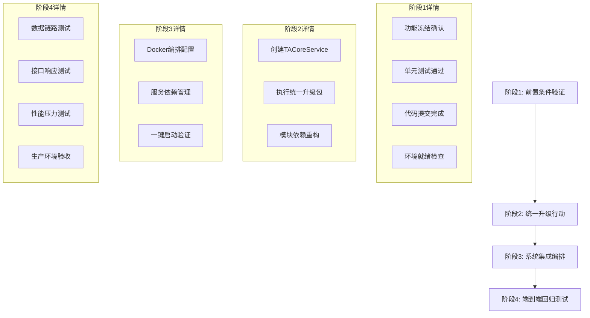

# AI智能体驱动交易系统 - 系统级集成流程与部署指南

> **重要说明**: 本文档是基于 `MASTER-SYSTEM-SPEC-V1.2.md` 主规范文档的详细集成和部署指导。当本文档与主规范文档存在冲突时，以主规范文档为准。建议开发者首先阅读主规范文档以理解全局架构和设计理念。

**主规范文档**: `MASTER-SYSTEM-SPEC-V1.2.md` - 项目唯一权威技术纲领

## 1. 集成流程概述

### 1.1 四阶段集成策略



### 1.2 集成时间线

| 阶段 | 预计时间 | 关键里程碑 | 负责团队 |
|------|----------|------------|----------|
| 阶段1 | 1-2天 | 所有模块通过前置检查 | 各模块开发团队 |
| 阶段2 | 3-5天 | TACoreService部署完成，所有模块完成重构 | 核心架构团队 |
| 阶段3 | 2-3天 | Docker Compose一键启动成功 | DevOps团队 |
| 阶段4 | 3-5天 | 所有测试用例通过，性能达标 | QA团队 |

## 2. 详细集成步骤

### 2.1 阶段1：前置条件验证

#### 步骤1.1：功能冻结确认
```bash
#!/bin/bash
# 功能冻结检查脚本

echo "开始功能冻结检查..."

# 检查各模块是否有未完成的功能开发
modules=("01APIForge" "02DataSpider" "03ScanPulse" "04OptiCore" "05-07TradeGuard" 
         "08NeuroHub" "09MMS" "10ReviewGuard" "11ASTS Console" "12TACoreService" 
         "13AI Strategy Assistant" "14Observability Center")

for module in "${modules[@]}"; do
    echo "检查模块: $module"
    cd "$module"
    
    # 检查是否有未提交的代码
    if [ -n "$(git status --porcelain)" ]; then
        echo "❌ $module 存在未提交的代码变更"
        exit 1
    fi
    
    # 检查是否有开发分支未合并
    unmerged=$(git branch --no-merged main | grep -v main | wc -l)
    if [ $unmerged -gt 0 ]; then
        echo "❌ $module 存在未合并的开发分支"
        exit 1
    fi
    
    echo "✅ $module 功能冻结检查通过"
    cd ..
done

echo "✅ 所有模块功能冻结检查通过"
```

#### 步骤1.2：单元测试验证
```bash
#!/bin/bash
# 单元测试验证脚本

echo "开始单元测试验证..."

failed_modules=()

for module in "${modules[@]}"; do
    echo "运行 $module 单元测试..."
    cd "$module"
    
    # Python项目测试
    if [ -f "pytest.ini" ] || [ -f "requirements.txt" ]; then
        python -m pytest tests/ --cov=. --cov-report=term-missing --cov-fail-under=80
        if [ $? -ne 0 ]; then
            failed_modules+=("$module")
        fi
    fi
    
    # Node.js项目测试
    if [ -f "package.json" ]; then
        npm test
        if [ $? -ne 0 ]; then
            failed_modules+=("$module")
        fi
    fi
    
    cd ..
done

if [ ${#failed_modules[@]} -gt 0 ]; then
    echo "❌ 以下模块测试失败: ${failed_modules[*]}"
    exit 1
fi

echo "✅ 所有模块单元测试通过"
```

### 2.2 阶段2：统一升级行动

#### 步骤2.1：创建TACoreService
```bash
#!/bin/bash
# TACoreService创建脚本

echo "开始创建TACoreService..."

# 创建目录结构
mkdir -p 12TACoreService/{config,data,logs,tests}

# 创建主服务文件
cat > 12TACoreService/main.py << 'EOF'
#!/usr/bin/env python3
"""
TACoreService - AI交易核心服务
统一适配器，基于现有TradingAgents-CN实现
"""

import zmq
import json
import logging
import asyncio
from datetime import datetime
from typing import Dict, Any
from tradingagents import TradingAgent

class TACoreService:
    """AI交易核心服务类"""
    
    def __init__(self, port: int = 5555):
        self.port = port
        self.context = zmq.Context()
        self.socket = self.context.socket(zmq.REP)
        self.trading_agent = TradingAgent()
        self.logger = self._setup_logger()
        
    def _setup_logger(self) -> logging.Logger:
        """设置日志记录器"""
        logger = logging.getLogger('tacore_service')
        logger.setLevel(logging.INFO)
        
        handler = logging.FileHandler('logs/tacore_service.log')
        formatter = logging.Formatter(
            '%(asctime)s - %(name)s - %(levelname)s - %(message)s'
        )
        handler.setFormatter(formatter)
        logger.addHandler(handler)
        
        return logger
    
    async def start_service(self):
        """启动ZeroMQ REP服务"""
        self.socket.bind(f"tcp://*:{self.port}")
        self.logger.info(f"TACoreService启动，监听端口: {self.port}")
        
        while True:
            try:
                # 接收请求
                message = self.socket.recv_json(zmq.NOBLOCK)
                self.logger.info(f"收到请求: {message}")
                
                # 处理请求
                response = await self._process_request(message)
                
                # 发送响应
                self.socket.send_json(response)
                self.logger.info(f"发送响应: {response}")
                
            except zmq.Again:
                await asyncio.sleep(0.01)
            except Exception as e:
                self.logger.error(f"处理请求时发生错误: {e}")
                error_response = {
                    "success": False,
                    "error": str(e),
                    "timestamp": datetime.now().isoformat()
                }
                self.socket.send_json(error_response)
    
    async def _process_request(self, message: Dict[str, Any]) -> Dict[str, Any]:
        """处理业务请求"""
        action = message.get('action')
        params = message.get('params', {})
        
        try:
            if action == 'analyze_strategy':
                result = await self._analyze_strategy(params)
            elif action == 'generate_signal':
                result = await self._generate_signal(params)
            elif action == 'optimize_parameters':
                result = await self._optimize_parameters(params)
            else:
                raise ValueError(f"不支持的操作: {action}")
            
            return {
                "success": True,
                "data": result,
                "timestamp": datetime.now().isoformat(),
                "request_id": message.get('request_id')
            }
            
        except Exception as e:
            return {
                "success": False,
                "error": str(e),
                "timestamp": datetime.now().isoformat(),
                "request_id": message.get('request_id')
            }
    
    async def _analyze_strategy(self, params: Dict[str, Any]) -> Dict[str, Any]:
        """策略分析"""
        symbol = params.get('symbol')
        timeframe = params.get('timeframe')
        strategy_type = params.get('strategy_type')
        
        # 调用TradingAgents-CN进行分析
        analysis = self.trading_agent.analyze(
            symbol=symbol,
            timeframe=timeframe,
            strategy=strategy_type
        )
        
        return {
            "symbol": symbol,
            "analysis": analysis,
            "confidence": analysis.get('confidence', 0.5),
            "recommendation": analysis.get('action', 'hold')
        }
    
    async def _generate_signal(self, params: Dict[str, Any]) -> Dict[str, Any]:
        """生成交易信号"""
        # 实现信号生成逻辑
        pass
    
    async def _optimize_parameters(self, params: Dict[str, Any]) -> Dict[str, Any]:
        """参数优化"""
        # 实现参数优化逻辑
        pass

if __name__ == "__main__":
    service = TACoreService()
    asyncio.run(service.start_service())
EOF

# 创建Dockerfile
cat > 12TACoreService/Dockerfile << 'EOF'
FROM python:3.11-slim

WORKDIR /app

# 安装依赖
COPY requirements.txt .
RUN pip install --no-cache-dir -r requirements.txt

# 复制源码
COPY . .

# 创建必要目录
RUN mkdir -p logs data

# 暴露端口
EXPOSE 5555

# 启动服务
CMD ["python", "main.py"]
EOF

# 创建requirements.txt
cat > 12TACoreService/requirements.txt << 'EOF'
zmq==0.0.0
pyzmq==25.1.1
tradingagents-cn==1.0.0
aiofiles==23.2.1
pydantic==2.5.0
EOF

echo "✅ TACoreService创建完成"
```

#### 步骤2.2：执行统一升级包
```bash
#!/bin/bash
# 统一升级包执行脚本

echo "开始执行统一升级包..."

# 为每个模块执行升级
for module in "${modules[@]}"; do
    if [ "$module" != "12TACoreService" ]; then
        echo "升级模块: $module"
        cd "$module"
        
        # 1. 清理旧的TradingAgents-CN相关代码
        echo "清理旧依赖..."
        find . -name "*trading_agents*" -type f -delete
        find . -name "*tradingagents*" -type f -delete
        
        # 2. 更新requirements.txt，移除TradingAgents-CN依赖
        if [ -f "requirements.txt" ]; then
            grep -v "tradingagents" requirements.txt > requirements_new.txt
            mv requirements_new.txt requirements.txt
            echo "pyzmq==25.1.1" >> requirements.txt
        fi
        
        # 3. 创建ZeroMQ客户端适配器
        cat > zmq_client.py << 'EOF'
#!/usr/bin/env python3
"""
ZeroMQ客户端适配器
用于与TACoreService通信
"""

import zmq
import json
import uuid
from typing import Dict, Any

class TACoreClient:
    """TACoreService客户端"""
    
    def __init__(self, host: str = "tacore_service", port: int = 5555):
        self.context = zmq.Context()
        self.socket = self.context.socket(zmq.REQ)
        self.socket.connect(f"tcp://{host}:{port}")
    
    def analyze_strategy(self, symbol: str, timeframe: str, strategy_type: str) -> Dict[str, Any]:
        """策略分析"""
        request = {
            "action": "analyze_strategy",
            "request_id": str(uuid.uuid4()),
            "params": {
                "symbol": symbol,
                "timeframe": timeframe,
                "strategy_type": strategy_type
            }
        }
        
        self.socket.send_json(request)
        response = self.socket.recv_json()
        
        if not response.get("success"):
            raise Exception(f"TACoreService错误: {response.get('error')}")
        
        return response.get("data")
    
    def generate_signal(self, **params) -> Dict[str, Any]:
        """生成交易信号"""
        request = {
            "action": "generate_signal",
            "request_id": str(uuid.uuid4()),
            "params": params
        }
        
        self.socket.send_json(request)
        response = self.socket.recv_json()
        
        if not response.get("success"):
            raise Exception(f"TACoreService错误: {response.get('error')}")
        
        return response.get("data")
    
    def close(self):
        """关闭连接"""
        self.socket.close()
        self.context.term()
EOF
        
        echo "✅ $module 升级完成"
        cd ..
    fi
done

echo "✅ 统一升级包执行完成"
```

### 2.3 阶段3：系统集成编排

#### 步骤3.1：创建根级Docker Compose
```yaml
# docker-compose.yml
version: '3.8'

services:
  # 基础设施服务
  redis:
    image: redis:7-alpine
    container_name: asts_redis
    ports:
      - "6379:6379"
    volumes:
      - redis_data:/data
    networks:
      - asts_network
    restart: unless-stopped
    healthcheck:
      test: ["CMD", "redis-cli", "ping"]
      interval: 30s
      timeout: 10s
      retries: 3

  # 核心AI服务
  tacore_service:
    build:
      context: ./12TACoreService
      dockerfile: Dockerfile
    container_name: tacore_service
    ports:
      - "5555:5555"
    environment:
      - REDIS_URL=redis://redis:6379
      - LOG_LEVEL=INFO
    volumes:
      - ./12TACoreService/data:/app/data
      - ./12TACoreService/logs:/app/logs
    networks:
      - asts_network
    restart: unless-stopped
    depends_on:
      redis:
        condition: service_healthy
    healthcheck:
      test: ["CMD", "python", "-c", "import zmq; print('OK')"]
      interval: 30s
      timeout: 10s
      retries: 3

  # API网关
  api_factory:
    build:
      context: ./01APIForge
      dockerfile: Dockerfile
    container_name: api_factory
    ports:
      - "8000:8000"
    environment:
      - TACORE_SERVICE_URL=tcp://tacore_service:5555
      - REDIS_URL=redis://redis:6379
    volumes:
      - ./01APIForge/logs:/app/logs
    networks:
      - asts_network
    restart: unless-stopped
    depends_on:
      tacore_service:
        condition: service_healthy
      redis:
        condition: service_healthy

  # 数据爬虫服务
  info_crawler:
    build:
      context: ./02DataSpider
      dockerfile: Dockerfile
    container_name: info_crawler
    environment:
      - TACORE_SERVICE_URL=tcp://tacore_service:5555
      - REDIS_URL=redis://redis:6379
    volumes:
      - ./02DataSpider/data:/app/data
      - ./02DataSpider/logs:/app/logs
    networks:
      - asts_network
    restart: unless-stopped
    depends_on:
      tacore_service:
        condition: service_healthy

  # 信号扫描服务
  scanner:
    build:
      context: ./03ScanPulse
      dockerfile: Dockerfile
    container_name: scanner
    environment:
      - TACORE_SERVICE_URL=tcp://tacore_service:5555
      - REDIS_URL=redis://redis:6379
    volumes:
      - ./03ScanPulse/logs:/app/logs
    networks:
      - asts_network
    restart: unless-stopped
    depends_on:
      tacore_service:
        condition: service_healthy

  # 策略优化服务
  strategy_optimizer:
    build:
      context: ./04OptiCore
      dockerfile: Dockerfile
    container_name: strategy_optimizer
    ports:
      - "8001:8000"
    environment:
      - TACORE_SERVICE_URL=tcp://tacore_service:5555
      - REDIS_URL=redis://redis:6379
    volumes:
      - ./04OptiCore/data:/app/data
      - ./04OptiCore/logs:/app/logs
    networks:
      - asts_network
    restart: unless-stopped
    depends_on:
      tacore_service:
        condition: service_healthy

  # 交易守卫服务（合并5-7模块）
  trade_guard:
    build:
      context: ./05-07TradeGuard
      dockerfile: Dockerfile
    container_name: trade_guard
    ports:
      - "8002:8000"
    environment:
      - TACORE_SERVICE_URL=tcp://tacore_service:5555
      - REDIS_URL=redis://redis:6379
    volumes:
      - ./05-07TradeGuard/data:/app/data
      - ./05-07TradeGuard/logs:/app/logs
    networks:
      - asts_network
    restart: unless-stopped
    depends_on:
      tacore_service:
        condition: service_healthy

  # 神经中枢
  neurohub:
    build:
      context: ./08NeuroHub
      dockerfile: Dockerfile
    container_name: neurohub
    ports:
      - "8003:8000"
    environment:
      - TACORE_SERVICE_URL=tcp://tacore_service:5555
      - REDIS_URL=redis://redis:6379
    volumes:
      - ./08NeuroHub/data:/app/data
      - ./08NeuroHub/logs:/app/logs
    networks:
      - asts_network
    restart: unless-stopped
    depends_on:
      tacore_service:
        condition: service_healthy

  # 主控管理系统
  mms:
    build:
      context: ./09MMS
      dockerfile: Dockerfile
    container_name: mms
    ports:
      - "8004:8000"
    environment:
      - TACORE_SERVICE_URL=tcp://tacore_service:5555
      - REDIS_URL=redis://redis:6379
    volumes:
      - ./09MMS/data:/app/data
      - ./09MMS/logs:/app/logs
    networks:
      - asts_network
    restart: unless-stopped
    depends_on:
      tacore_service:
        condition: service_healthy

  # 审查守卫
  review_guard:
    build:
      context: ./10ReviewGuard
      dockerfile: Dockerfile
    container_name: review_guard
    ports:
      - "8005:8000"
    environment:
      - TACORE_SERVICE_URL=tcp://tacore_service:5555
      - REDIS_URL=redis://redis:6379
    volumes:
      - ./10ReviewGuard/logs:/app/logs
    networks:
      - asts_network
    restart: unless-stopped
    depends_on:
      tacore_service:
        condition: service_healthy

  # 前端控制台
  frontend_console:
    build:
      context: ./11ASTS Console
      dockerfile: Dockerfile
    container_name: frontend_console
    ports:
      - "3000:3000"
    environment:
      - NEXT_PUBLIC_API_URL=http://api_factory:8000
      - NODE_ENV=production
    networks:
      - asts_network
    restart: unless-stopped
    depends_on:
      api_factory:
        condition: service_started

volumes:
  redis_data:

networks:
  asts_network:
    driver: bridge
    ipam:
      config:
        - subnet: 172.20.0.0/16
```

#### 步骤3.2：一键启动脚本
```bash
#!/bin/bash
# 一键启动脚本

set -e

echo "🚀 开始启动AI智能体驱动交易系统..."

# 检查Docker和Docker Compose
if ! command -v docker &> /dev/null; then
    echo "❌ Docker未安装，请先安装Docker"
    exit 1
fi

if ! command -v docker-compose &> /dev/null; then
    echo "❌ Docker Compose未安装，请先安装Docker Compose"
    exit 1
fi

# 清理旧容器
echo "🧹 清理旧容器..."
docker-compose down --remove-orphans
docker system prune -f

# 构建镜像
echo "🔨 构建Docker镜像..."
docker-compose build --no-cache

# 启动服务
echo "🎯 启动服务..."
docker-compose up -d

# 等待服务启动
echo "⏳ 等待服务启动..."
sleep 30

# 健康检查
echo "🔍 执行健康检查..."
services=("redis" "tacore_service" "api_factory" "info_crawler" "scanner" 
          "strategy_optimizer" "trade_guard" "neurohub" "mms" "review_guard" "frontend_console")

failed_services=()

for service in "${services[@]}"; do
    if docker-compose ps $service | grep -q "Up"; then
        echo "✅ $service 运行正常"
    else
        echo "❌ $service 启动失败"
        failed_services+=("$service")
    fi
done

if [ ${#failed_services[@]} -gt 0 ]; then
    echo "❌ 以下服务启动失败: ${failed_services[*]}"
    echo "查看日志: docker-compose logs [service_name]"
    exit 1
fi

# 显示访问信息
echo ""
echo "🎉 系统启动成功！"
echo "📊 前端控制台: http://localhost:3000"
echo "🔌 API网关: http://localhost:8000"
echo "📈 策略优化: http://localhost:8001"
echo "🛡️ 交易守卫: http://localhost:8002"
echo "🧠 神经中枢: http://localhost:8003"
echo "⚙️ 主控系统: http://localhost:8004"
echo "🔍 审查守卫: http://localhost:8005"
echo ""
echo "📋 查看所有服务状态: docker-compose ps"
echo "📝 查看服务日志: docker-compose logs [service_name]"
echo "🛑 停止系统: docker-compose down"
```

### 2.4 阶段4：端到端回归测试

#### 步骤4.1：数据链路测试
```python
#!/usr/bin/env python3
"""
数据链路端到端测试
"""

import asyncio
import aiohttp
import zmq
import json
from datetime import datetime

class E2EDataFlowTest:
    """端到端数据流测试类"""
    
    def __init__(self):
        self.api_base_url = "http://localhost:8000"
        self.tacore_url = "tcp://localhost:5555"
        
    async def test_complete_data_flow(self):
        """测试完整数据流"""
        print("🔄 开始数据链路测试...")
        
        # 1. 测试数据爬取
        await self._test_data_crawling()
        
        # 2. 测试信号扫描
        await self._test_signal_scanning()
        
        # 3. 测试策略分析
        await self._test_strategy_analysis()
        
        # 4. 测试交易执行
        await self._test_trade_execution()
        
        # 5. 测试风险控制
        await self._test_risk_control()
        
        print("✅ 数据链路测试完成")
    
    async def _test_data_crawling(self):
        """测试数据爬取"""
        print("📊 测试数据爬取...")
        
        async with aiohttp.ClientSession() as session:
            async with session.get(f"{self.api_base_url}/api/data/market/BTCUSDT") as resp:
                assert resp.status == 200
                data = await resp.json()
                assert "price" in data
                assert "volume" in data
                print(f"✅ 获取到市场数据: {data['price']}")
    
    async def _test_signal_scanning(self):
        """测试信号扫描"""
        print("🔍 测试信号扫描...")
        
        async with aiohttp.ClientSession() as session:
            payload = {
                "symbol": "BTCUSDT",
                "timeframe": "1h",
                "indicators": ["RSI", "MACD", "MA"]
            }
            
            async with session.post(f"{self.api_base_url}/api/scan/signals", json=payload) as resp:
                assert resp.status == 200
                signals = await resp.json()
                assert "signals" in signals
                print(f"✅ 扫描到信号: {len(signals['signals'])}个")
    
    async def _test_strategy_analysis(self):
        """测试策略分析"""
        print("🧠 测试策略分析...")
        
        # 直接测试TACoreService
        context = zmq.Context()
        socket = context.socket(zmq.REQ)
        socket.connect(self.tacore_url)
        
        request = {
            "action": "analyze_strategy",
            "request_id": "test_001",
            "params": {
                "symbol": "BTCUSDT",
                "timeframe": "1h",
                "strategy_type": "mean_reversion"
            }
        }
        
        socket.send_json(request)
        response = socket.recv_json()
        
        assert response["success"] is True
        assert "data" in response
        print(f"✅ 策略分析完成: {response['data']['recommendation']}")
        
        socket.close()
        context.term()
    
    async def _test_trade_execution(self):
        """测试交易执行"""
        print("💰 测试交易执行...")
        
        async with aiohttp.ClientSession() as session:
            payload = {
                "symbol": "BTCUSDT",
                "side": "buy",
                "quantity": 0.001,
                "order_type": "market"
            }
            
            async with session.post(f"{self.api_base_url}/api/trade/execute", json=payload) as resp:
                assert resp.status == 200
                result = await resp.json()
                assert "order_id" in result
                print(f"✅ 交易执行成功: {result['order_id']}")
    
    async def _test_risk_control(self):
        """测试风险控制"""
        print("🛡️ 测试风险控制...")
        
        async with aiohttp.ClientSession() as session:
            async with session.get(f"{self.api_base_url}/api/risk/status") as resp:
                assert resp.status == 200
                risk_data = await resp.json()
                assert "risk_level" in risk_data
                assert "metrics" in risk_data
                print(f"✅ 风险状态: {risk_data['risk_level']}")

if __name__ == "__main__":
    test = E2EDataFlowTest()
    asyncio.run(test.test_complete_data_flow())
```

#### 步骤4.2：性能压力测试
```python
#!/usr/bin/env python3
"""
性能压力测试
"""

import asyncio
import aiohttp
import time
from concurrent.futures import ThreadPoolExecutor
import statistics

class PerformanceTest:
    """性能测试类"""
    
    def __init__(self):
        self.api_base_url = "http://localhost:8000"
        self.results = []
    
    async def run_load_test(self, concurrent_users: int = 50, duration: int = 60):
        """运行负载测试"""
        print(f"🚀 开始性能测试: {concurrent_users}并发用户, {duration}秒")
        
        start_time = time.time()
        tasks = []
        
        # 创建并发任务
        for i in range(concurrent_users):
            task = asyncio.create_task(self._user_simulation(i, start_time + duration))
            tasks.append(task)
        
        # 等待所有任务完成
        await asyncio.gather(*tasks)
        
        # 分析结果
        self._analyze_results()
    
    async def _user_simulation(self, user_id: int, end_time: float):
        """模拟用户行为"""
        async with aiohttp.ClientSession() as session:
            while time.time() < end_time:
                start = time.time()
                
                try:
                    # 模拟典型用户操作序列
                    await self._simulate_user_workflow(session)
                    
                    response_time = time.time() - start
                    self.results.append({
                        "user_id": user_id,
                        "response_time": response_time,
                        "success": True,
                        "timestamp": time.time()
                    })
                    
                except Exception as e:
                    response_time = time.time() - start
                    self.results.append({
                        "user_id": user_id,
                        "response_time": response_time,
                        "success": False,
                        "error": str(e),
                        "timestamp": time.time()
                    })
                
                # 模拟用户思考时间
                await asyncio.sleep(1)
    
    async def _simulate_user_workflow(self, session):
        """模拟用户工作流"""
        # 1. 获取市场数据
        async with session.get(f"{self.api_base_url}/api/data/market/BTCUSDT") as resp:
            assert resp.status == 200
        
        # 2. 扫描信号
        payload = {"symbol": "BTCUSDT", "timeframe": "1h"}
        async with session.post(f"{self.api_base_url}/api/scan/signals", json=payload) as resp:
            assert resp.status == 200
        
        # 3. 检查风险状态
        async with session.get(f"{self.api_base_url}/api/risk/status") as resp:
            assert resp.status == 200
    
    def _analyze_results(self):
        """分析测试结果"""
        if not self.results:
            print("❌ 没有测试结果")
            return
        
        successful_requests = [r for r in self.results if r["success"]]
        failed_requests = [r for r in self.results if not r["success"]]
        
        total_requests = len(self.results)
        success_rate = len(successful_requests) / total_requests * 100
        
        if successful_requests:
            response_times = [r["response_time"] for r in successful_requests]
            avg_response_time = statistics.mean(response_times)
            p95_response_time = statistics.quantiles(response_times, n=20)[18]  # 95th percentile
            p99_response_time = statistics.quantiles(response_times, n=100)[98]  # 99th percentile
        else:
            avg_response_time = p95_response_time = p99_response_time = 0
        
        print("\n📊 性能测试结果:")
        print(f"总请求数: {total_requests}")
        print(f"成功率: {success_rate:.2f}%")
        print(f"失败请求数: {len(failed_requests)}")
        print(f"平均响应时间: {avg_response_time:.3f}秒")
        print(f"95%响应时间: {p95_response_time:.3f}秒")
        print(f"99%响应时间: {p99_response_time:.3f}秒")
        
        # 性能基准检查
        if success_rate < 99.0:
            print("❌ 成功率低于99%，需要优化")
        elif avg_response_time > 1.0:
            print("❌ 平均响应时间超过1秒，需要优化")
        elif p95_response_time > 2.0:
            print("❌ 95%响应时间超过2秒，需要优化")
        else:
            print("✅ 性能测试通过")

if __name__ == "__main__":
    test = PerformanceTest()
    asyncio.run(test.run_load_test(concurrent_users=50, duration=60))
```

## 3. 运维监控规范

### 3.1 日志管理
```yaml
# 日志配置示例
logging:
  version: 1
  disable_existing_loggers: false
  
  formatters:
    standard:
      format: '%(asctime)s [%(levelname)s] %(name)s: %(message)s'
    json:
      format: '{
        "timestamp": "%(asctime)s",
        "level": "%(levelname)s",
        "logger": "%(name)s",
        "message": "%(message)s",
        "module": "%(module)s",
        "function": "%(funcName)s",
        "line": %(lineno)d
      }'
  
  handlers:
    console:
      class: logging.StreamHandler
      level: INFO
      formatter: standard
      stream: ext://sys.stdout
    
    file:
      class: logging.handlers.RotatingFileHandler
      level: DEBUG
      formatter: json
      filename: logs/app.log
      maxBytes: 10485760  # 10MB
      backupCount: 5
  
  loggers:
    tacore_service:
      level: DEBUG
      handlers: [console, file]
      propagate: false
    
    api_factory:
      level: INFO
      handlers: [console, file]
      propagate: false
  
  root:
    level: INFO
    handlers: [console]
```

### 3.2 监控指标
```python
# 监控指标定义
from prometheus_client import Counter, Histogram, Gauge, Info

# 业务指标
TRADE_ORDERS_TOTAL = Counter(
    'trade_orders_total',
    'Total number of trade orders',
    ['status', 'symbol', 'side']
)

TRADE_EXECUTION_DURATION = Histogram(
    'trade_execution_duration_seconds',
    'Trade execution duration in seconds',
    ['symbol', 'order_type']
)

ACTIVE_STRATEGIES = Gauge(
    'active_strategies_count',
    'Number of active trading strategies'
)

SYSTEM_INFO = Info(
    'system_info',
    'System information'
)

# 技术指标
HTTP_REQUESTS_TOTAL = Counter(
    'http_requests_total',
    'Total HTTP requests',
    ['method', 'endpoint', 'status']
)

HTTP_REQUEST_DURATION = Histogram(
    'http_request_duration_seconds',
    'HTTP request duration in seconds',
    ['method', 'endpoint']
)

ZMQ_MESSAGES_TOTAL = Counter(
    'zmq_messages_total',
    'Total ZeroMQ messages',
    ['service', 'action', 'status']
)

REDIS_OPERATIONS_TOTAL = Counter(
    'redis_operations_total',
    'Total Redis operations',
    ['operation', 'status']
)
```

### 3.3 告警规则
```yaml
# Prometheus告警规则
groups:
  - name: asts_alerts
    rules:
      # 服务可用性告警
      - alert: ServiceDown
        expr: up == 0
        for: 1m
        labels:
          severity: critical
        annotations:
          summary: "Service {{ $labels.instance }} is down"
          description: "{{ $labels.job }} service has been down for more than 1 minute."
      
      # 高错误率告警
      - alert: HighErrorRate
        expr: |
          (
            rate(http_requests_total{status=~"5.."}[5m]) /
            rate(http_requests_total[5m])
          ) > 0.05
        for: 5m
        labels:
          severity: warning
        annotations:
          summary: "High error rate detected"
          description: "Error rate is {{ $value | humanizePercentage }} for {{ $labels.job }}."
      
      # 响应时间告警
      - alert: HighResponseTime
        expr: |
          histogram_quantile(0.95, rate(http_request_duration_seconds_bucket[5m])) > 2
        for: 5m
        labels:
          severity: warning
        annotations:
          summary: "High response time detected"
          description: "95th percentile response time is {{ $value }}s for {{ $labels.job }}."
      
      # 交易异常告警
      - alert: TradingAnomalyDetected
        expr: |
          rate(trade_orders_total{status="failed"}[5m]) > 0.1
        for: 2m
        labels:
          severity: critical
        annotations:
          summary: "Trading anomaly detected"
          description: "High rate of failed trades: {{ $value }} failures per second."
```

## 4. 故障恢复流程

### 4.1 自动故障恢复
```bash
#!/bin/bash
# 自动故障恢复脚本

set -e

echo "🔧 开始故障恢复检查..."

# 检查服务状态
check_service_health() {
    local service=$1
    local max_retries=3
    local retry_count=0
    
    while [ $retry_count -lt $max_retries ]; do
        if docker-compose ps $service | grep -q "Up"; then
            echo "✅ $service 运行正常"
            return 0
        else
            echo "⚠️ $service 状态异常，尝试重启..."
            docker-compose restart $service
            sleep 10
            retry_count=$((retry_count + 1))
        fi
    done
    
    echo "❌ $service 恢复失败"
    return 1
}

# 关键服务列表
critical_services=("redis" "tacore_service" "api_factory")

# 检查并恢复关键服务
for service in "${critical_services[@]}"; do
    if ! check_service_health $service; then
        echo "🚨 关键服务 $service 恢复失败，触发告警"
        # 发送告警通知
        curl -X POST "$WEBHOOK_URL" \
             -H "Content-Type: application/json" \
             -d "{\"text\": \"🚨 ASTS关键服务 $service 故障，需要人工介入\"}"
    fi
done

echo "✅ 故障恢复检查完成"
```

### 4.2 数据备份恢复
```bash
#!/bin/bash
# 数据备份恢复脚本

BACKUP_DIR="/backup/asts"
DATE=$(date +%Y%m%d_%H%M%S)

# 备份数据
backup_data() {
    echo "📦 开始数据备份..."
    
    mkdir -p "$BACKUP_DIR/$DATE"
    
    # 备份Redis数据
    docker exec asts_redis redis-cli BGSAVE
    docker cp asts_redis:/data/dump.rdb "$BACKUP_DIR/$DATE/redis_dump.rdb"
    
    # 备份SQLite数据库
    for module in "04OptiCore" "09MMS" "12TACoreService"; do
        if [ -d "$module/data" ]; then
            cp -r "$module/data" "$BACKUP_DIR/$DATE/${module}_data"
        fi
    done
    
    # 备份配置文件
    cp docker-compose.yml "$BACKUP_DIR/$DATE/"
    cp -r config/ "$BACKUP_DIR/$DATE/" 2>/dev/null || true
    
    # 压缩备份
    cd "$BACKUP_DIR"
    tar -czf "asts_backup_$DATE.tar.gz" "$DATE"
    rm -rf "$DATE"
    
    echo "✅ 数据备份完成: asts_backup_$DATE.tar.gz"
}

# 恢复数据
restore_data() {
    local backup_file=$1
    
    if [ ! -f "$backup_file" ]; then
        echo "❌ 备份文件不存在: $backup_file"
        exit 1
    fi
    
    echo "🔄 开始数据恢复..."
    
    # 停止服务
    docker-compose down
    
    # 解压备份
    cd "$BACKUP_DIR"
    tar -xzf "$backup_file"
    
    backup_dir=$(basename "$backup_file" .tar.gz | sed 's/asts_backup_//')
    
    # 恢复Redis数据
    if [ -f "$backup_dir/redis_dump.rdb" ]; then
        docker-compose up -d redis
        sleep 5
        docker cp "$backup_dir/redis_dump.rdb" asts_redis:/data/dump.rdb
        docker-compose restart redis
    fi
    
    # 恢复SQLite数据库
    for module in "04OptiCore" "09MMS" "12TACoreService"; do
        if [ -d "$backup_dir/${module}_data" ]; then
            rm -rf "../$module/data"
            cp -r "$backup_dir/${module}_data" "../$module/data"
        fi
    done
    
    # 恢复配置文件
    if [ -f "$backup_dir/docker-compose.yml" ]; then
        cp "$backup_dir/docker-compose.yml" ../
    fi
    
    # 重启服务
    cd ..
    docker-compose up -d
    
    echo "✅ 数据恢复完成"
}

# 根据参数执行操作
case "$1" in
    backup)
        backup_data
        ;;
    restore)
        restore_data "$2"
        ;;
    *)
        echo "用法: $0 {backup|restore backup_file}"
        exit 1
        ;;
esac
```

这个系统级集成流程文档提供了完整的部署和运维指南，确保AI智能体驱动交易系统能够稳定、高效地运行在生产环境中。