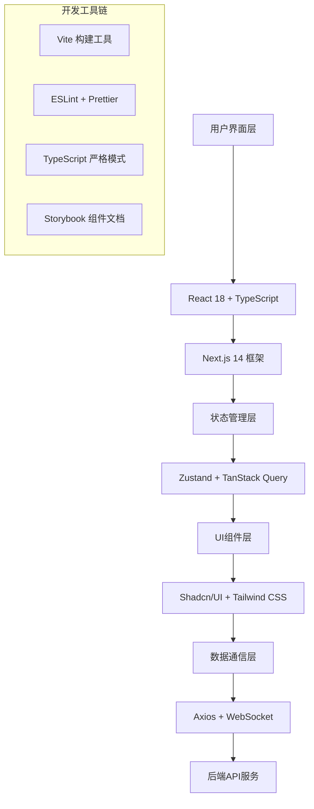

# AI智能体驱动交易系统 - 统一前端规划与设计规范

> **重要说明**: 本文档是基于 `MASTER-SYSTEM-SPEC-V1.2.md` 主规范文档的前端技术实现规范。当本文档与主规范文档存在冲突时，以主规范文档为准。建议开发者首先阅读主规范文档以理解全局架构和设计理念。

**主规范文档**: `MASTER-SYSTEM-SPEC-V1.2.md` - 项目唯一权威技术纲领

## 1. 前端架构概述

### 1.1 技术栈选型



### 1.2 核心技术选择理由

**核心框架**:
- **React 18** - 主框架，支持并发特性
- **TypeScript** - 类型安全，提升开发效率
- **Next.js 14** - 全栈React框架，支持SSR/SSG

**UI组件库**:
- **Shadcn/UI** - 现代化组件库
- **Tailwind CSS** - 原子化CSS框架
- **Radix UI** - 无样式组件基础

**状态管理**:
- **Zustand** - 轻量级状态管理
- **TanStack Query** - 服务端状态管理

**路由管理**:
- **Next.js App Router** - 基于文件系统的路由

**数据可视化**:
- **Recharts** - React图表库
- **D3.js** - 自定义可视化

| 技术 | 版本 | 选择理由 | 替代方案 |
|------|------|----------|----------|
| React | 18.x | 成熟生态、组件化、Hooks支持 | Vue 3, Angular |
| Next.js | 14.x | SSR/SSG、路由、API路由、优化 | Vite + React Router |
| TypeScript | 5.x | 类型安全、开发体验、重构支持 | JavaScript + JSDoc |
| Zustand | 4.x | 轻量级、简单API、TypeScript友好 | Redux Toolkit, Jotai |
| TanStack Query | 5.x | 服务端状态管理、缓存、同步 | SWR, Apollo Client |
| Shadcn/UI | 最新 | 现代设计、可定制、无依赖锁定 | Ant Design, MUI |
| Tailwind CSS | 3.x | 原子化CSS、快速开发、一致性 | Styled Components |

## 2. 项目结构规范

### 2.1 目录结构

```
11ASTS Console/
├── public/                     # 静态资源
│   ├── icons/                 # 图标文件
│   ├── images/                # 图片资源
│   └── favicon.ico           # 网站图标
├── src/
│   ├── app/                   # Next.js App Router
│   │   ├── (dashboard)/       # 仪表盘路由组
│   │   │   ├── page.tsx      # 首页
│   │   │   ├── strategy/     # 策略管理
│   │   │   ├── trading/      # 交易执行
│   │   │   ├── risk/         # 风险控制
│   │   │   ├── data/         # 数据中心
│   │   │   ├── finance/      # 财务管理
│   │   │   └── monitor/      # 系统监控
│   │   ├── auth/             # 认证相关页面
│   │   ├── settings/         # 设置页面
│   │   ├── layout.tsx        # 根布局
│   │   ├── loading.tsx       # 加载组件
│   │   ├── error.tsx         # 错误页面
│   │   └── not-found.tsx     # 404页面
│   ├── components/            # 可复用组件
│   │   ├── ui/               # 基础UI组件
│   │   │   ├── button.tsx
│   │   │   ├── card.tsx
│   │   │   ├── dialog.tsx
│   │   │   ├── form.tsx
│   │   │   ├── table.tsx
│   │   │   └── index.ts      # 统一导出
│   │   ├── charts/           # 图表组件
│   │   │   ├── line-chart.tsx
│   │   │   ├── candlestick-chart.tsx
│   │   │   ├── pie-chart.tsx
│   │   │   └── index.ts
│   │   ├── forms/            # 表单组件
│   │   │   ├── strategy-form.tsx
│   │   │   ├── trade-form.tsx
│   │   │   └── index.ts
│   │   ├── layout/           # 布局组件
│   │   │   ├── header.tsx
│   │   │   ├── sidebar.tsx
│   │   │   ├── footer.tsx
│   │   │   └── index.ts
│   │   └── features/         # 功能组件
│   │       ├── strategy/
│   │       ├── trading/
│   │       ├── risk/
│   │       └── monitoring/
│   ├── hooks/                # 自定义Hooks
│   │   ├── use-api.ts        # API调用Hook
│   │   ├── use-websocket.ts  # WebSocket Hook
│   │   ├── use-auth.ts       # 认证Hook
│   │   ├── use-theme.ts      # 主题Hook
│   │   └── index.ts
│   ├── lib/                  # 工具库
│   │   ├── api.ts           # API客户端
│   │   ├── auth.ts          # 认证工具
│   │   ├── utils.ts         # 通用工具
│   │   ├── constants.ts     # 常量定义
│   │   ├── validations.ts   # 表单验证
│   │   └── types.ts         # 类型定义
│   ├── stores/              # 状态管理
│   │   ├── auth-store.ts    # 认证状态
│   │   ├── strategy-store.ts # 策略状态
│   │   ├── trading-store.ts  # 交易状态
│   │   ├── risk-store.ts     # 风险状态
│   │   └── index.ts
│   └── styles/              # 样式文件
│       ├── globals.css      # 全局样式
│       ├── components.css   # 组件样式
│       └── themes.css       # 主题样式
├── .env.local               # 环境变量
├── .env.example            # 环境变量示例
├── next.config.js          # Next.js配置
├── tailwind.config.js      # Tailwind配置
├── tsconfig.json           # TypeScript配置
├── package.json            # 依赖管理
└── README.md               # 项目文档
```

### 2.2 命名规范

#### 文件命名
- **组件文件**: kebab-case (例: `strategy-card.tsx`)
- **页面文件**: kebab-case (例: `trading-dashboard.tsx`)
- **Hook文件**: kebab-case with use- prefix (例: `use-trading-data.ts`)
- **工具文件**: kebab-case (例: `api-client.ts`)
- **类型文件**: kebab-case (例: `trading-types.ts`)

#### 组件命名
- **React组件**: PascalCase (例: `StrategyCard`, `TradingDashboard`)
- **Hook函数**: camelCase with use prefix (例: `useTradingData`, `useAuth`)
- **工具函数**: camelCase (例: `formatCurrency`, `calculatePnL`)
- **常量**: SCREAMING_SNAKE_CASE (例: `API_BASE_URL`, `DEFAULT_TIMEFRAME`)

## 3. 组件设计规范

### 3.1 基础UI组件

#### Button组件
```typescript
// src/components/ui/button.tsx
import * as React from "react"
import { Slot } from "@radix-ui/react-slot"
import { cva, type VariantProps } from "class-variance-authority"
import { cn } from "@/lib/utils"

const buttonVariants = cva(
  "inline-flex items-center justify-center whitespace-nowrap rounded-md text-sm font-medium ring-offset-background transition-colors focus-visible:outline-none focus-visible:ring-2 focus-visible:ring-ring focus-visible:ring-offset-2 disabled:pointer-events-none disabled:opacity-50",
  {
    variants: {
      variant: {
        default: "bg-primary text-primary-foreground hover:bg-primary/90",
        destructive: "bg-destructive text-destructive-foreground hover:bg-destructive/90",
        outline: "border border-input bg-background hover:bg-accent hover:text-accent-foreground",
        secondary: "bg-secondary text-secondary-foreground hover:bg-secondary/80",
        ghost: "hover:bg-accent hover:text-accent-foreground",
        link: "text-primary underline-offset-4 hover:underline",
        success: "bg-green-600 text-white hover:bg-green-700",
        warning: "bg-yellow-600 text-white hover:bg-yellow-700",
      },
      size: {
        default: "h-10 px-4 py-2",
        sm: "h-9 rounded-md px-3",
        lg: "h-11 rounded-md px-8",
        icon: "h-10 w-10",
      },
    },
    defaultVariants: {
      variant: "default",
      size: "default",
    },
  }
)

export interface ButtonProps
  extends React.ButtonHTMLAttributes<HTMLButtonElement>,
    VariantProps<typeof buttonVariants> {
  asChild?: boolean
  loading?: boolean
}

const Button = React.forwardRef<HTMLButtonElement, ButtonProps>(
  ({ className, variant, size, asChild = false, loading = false, children, disabled, ...props }, ref) => {
    const Comp = asChild ? Slot : "button"
    
    return (
      <Comp
        className={cn(buttonVariants({ variant, size, className }))}
        ref={ref}
        disabled={disabled || loading}
        {...props}
      >
        {loading && (
          <svg className="animate-spin -ml-1 mr-2 h-4 w-4" fill="none" viewBox="0 0 24 24">
            <circle className="opacity-25" cx="12" cy="12" r="10" stroke="currentColor" strokeWidth="4" />
            <path className="opacity-75" fill="currentColor" d="M4 12a8 8 0 018-8V0C5.373 0 0 5.373 0 12h4zm2 5.291A7.962 7.962 0 014 12H0c0 3.042 1.135 5.824 3 7.938l3-2.647z" />
          </svg>
        )}
        {children}
      </Comp>
    )
  }
)
Button.displayName = "Button"

export { Button, buttonVariants }
```

#### Card组件
```typescript
// src/components/ui/card.tsx
import * as React from "react"
import { cn } from "@/lib/utils"

const Card = React.forwardRef<
  HTMLDivElement,
  React.HTMLAttributes<HTMLDivElement>
>(({ className, ...props }, ref) => (
  <div
    ref={ref}
    className={cn(
      "rounded-lg border bg-card text-card-foreground shadow-sm",
      className
    )}
    {...props}
  />
))
Card.displayName = "Card"

const CardHeader = React.forwardRef<
  HTMLDivElement,
  React.HTMLAttributes<HTMLDivElement>
>(({ className, ...props }, ref) => (
  <div
    ref={ref}
    className={cn("flex flex-col space-y-1.5 p-6", className)}
    {...props}
  />
))
CardHeader.displayName = "CardHeader"

const CardTitle = React.forwardRef<
  HTMLParagraphElement,
  React.HTMLAttributes<HTMLHeadingElement>
>(({ className, ...props }, ref) => (
  <h3
    ref={ref}
    className={cn(
      "text-2xl font-semibold leading-none tracking-tight",
      className
    )}
    {...props}
  />
))
CardTitle.displayName = "CardTitle"

const CardDescription = React.forwardRef<
  HTMLParagraphElement,
  React.HTMLAttributes<HTMLParagraphElement>
>(({ className, ...props }, ref) => (
  <p
    ref={ref}
    className={cn("text-sm text-muted-foreground", className)}
    {...props}
  />
))
CardDescription.displayName = "CardDescription"

const CardContent = React.forwardRef<
  HTMLDivElement,
  React.HTMLAttributes<HTMLDivElement>
>(({ className, ...props }, ref) => (
  <div ref={ref} className={cn("p-6 pt-0", className)} {...props} />
))
CardContent.displayName = "CardContent"

const CardFooter = React.forwardRef<
  HTMLDivElement,
  React.HTMLAttributes<HTMLDivElement>
>(({ className, ...props }, ref) => (
  <div
    ref={ref}
    className={cn("flex items-center p-6 pt-0", className)}
    {...props}
  />
))
CardFooter.displayName = "CardFooter"

export { Card, CardHeader, CardFooter, CardTitle, CardDescription, CardContent }
```

### 3.2 业务组件

#### 策略卡片组件
```typescript
// src/components/features/strategy/strategy-card.tsx
import React from 'react'
import { Card, CardContent, CardFooter, CardHeader, CardTitle } from '@/components/ui/card'
import { Button } from '@/components/ui/button'
import { Badge } from '@/components/ui/badge'
import { TrendingUp, TrendingDown, Activity, DollarSign } from 'lucide-react'
import { Strategy, StrategyStatus } from '@/lib/types'
import { formatCurrency, formatPercentage } from '@/lib/utils'

interface StrategyCardProps {
  strategy: Strategy
  onEdit: (strategyId: string) => void
  onDelete: (strategyId: string) => void
  onToggleStatus: (strategyId: string) => void
  className?: string
}

const statusConfig = {
  active: { label: '运行中', variant: 'success' as const, icon: Activity },
  inactive: { label: '已停止', variant: 'secondary' as const, icon: TrendingDown },
  paused: { label: '已暂停', variant: 'warning' as const, icon: TrendingUp },
} as const

export const StrategyCard: React.FC<StrategyCardProps> = ({
  strategy,
  onEdit,
  onDelete,
  onToggleStatus,
  className
}) => {
  const statusInfo = statusConfig[strategy.status]
  const StatusIcon = statusInfo.icon
  
  const isProfit = strategy.performance.totalReturn > 0
  
  return (
    <Card className={`transition-all duration-200 hover:shadow-md ${className}`}>
      <CardHeader className="pb-3">
        <div className="flex items-center justify-between">
          <CardTitle className="text-lg font-semibold">{strategy.name}</CardTitle>
          <Badge variant={statusInfo.variant} className="flex items-center gap-1">
            <StatusIcon className="h-3 w-3" />
            {statusInfo.label}
          </Badge>
        </div>
        {strategy.description && (
          <p className="text-sm text-muted-foreground mt-1">
            {strategy.description}
          </p>
        )}
      </CardHeader>
      
      <CardContent className="pb-3">
        <div className="grid grid-cols-2 gap-4">
          <div className="space-y-2">
            <div className="flex items-center justify-between">
              <span className="text-sm text-muted-foreground">总收益</span>
              <div className={`flex items-center gap-1 ${
                isProfit ? 'text-green-600' : 'text-red-600'
              }`}>
                {isProfit ? (
                  <TrendingUp className="h-3 w-3" />
                ) : (
                  <TrendingDown className="h-3 w-3" />
                )}
                <span className="font-medium">
                  {formatPercentage(strategy.performance.totalReturn)}
                </span>
              </div>
            </div>
            
            <div className="flex items-center justify-between">
              <span className="text-sm text-muted-foreground">夏普比率</span>
              <span className="font-medium">
                {strategy.performance.sharpeRatio.toFixed(2)}
              </span>
            </div>
          </div>
          
          <div className="space-y-2">
            <div className="flex items-center justify-between">
              <span className="text-sm text-muted-foreground">最大回撤</span>
              <span className="font-medium text-red-600">
                {formatPercentage(strategy.performance.maxDrawdown)}
              </span>
            </div>
            
            <div className="flex items-center justify-between">
              <span className="text-sm text-muted-foreground">当前仓位</span>
              <div className="flex items-center gap-1">
                <DollarSign className="h-3 w-3 text-muted-foreground" />
                <span className="font-medium">
                  {formatCurrency(strategy.currentPosition)}
                </span>
              </div>
            </div>
          </div>
        </div>
        
        {/* 策略配置预览 */}
        <div className="mt-4 p-3 bg-muted/50 rounded-md">
          <div className="text-xs text-muted-foreground mb-1">配置参数</div>
          <div className="flex flex-wrap gap-2">
            {Object.entries(strategy.config).slice(0, 3).map(([key, value]) => (
              <Badge key={key} variant="outline" className="text-xs">
                {key}: {String(value)}
              </Badge>
            ))}
            {Object.keys(strategy.config).length > 3 && (
              <Badge variant="outline" className="text-xs">
                +{Object.keys(strategy.config).length - 3} 更多
              </Badge>
            )}
          </div>
        </div>
      </CardContent>
      
      <CardFooter className="pt-3 border-t">
        <div className="flex items-center gap-2 w-full">
          <Button
            variant="outline"
            size="sm"
            onClick={() => onEdit(strategy.id)}
            className="flex-1"
          >
            编辑
          </Button>
          
          <Button
            variant={strategy.status === 'active' ? 'warning' : 'success'}
            size="sm"
            onClick={() => onToggleStatus(strategy.id)}
            className="flex-1"
          >
            {strategy.status === 'active' ? '暂停' : '启动'}
          </Button>
          
          <Button
            variant="destructive"
            size="sm"
            onClick={() => onDelete(strategy.id)}
          >
            删除
          </Button>
        </div>
      </CardFooter>
    </Card>
  )
}
```

#### 实时数据表格组件
```typescript
// src/components/features/trading/real-time-table.tsx
import React, { useMemo } from 'react'
import {
  Table,
  TableBody,
  TableCell,
  TableHead,
  TableHeader,
  TableRow,
} from '@/components/ui/table'
import { Badge } from '@/components/ui/badge'
import { Button } from '@/components/ui/button'
import { ArrowUpDown, TrendingUp, TrendingDown } from 'lucide-react'
import { TradeOrder, OrderStatus } from '@/lib/types'
import { formatCurrency, formatDateTime, cn } from '@/lib/utils'

interface RealTimeTableProps {
  orders: TradeOrder[]
  onSort: (field: keyof TradeOrder) => void
  onCancel: (orderId: string) => void
  sortField?: keyof TradeOrder
  sortDirection?: 'asc' | 'desc'
  className?: string
}

const statusConfig = {
  pending: { label: '待成交', variant: 'warning' as const },
  filled: { label: '已成交', variant: 'success' as const },
  cancelled: { label: '已取消', variant: 'secondary' as const },
  failed: { label: '失败', variant: 'destructive' as const },
} as const

export const RealTimeTable: React.FC<RealTimeTableProps> = ({
  orders,
  onSort,
  onCancel,
  sortField,
  sortDirection,
  className
}) => {
  const sortedOrders = useMemo(() => {
    if (!sortField) return orders
    
    return [...orders].sort((a, b) => {
      const aValue = a[sortField]
      const bValue = b[sortField]
      
      if (aValue < bValue) return sortDirection === 'asc' ? -1 : 1
      if (aValue > bValue) return sortDirection === 'asc' ? 1 : -1
      return 0
    })
  }, [orders, sortField, sortDirection])
  
  const SortButton: React.FC<{ field: keyof TradeOrder; children: React.ReactNode }> = ({ field, children }) => (
    <Button
      variant="ghost"
      size="sm"
      onClick={() => onSort(field)}
      className="h-auto p-0 font-semibold hover:bg-transparent"
    >
      {children}
      <ArrowUpDown className="ml-1 h-3 w-3" />
    </Button>
  )
  
  return (
    <div className={cn("rounded-md border", className)}>
      <Table>
        <TableHeader>
          <TableRow>
            <TableHead>
              <SortButton field="symbol">交易对</SortButton>
            </TableHead>
            <TableHead>
              <SortButton field="side">方向</SortButton>
            </TableHead>
            <TableHead className="text-right">
              <SortButton field="quantity">数量</SortButton>
            </TableHead>
            <TableHead className="text-right">
              <SortButton field="price">价格</SortButton>
            </TableHead>
            <TableHead>
              <SortButton field="status">状态</SortButton>
            </TableHead>
            <TableHead>
              <SortButton field="createdAt">时间</SortButton>
            </TableHead>
            <TableHead className="text-right">操作</TableHead>
          </TableRow>
        </TableHeader>
        <TableBody>
          {sortedOrders.map((order) => {
            const statusInfo = statusConfig[order.status]
            const isBuy = order.side === 'buy'
            
            return (
              <TableRow key={order.id} className="hover:bg-muted/50">
                <TableCell className="font-medium">
                  {order.symbol}
                </TableCell>
                
                <TableCell>
                  <div className={`flex items-center gap-1 ${
                    isBuy ? 'text-green-600' : 'text-red-600'
                  }`}>
                    {isBuy ? (
                      <TrendingUp className="h-3 w-3" />
                    ) : (
                      <TrendingDown className="h-3 w-3" />
                    )}
                    <span className="font-medium">
                      {isBuy ? '买入' : '卖出'}
                    </span>
                  </div>
                </TableCell>
                
                <TableCell className="text-right font-mono">
                  {order.quantity.toFixed(8)}
                </TableCell>
                
                <TableCell className="text-right font-mono">
                  {order.price ? formatCurrency(order.price) : '市价'}
                </TableCell>
                
                <TableCell>
                  <Badge variant={statusInfo.variant}>
                    {statusInfo.label}
                  </Badge>
                </TableCell>
                
                <TableCell className="text-sm text-muted-foreground">
                  {formatDateTime(order.createdAt)}
                </TableCell>
                
                <TableCell className="text-right">
                  {order.status === 'pending' && (
                    <Button
                      variant="outline"
                      size="sm"
                      onClick={() => onCancel(order.id)}
                    >
                      取消
                    </Button>
                  )}
                </TableCell>
              </TableRow>
            )
          })}
        </TableBody>
      </Table>
      
      {orders.length === 0 && (
        <div className="text-center py-8 text-muted-foreground">
          暂无交易订单
        </div>
      )}
    </div>
  )
}
```

## 4. 状态管理规范

### 4.1 Zustand Store设计

#### 认证状态管理
```typescript
// src/stores/auth-store.ts
import { create } from 'zustand'
import { persist } from 'zustand/middleware'
import { User, LoginCredentials } from '@/lib/types'
import { authApi } from '@/lib/api'

interface AuthState {
  user: User | null
  token: string | null
  isLoading: boolean
  error: string | null
  
  // Actions
  login: (credentials: LoginCredentials) => Promise<void>
  logout: () => void
  refreshToken: () => Promise<void>
  clearError: () => void
  updateUser: (user: Partial<User>) => void
}

export const useAuthStore = create<AuthState>()(
  persist(
    (set, get) => ({
      user: null,
      token: null,
      isLoading: false,
      error: null,
      
      login: async (credentials) => {
        set({ isLoading: true, error: null })
        
        try {
          const response = await authApi.login(credentials)
          set({
            user: response.user,
            token: response.token,
            isLoading: false
          })
        } catch (error) {
          set({
            error: error instanceof Error ? error.message : '登录失败',
            isLoading: false
          })
          throw error
        }
      },
      
      logout: () => {
        set({ user: null, token: null, error: null })
        // 清除本地存储
        localStorage.removeItem('auth-storage')
      },
      
      refreshToken: async () => {
        const { token } = get()
        if (!token) return
        
        try {
          const response = await authApi.refreshToken(token)
          set({ token: response.token })
        } catch (error) {
          // Token刷新失败，清除认证状态
          get().logout()
          throw error
        }
      },
      
      clearError: () => set({ error: null }),
      
      updateUser: (userData) => {
        const { user } = get()
        if (user) {
          set({ user: { ...user, ...userData } })
        }
      }
    }),
    {
      name: 'auth-storage',
      partialize: (state) => ({
        user: state.user,
        token: state.token
      })
    }
  )
)
```

#### 策略状态管理
```typescript
// src/stores/strategy-store.ts
import { create } from 'zustand'
import { Strategy, StrategyConfig, CreateStrategyRequest } from '@/lib/types'
import { strategyApi } from '@/lib/api'

interface StrategyState {
  strategies: Strategy[]
  selectedStrategy: Strategy | null
  isLoading: boolean
  error: string | null
  
  // Actions
  fetchStrategies: () => Promise<void>
  createStrategy: (request: CreateStrategyRequest) => Promise<Strategy>
  updateStrategy: (id: string, updates: Partial<Strategy>) => Promise<void>
  deleteStrategy: (id: string) => Promise<void>
  toggleStrategyStatus: (id: string) => Promise<void>
  selectStrategy: (strategy: Strategy | null) => void
  clearError: () => void
}

export const useStrategyStore = create<StrategyState>((set, get) => ({
  strategies: [],
  selectedStrategy: null,
  isLoading: false,
  error: null,
  
  fetchStrategies: async () => {
    set({ isLoading: true, error: null })
    
    try {
      const strategies = await strategyApi.getAll()
      set({ strategies, isLoading: false })
    } catch (error) {
      set({
        error: error instanceof Error ? error.message : '获取策略列表失败',
        isLoading: false
      })
    }
  },
  
  createStrategy: async (request) => {
    set({ isLoading: true, error: null })
    
    try {
      const strategy = await strategyApi.create(request)
      set((state) => ({
        strategies: [...state.strategies, strategy],
        isLoading: false
      }))
      return strategy
    } catch (error) {
      set({
        error: error instanceof Error ? error.message : '创建策略失败',
        isLoading: false
      })
      throw error
    }
  },
  
  updateStrategy: async (id, updates) => {
    set({ isLoading: true, error: null })
    
    try {
      const updatedStrategy = await strategyApi.update(id, updates)
      set((state) => ({
        strategies: state.strategies.map(s => 
          s.id === id ? updatedStrategy : s
        ),
        selectedStrategy: state.selectedStrategy?.id === id 
          ? updatedStrategy 
          : state.selectedStrategy,
        isLoading: false
      }))
    } catch (error) {
      set({
        error: error instanceof Error ? error.message : '更新策略失败',
        isLoading: false
      })
      throw error
    }
  },
  
  deleteStrategy: async (id) => {
    set({ isLoading: true, error: null })
    
    try {
      await strategyApi.delete(id)
      set((state) => ({
        strategies: state.strategies.filter(s => s.id !== id),
        selectedStrategy: state.selectedStrategy?.id === id 
          ? null 
          : state.selectedStrategy,
        isLoading: false
      }))
    } catch (error) {
      set({
        error: error instanceof Error ? error.message : '删除策略失败',
        isLoading: false
      })
      throw error
    }
  },
  
  toggleStrategyStatus: async (id) => {
    const strategy = get().strategies.find(s => s.id === id)
    if (!strategy) return
    
    const newStatus = strategy.status === 'active' ? 'paused' : 'active'
    await get().updateStrategy(id, { status: newStatus })
  },
  
  selectStrategy: (strategy) => set({ selectedStrategy: strategy }),
  
  clearError: () => set({ error: null })
}))
```

### 4.2 TanStack Query集成

#### API查询Hooks
```typescript
// src/hooks/use-api.ts
import { useQuery, useMutation, useQueryClient } from '@tanstack/react-query'
import { tradingApi, marketDataApi } from '@/lib/api'
import { TradeOrder, MarketData } from '@/lib/types'

// 市场数据查询
export const useMarketData = (symbol: string, interval: string = '1m') => {
  return useQuery({
    queryKey: ['marketData', symbol, interval],
    queryFn: () => marketDataApi.getKlines(symbol, interval),
    refetchInterval: 1000, // 每秒刷新
    staleTime: 500, // 500ms内认为数据是新鲜的
  })
}

// 交易订单查询
export const useTradeOrders = () => {
  return useQuery({
    queryKey: ['tradeOrders'],
    queryFn: tradingApi.getOrders,
    refetchInterval: 2000, // 每2秒刷新
  })
}

// 创建交易订单
export const useCreateOrder = () => {
  const queryClient = useQueryClient()
  
  return useMutation({
    mutationFn: tradingApi.createOrder,
    onSuccess: () => {
      // 刷新订单列表
      queryClient.invalidateQueries({ queryKey: ['tradeOrders'] })
    },
    onError: (error) => {
      console.error('创建订单失败:', error)
    }
  })
}

// 取消交易订单
export const useCancelOrder = () => {
  const queryClient = useQueryClient()
  
  return useMutation({
    mutationFn: tradingApi.cancelOrder,
    onSuccess: () => {
      queryClient.invalidateQueries({ queryKey: ['tradeOrders'] })
    }
  })
}

// 实时价格订阅
export const useRealTimePrice = (symbol: string) => {
  return useQuery({
    queryKey: ['realTimePrice', symbol],
    queryFn: () => marketDataApi.getCurrentPrice(symbol),
    refetchInterval: 100, // 100ms刷新
    refetchIntervalInBackground: true,
  })
}
```

## 5. 主题和样式规范

### 5.1 设计令牌系统

```css
/* src/styles/themes.css */
:root {
  /* 颜色系统 */
  --color-primary-50: #eff6ff;
  --color-primary-100: #dbeafe;
  --color-primary-200: #bfdbfe;
  --color-primary-300: #93c5fd;
  --color-primary-400: #60a5fa;
  --color-primary-500: #3b82f6;
  --color-primary-600: #2563eb;
  --color-primary-700: #1d4ed8;
  --color-primary-800: #1e40af;
  --color-primary-900: #1e3a8a;
  
  /* 成功色 */
  --color-success-50: #f0fdf4;
  --color-success-500: #22c55e;
  --color-success-600: #16a34a;
  --color-success-700: #15803d;
  
  /* 错误色 */
  --color-error-50: #fef2f2;
  --color-error-500: #ef4444;
  --color-error-600: #dc2626;
  --color-error-700: #b91c1c;
  
  /* 警告色 */
  --color-warning-50: #fffbeb;
  --color-warning-500: #f59e0b;
  --color-warning-600: #d97706;
  --color-warning-700: #b45309;
  
  /* 中性色 */
  --color-gray-50: #f9fafb;
  --color-gray-100: #f3f4f6;
  --color-gray-200: #e5e7eb;
  --color-gray-300: #d1d5db;
  --color-gray-400: #9ca3af;
  --color-gray-500: #6b7280;
  --color-gray-600: #4b5563;
  --color-gray-700: #374151;
  --color-gray-800: #1f2937;
  --color-gray-900: #111827;
  
  /* 字体系统 */
  --font-family-sans: 'Inter', -apple-system, BlinkMacSystemFont, 'Segoe UI', Roboto, sans-serif;
  --font-family-mono: 'JetBrains Mono', 'Fira Code', Consolas, monospace;
  --font-family-chinese: 'Source Han Sans SC', 'Noto Sans CJK SC', sans-serif;
  
  /* 字体大小 */
  --font-size-xs: 0.75rem;    /* 12px */
  --font-size-sm: 0.875rem;   /* 14px */
  --font-size-base: 1rem;     /* 16px */
  --font-size-lg: 1.125rem;   /* 18px */
  --font-size-xl: 1.25rem;    /* 20px */
  --font-size-2xl: 1.5rem;    /* 24px */
  --font-size-3xl: 1.875rem;  /* 30px */
  --font-size-4xl: 2.25rem;   /* 36px */
  
  /* 间距系统 */
  --spacing-1: 0.25rem;   /* 4px */
  --spacing-2: 0.5rem;    /* 8px */
  --spacing-3: 0.75rem;   /* 12px */
  --spacing-4: 1rem;      /* 16px */
  --spacing-5: 1.25rem;   /* 20px */
  --spacing-6: 1.5rem;    /* 24px */
  --spacing-8: 2rem;      /* 32px */
  --spacing-10: 2.5rem;   /* 40px */
  --spacing-12: 3rem;     /* 48px */
  --spacing-16: 4rem;     /* 64px */
  
  /* 圆角系统 */
  --radius-sm: 0.125rem;   /* 2px */
  --radius-base: 0.25rem;  /* 4px */
  --radius-md: 0.375rem;   /* 6px */
  --radius-lg: 0.5rem;     /* 8px */
  --radius-xl: 0.75rem;    /* 12px */
  --radius-2xl: 1rem;      /* 16px */
  --radius-full: 9999px;
  
  /* 阴影系统 */
  --shadow-sm: 0 1px 2px 0 rgb(0 0 0 / 0.05);
  --shadow-base: 0 1px 3px 0 rgb(0 0 0 / 0.1), 0 1px 2px -1px rgb(0 0 0 / 0.1);
  --shadow-md: 0 4px 6px -1px rgb(0 0 0 / 0.1), 0 2px 4px -2px rgb(0 0 0 / 0.1);
  --shadow-lg: 0 10px 15px -3px rgb(0 0 0 / 0.1), 0 4px 6px -4px rgb(0 0 0 / 0.1);
  --shadow-xl: 0 20px 25px -5px rgb(0 0 0 / 0.1), 0 8px 10px -6px rgb(0 0 0 / 0.1);
  
  /* 动画系统 */
  --transition-fast: 150ms ease;
  --transition-base: 200ms ease;
  --transition-slow: 300ms ease;
  
  /* Z-index系统 */
  --z-dropdown: 1000;
  --z-sticky: 1020;
  --z-fixed: 1030;
  --z-modal-backdrop: 1040;
  --z-modal: 1050;
  --z-popover: 1060;
  --z-tooltip: 1070;
  --z-toast: 1080;
}

/* 暗色主题 */
[data-theme="dark"] {
  --color-background: var(--color-gray-900);
  --color-foreground: var(--color-gray-50);
  --color-muted: var(--color-gray-800);
  --color-muted-foreground: var(--color-gray-400);
  --color-border: var(--color-gray-700);
  --color-input: var(--color-gray-800);
  --color-card: var(--color-gray-800);
  --color-card-foreground: var(--color-gray-50);
}

/* 亮色主题 */
[data-theme="light"] {
  --color-background: var(--color-gray-50);
  --color-foreground: var(--color-gray-900);
  --color-muted: var(--color-gray-100);
  --color-muted-foreground: var(--color-gray-500);
  --color-border: var(--color-gray-200);
  --color-input: var(--color-gray-50);
  --color-card: var(--color-gray-50);
  --color-card-foreground: var(--color-gray-900);
}
```

### 5.2 Tailwind配置

```javascript
// tailwind.config.js
const { fontFamily } = require('tailwindcss/defaultTheme')

/** @type {import('tailwindcss').Config} */
module.exports = {
  darkMode: ['class', '[data-theme="dark"]'],
  content: [
    './src/**/*.{js,ts,jsx,tsx,mdx}',
    './app/**/*.{js,ts,jsx,tsx,mdx}',
  ],
  theme: {
    extend: {
      colors: {
        border: 'hsl(var(--border))',
        input: 'hsl(var(--input))',
        ring: 'hsl(var(--ring))',
        background: 'hsl(var(--background))',
        foreground: 'hsl(var(--foreground))',
        primary: {
          DEFAULT: 'hsl(var(--primary))',
          foreground: 'hsl(var(--primary-foreground))',
          50: 'var(--color-primary-50)',
          100: 'var(--color-primary-100)',
          200: 'var(--color-primary-200)',
          300: 'var(--color-primary-300)',
          400: 'var(--color-primary-400)',
          500: 'var(--color-primary-500)',
          600: 'var(--color-primary-600)',
          700: 'var(--color-primary-700)',
          800: 'var(--color-primary-800)',
          900: 'var(--color-primary-900)',
        },
        secondary: {
          DEFAULT: 'hsl(var(--secondary))',
          foreground: 'hsl(var(--secondary-foreground))',
        },
        destructive: {
          DEFAULT: 'hsl(var(--destructive))',
          foreground: 'hsl(var(--destructive-foreground))',
        },
        muted: {
          DEFAULT: 'hsl(var(--muted))',
          foreground: 'hsl(var(--muted-foreground))',
        },
        accent: {
          DEFAULT: 'hsl(var(--accent))',
          foreground: 'hsl(var(--accent-foreground))',
        },
        popover: {
          DEFAULT: 'hsl(var(--popover))',
          foreground: 'hsl(var(--popover-foreground))',
        },
        card: {
          DEFAULT: 'hsl(var(--card))',
          foreground: 'hsl(var(--card-foreground))',
        },
        // 业务色彩
        success: {
          50: 'var(--color-success-50)',
          500: 'var(--color-success-500)',
          600: 'var(--color-success-600)',
          700: 'var(--color-success-700)',
        },
        error: {
          50: 'var(--color-error-50)',
          500: 'var(--color-error-500)',
          600: 'var(--color-error-600)',
          700: 'var(--color-error-700)',
        },
        warning: {
          50: 'var(--color-warning-50)',
          500: 'var(--color-warning-500)',
          600: 'var(--color-warning-600)',
          700: 'var(--color-warning-700)',
        },
      },
      fontFamily: {
        sans: ['var(--font-family-sans)', ...fontFamily.sans],
        mono: ['var(--font-family-mono)', ...fontFamily.mono],
        chinese: ['var(--font-family-chinese)', ...fontFamily.sans],
      },
      fontSize: {
        xs: 'var(--font-size-xs)',
        sm: 'var(--font-size-sm)',
        base: 'var(--font-size-base)',
        lg: 'var(--font-size-lg)',
        xl: 'var(--font-size-xl)',
        '2xl': 'var(--font-size-2xl)',
        '3xl': 'var(--font-size-3xl)',
        '4xl': 'var(--font-size-4xl)',
      },
      spacing: {
        1: 'var(--spacing-1)',
        2: 'var(--spacing-2)',
        3: 'var(--spacing-3)',
        4: 'var(--spacing-4)',
        5: 'var(--spacing-5)',
        6: 'var(--spacing-6)',
        8: 'var(--spacing-8)',
        10: 'var(--spacing-10)',
        12: 'var(--spacing-12)',
        16: 'var(--spacing-16)',
      },
      borderRadius: {
        sm: 'var(--radius-sm)',
        DEFAULT: 'var(--radius-base)',
        md: 'var(--radius-md)',
        lg: 'var(--radius-lg)',
        xl: 'var(--radius-xl)',
        '2xl': 'var(--radius-2xl)',
        full: 'var(--radius-full)',
      },
      boxShadow: {
        sm: 'var(--shadow-sm)',
        DEFAULT: 'var(--shadow-base)',
        md: 'var(--shadow-md)',
        lg: 'var(--shadow-lg)',
        xl: 'var(--shadow-xl)',
      },
      transitionDuration: {
        fast: 'var(--transition-fast)',
        DEFAULT: 'var(--transition-base)',
        slow: 'var(--transition-slow)',
      },
      zIndex: {
        dropdown: 'var(--z-dropdown)',
        sticky: 'var(--z-sticky)',
        fixed: 'var(--z-fixed)',
        'modal-backdrop': 'var(--z-modal-backdrop)',
        modal: 'var(--z-modal)',
        popover: 'var(--z-popover)',
        tooltip: 'var(--z-tooltip)',
        toast: 'var(--z-toast)',
      },
      animation: {
        'fade-in': 'fadeIn 0.2s ease-in-out',
        'fade-out': 'fadeOut 0.2s ease-in-out',
        'slide-in': 'slideIn 0.3s ease-out',
        'slide-out': 'slideOut 0.3s ease-out',
        'pulse-slow': 'pulse 3s cubic-bezier(0.4, 0, 0.6, 1) infinite',
      },
      keyframes: {
        fadeIn: {
          '0%': { opacity: '0' },
          '100%': { opacity: '1' },
        },
        fadeOut: {
          '0%': { opacity: '1' },
          '100%': { opacity: '0' },
        },
        slideIn: {
          '0%': { transform: 'translateX(-100%)' },
          '100%': { transform: 'translateX(0)' },
        },
        slideOut: {
          '0%': { transform: 'translateX(0)' },
          '100%': { transform: 'translateX(-100%)' },
        },
      },
    },
  },
  plugins: [
    require('tailwindcss-animate'),
    require('@tailwindcss/forms'),
    require('@tailwindcss/typography'),
  ],
}
```

## 6. 性能优化规范

### 6.1 代码分割和懒加载

```typescript
// src/app/layout.tsx
import { Suspense } from 'react'
import dynamic from 'next/dynamic'

// 懒加载非关键组件
const NotificationCenter = dynamic(
  () => import('@/components/features/notifications/notification-center'),
  { ssr: false }
)

const ChatSupport = dynamic(
  () => import('@/components/features/support/chat-support'),
  { ssr: false }
)

export default function RootLayout({
  children,
}: {
  children: React.ReactNode
}) {
  return (
    <html lang="zh-CN">
      <body>
        <div id="root">
          {children}
          
          <Suspense fallback={null}>
            <NotificationCenter />
            <ChatSupport />
          </Suspense>
        </div>
      </body>
    </html>
  )
}
```

### 6.2 图片优化

```typescript
// src/components/ui/optimized-image.tsx
import Image from 'next/image'
import { useState } from 'react'
import { cn } from '@/lib/utils'

interface OptimizedImageProps {
  src: string
  alt: string
  width?: number
  height?: number
  className?: string
  priority?: boolean
  placeholder?: 'blur' | 'empty'
  blurDataURL?: string
}

export const OptimizedImage: React.FC<OptimizedImageProps> = ({
  src,
  alt,
  width,
  height,
  className,
  priority = false,
  placeholder = 'empty',
  blurDataURL
}) => {
  const [isLoading, setIsLoading] = useState(true)
  const [hasError, setHasError] = useState(false)
  
  return (
    <div className={cn('relative overflow-hidden', className)}>
      {!hasError ? (
        <Image
          src={src}
          alt={alt}
          width={width}
          height={height}
          priority={priority}
          placeholder={placeholder}
          blurDataURL={blurDataURL}
          className={cn(
            'transition-opacity duration-300',
            isLoading ? 'opacity-0' : 'opacity-100'
          )}
          onLoad={() => setIsLoading(false)}
          onError={() => {
            setIsLoading(false)
            setHasError(true)
          }}
        />
      ) : (
        <div className="flex items-center justify-center bg-muted text-muted-foreground">
          <span className="text-sm">图片加载失败</span>
        </div>
      )}
      
      {isLoading && (
        <div className="absolute inset-0 bg-muted animate-pulse" />
      )}
    </div>
  )
}
```

### 6.3 虚拟滚动

```typescript
// src/components/ui/virtual-list.tsx
import { FixedSizeList as List } from 'react-window'
import { memo } from 'react'

interface VirtualListProps<T> {
  items: T[]
  itemHeight: number
  height: number
  renderItem: (props: { index: number; style: React.CSSProperties; data: T }) => React.ReactNode
  className?: string
}

const VirtualListItem = memo<{
  index: number
  style: React.CSSProperties
  data: { items: any[]; renderItem: any }
}>(({ index, style, data }) => {
  const { items, renderItem } = data
  return (
    <div style={style}>
      {renderItem({ index, style, data: items[index] })}
    </div>
  )
})

VirtualListItem.displayName = 'VirtualListItem'

export function VirtualList<T>({
  items,
  itemHeight,
  height,
  renderItem,
  className
}: VirtualListProps<T>) {
  const itemData = {
    items,
    renderItem
  }
  
  return (
    <div className={className}>
      <List
        height={height}
        itemCount={items.length}
        itemSize={itemHeight}
        itemData={itemData}
      >
        {VirtualListItem}
      </List>
    </div>
  )
}
```

这个统一前端规划文档提供了完整的前端开发规范，确保AI智能体驱动交易系统的前端具有一致性、可维护性和高性能。